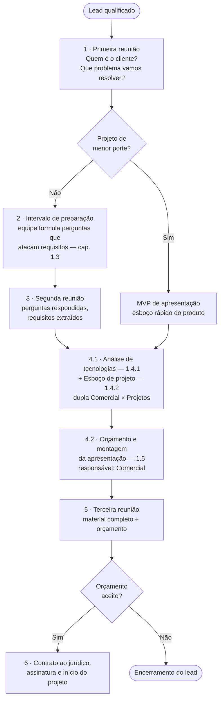

## 1.1 Introdução: Visão geral {#sec-1-1-introducao}

O objetivo dessa seção é delimitar padrões e compartilhar conhecimentos os quais, sobretudo, removam o gargalo de comunicação entre o que o cliente pede e o que o desenvolvedor entende e que gerem maior valor ao produto apresentado ao cliente.

De um modo geral, o diagrama abaixo ilustra como procede esse período pré-contratual:

1. **Primeira reunião:** A depender do contexto, a dupla comercial x projetos já estabelecida ou somente o membro do comercial entrará em contato, pela primeira vez, com o cliente. **O objetivo é entender quem é o cliente e o que ele precisa (qual seu negócio e suas dores), extraindo o máximo de informações possíveis**. A pergunta principal desta etapa é **“Que problema vamos solucionar e para quem?”.**

   **Entregáveis Esperados:** resumo do negócio, resumo do problema, stakeholders envolvidos e lista de dúvidas abertas. Possivelmente **disponibilizar recursos para o cliente pesquisar** **mais**: “**ex: consegue nos mandar uma lista de sites que você gosta, para nos baseamos?**”

| Em que focar | O que não (necessariamente) é o foco |
| ----------------------------------------- | ------------------------------- |
| Quem é o cliente? O que o cliente faz? Qual problema motiva esse projeto? Quem sofre com este problema? Apresentação da IDE | Telas Tecnologias a serem utilizadas. Campos específicos. Detalhes miúdos. |

2. **Intervalo de Preparação:** após o contato inicial, um intervalo de poucos dias para o cliente pensar melhor sobre o problema e a equipe **preparar dúvidas que visem atacar os requisitos**. Pode ser interessante, a depender da dificuldade técnica das dúvidas e do porte do projeto, comentar, ao final da primeira reunião, que possíveis dúvidas mais incisivas serão elaboradas acerca do projeto e posteriormente enviadas, com o objetivo de, na segunda reunião, elas serem respondidas. Dessa maneira, o cliente consegue elaborar as respostas para as dúvidas tidas.

   **Entregáveis Esperados:** seleção de questões que visam **atacar requisitos**, principalmente **básicos** e **performantes, de acordo com o *capítulo 1.3 desse manual : Levantamento de Requisitos***

   **Observação**: Caso o projeto seja visivelmente de menor porte (por exemplo, um site básico), a segunda reunião pode ser omitida, pulando direto para a reunião de apresentação de orçamento. Para esses casos, é muito interessante (e, possivelmente, necessário, por ser geralmente de fácil realização) confeccionar um MVP (*Minimum Viable Product* ou Produto Mínimo Viável) do projeto. Por exemplo, se for um site institucional básico, pode-se, com facilidade, utilizar o stitch do google ou o lovable para esboçar um site a apresentar ao cliente. Dessa forma, temos maiores chances de fazer com que o cliente feche o contrato conosco.

3. **Segunda Reunião:** momento para questionar o cliente e extrair o máximo possível de informações orientadas, de acordo com as perguntas desenvolvidas no passo anterior.  
   **Entregáveis Esperados:** perguntas respondidas, anotações de fatos que o cliente adicionou.  
4.
   1. **Elaboração e interpretação de requisitos:** nesta etapa, os membros se unem para realizar a **análise de tecnologias** e o **esboço do projeto (de acordo com os capítulos 1.4.1 Análise de tecnologias e 1.4.2 Esboço de projeto, respectivamente)**, baseando-se nos requisitos levantados do projeto. Para a realização dessa etapa, uma ideia é os membros da dupla comercial x projetos se programarem para, logo após a segunda reunião, engatarem uma reunião entre si para discutirem as ideias e matarem essa tarefa rapidamente. Não necessariamente precisa ser imediatamente a segunda reunião, mas é interessante que essa etapa seja realizada em reunião/em conjunto.  
   2. **Orçamento e montagem da apresentação:** Após realizada a etapa 4.1, o membro do setor comercial fica responsável por realizar o orçamento do projeto e pela montagem da apresentação a ser mostrada na reunião de apresentação de orçamento e projeto.  
5. **Terceira reunião:** momento de apresentação de todo material confeccionado até o momento, colocando, no final, o orçamento previsto. Proceder nessa reunião de acordo com o capítulo seguinte, assim como nas demais reuniões anteriores (1.2 Reuniões com o cliente, como proceder?), sobretudo no que concerne à questão do preço do projeto — usar a fala de sermos uma empresa de cunho voluntário e sem fins lucrativos e que, portanto, visamos a proposta de um preço o mais justo possível.  
6. **Orçamento aceito:** Caso o orçamento seja aceito, enviar o contrato para o nosso jurídico. **Tradução:** Os membros responsáveis pelo lead deverão contatar o diretor comercial para que este lide com essa etapa burocrática do contrato, que é basicamente enviar para o nosso jurídico para uma revisão contratual. Logo em seguida, o contrato deve ser enviado para assinatura e o projeto deve começar. Agilidade nessa etapa é peça fundamental para que o cliente não mude de ideia e abandone a ideia do projeto.

