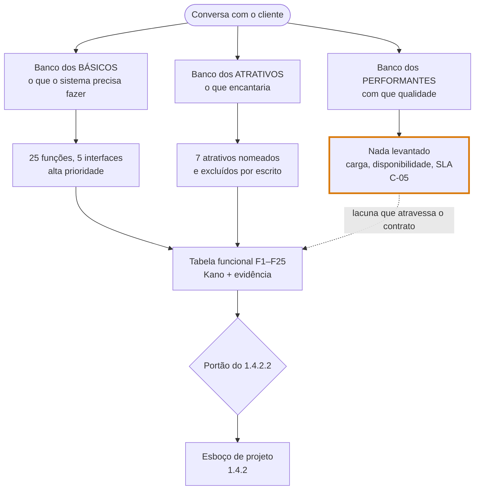

## 1.3 Levantamento de requisitos

Tomamos como base para o levantamento de requisitos o modelo Kano. O **Modelo Kano** é uma técnica de priorização de requisitos criada por Noriaki Kano na década de 1980 que divide os requisitos em três grupos: *básicos*, *performance/desempenho* e *atrativos*. A ideia é que diferentes requisitos impactam a satisfação do cliente de maneiras diferentes e devem ser priorizados de acordo.

*Figura 1 — Gráfico demonstrando o impacto dos requisitos, em sua execução, na satisfação do cliente.*

Os três grupos podem ser definidos da seguinte maneira:

1. **Requisitos Básicos:** funcionalidades que o usuário naturalmente espera do sistema, muitas vezes esquecendo de comentar sobre. Se estiverem presentes, não causam surpresa (“faz apenas a obrigação”), mas que se estiverem ausentes geram muita insatisfação.

2. **Requisitos Performantes:** características cuja qualidade ou nível de execução influencia diretamente a satisfação do usuário. Quanto melhor o desempenho percebido, maior tende a ser a satisfação.

3. **Requisitos Atrativos:** requisitos não esperados pelo usuário, mas que caso estejam presentes geram satisfação significativa. Sua ausência não causa insatisfação.

Delineamos exemplos das três categorias, para dois contextos diferentes.

| Tipo/Sistema | Gerenciamento de Estoque | Plataforma de Cursos Online |
| :----------- | :----------------------------- | :-------------------------------- |
| **Básico** | Deve ser possível cadastrar produtos.  | O sistema de login deve funcionar corretamente. |
| **Performante** | Os relatórios devem ser de alta qualidade | Os cursos devem carregar rapidamente |
| **Atrativo** | Deve haver uma previsão automática de falta de estoque baseada em padrões de uso. | Uma IA deve ser capaz de sumarizar o conteúdo das últimas semanas e criar questionários personalizados. |

Abaixo, deixamos também exemplos de perguntas que podem auxiliar a extrair esses requisitos:

**Requisitos Básicos (Foco: funcionalidade, fluxo e metas):**

**\>** *O sistema precisa fazer isso MUITO bem*

| Contexto de Negócio e Dores | Quais problemas específicos, gargalos e ineficiências esta solução deve resolver hoje? Qual é o processo atual? Como vocês realizam essa tarefa sem o sistema novo? Quais dados o sistema deve receber/processar, de onde eles vêm, e quais resultados exatos deve entregar? O cliente conhece algum outro software que faz algo parecido com o que ele deseja? Qual? |
| :---------------: | :--------------------------------------------------------- |
| **Funcionalidades Essenciais** | Quais funções ou telas você considera absolutamente essenciais para que o trabalho de um dia típico seja concluído? Existem regras de negócio específicas, fórmulas de cálculo ou critérios de aprovação que o sistema precisa aplicar automaticamente? Como você caracterizaria uma "boa" saída ou resultado gerado pelo sistema? Quais informações compõem um relatório ou dashboard ideal? |
| **Perfis de Usuário** | Quais são os diferentes tipos de usuários (ex: administrador, cliente final, gerente) e o que cada um deve ser capaz de fazer no sistema? |

**Requisitos Performantes (Foco: qualidade, restrições, infraestrutura):**  
**\>** *O cliente raramente lembra de mencionar isso. O papel do consultor e do setor comercial é arrancar essas informações.*

| Disponibilidade e Desempenho | O que aconteceria com a operação da empresa se o sistema ficasse indisponível por 10 minutos? E por 4 horas? (Ajuda a definir políticas de SLA e Backups). Qual é o volume de dados esperado? Quantos usuários simultâneos o sistema deve suportar no momento de pico de acesso? |
| :---------------: | :--------------------------------------------------------- |
| **Segurança e Conformidade** | Quem mais terá acesso aos dados no banco de dados e que tipo de informação (ex: dados financeiros, dados pessoais de clientes) é sensível e precisa ter o acesso restrito? Existem políticas internas de auditoria ou leis governamentais (como LGPD) que precisamos seguir estritamente na retenção e proteção destes dados? |
| **Ecossistema e Compatibilidade** | O sistema precisará funcionar em algum dispositivo específico ou ambiente de rede restrito que vocês já utilizam? (Ex: computadores legados, tablets em chão de fábrica). Com quais outros softwares o nosso sistema precisará "conversar" (integrações via API, exportação de CSV para o ERP atual, etc.)? Quais aspectos do seu processo atual você considera 'óbvios' e que não podem faltar de jeito nenhum, mesmo que você não tenha mencionado até agora? |

**Requisitos Atrativos (Foco: Inovação, Escala e Valor Agregado):**  
**\>** *Entregar o diferencial da empresa, com foco na experiência do usuário, para brilhar os olhos do cliente.*

| Eficiência e Automatização | Se pudéssemos automatizar qualquer parte do seu trabalho que hoje é tediosa, manual ou que toma muito tempo da equipe, qual seria? Existe alguma funcionalidade que você viu em outro sistema, aplicativo do dia a dia ou mesmo na concorrência e pensou: "seria incrível ter isso"? |
| :----------------: | :-------------------------------------------------------- |
| **Experiência do Usuário (UX)** | O que tornaria o uso diário deste sistema genuinamente "prazeroso", intuitivo ou "surpreendente" para a sua equipe? Se o usuário pudesse acessar este sistema pelo celular enquanto está sem acesso à internet no transporte ou em campo, como isso mudaria a operação? |
| **Visão de Futuro** | Se o orçamento e o tempo de desenvolvimento não fossem um problema, o que você pediria para ter no sistema que hoje parece impossível ou cena de filme? Como você imagina que o volume de dados ou os processos dessa empresa estarão daqui a 3 anos, e como este software pode estar preparado para esse crescimento? |

**Priorização:** dados os impactos dos requisitos na satisfação dos clientes, abordados anteriormente, considera-se que os requisitos básicos prevaleçam sobre os requisitos performantes e estes sobre os atrativos, de forma que:

Requisito Básico           		→  		Alta Prioridade  
	Requisito Performante 		→ 		Média Prioridade  
Requisito Atrativo          		→ 		Baixa Prioridade

Obviamente, fica a cargo da equipe a classificação detalhada.  

---

### Exemplo prático: o levantamento de requisitos do Impacto Ambiental

As perguntas acima são genéricas de propósito — servem para qualquer projeto. Este tópico mostra
**os três bancos aplicados a um caso real**, com as respostas que saíram e os requisitos que
nasceram delas. Use como modelo da saída esperada desta etapa.

O caso é o **Impacto Ambiental**: plataforma de incentivo à reciclagem, em que o usuário leva
material a um ecoponto, recebe pontos pelo que entregou e troca esses pontos por cupons de empresas
parceiras.

> **O que este exemplo é.** Uma **reconstrução**. Os documentos do projeto são o Orçamento
> (**ORÇ**) e a Apresentação (**APR**), ambos de 18/08/2026, mais definições acordadas depois do
> aceite (**DEF**, 21/08/2026). **Não existe, nos registros, uma lista de requisitos classificada
> por Kano.** O exemplo mostra o que o levantamento teria produzido — e, no fim, liga os problemas
> documentados do projeto às perguntas que não chegaram a ser feitas.
>
> É por isso que ele ensina bem: **dois dos três eixos foram bem cobertos, e o terceiro ficou
> vazio.**

---

#### Passo 1 — O insumo bruto, antes de qualquer pergunta

O que o cliente trouxe, na linguagem dele:

> *“Um sistema para incentivar a reciclagem, permitindo o registro de materiais recicláveis
> coletados em ecopontos, a conversão das coletas em pontos e a troca dos pontos acumulados por
> benefícios — cupons de empresas parceiras.”*

E quatro perfis de gente envolvida: **usuário**, **atendente do ecoponto**, **funcionário de
empresa parceira** e **administrador**.

Isso é o ponto de partida — não é o levantamento. É o que existe *antes* de aplicar os bancos de
perguntas.

---

#### Passo 2 — Banco dos básicos, aplicado

Foco em funcionalidade, fluxo e metas. O que o sistema **precisa fazer muito bem**:

| Pergunta do banco de básicos | Resposta obtida | Requisito que nasce |
| :------------------------------------------- | :------------------------------------------ | :------------------- |
| Que problema esta solução resolve hoje? | As pessoas não têm incentivo para levar recicláveis ao ecoponto | O sistema precisa converter entrega em benefício percebido |
| Qual é o processo atual, sem o sistema? | O material é recebido no ecoponto sem registro individual, e nada volta para quem entregou | Registro de coleta por usuário identificado |
| Quais são os tipos de usuário e o que cada um faz? | Usuário, atendente, empresa parceira e administrador | **Quatro perfis, quatro interfaces** |
| Quais funções são essenciais num dia típico? | Entregar material e ver os pontos entrarem; registrar a coleta no ecoponto; resgatar cupom | Registro de coleta, saldo, catálogo e resgate |
| Que regras de negócio o sistema aplica sozinho? | Pontos por quantidade pesada, **por material**, segundo a campanha vigente | Regra de conversão parametrizável |
| Que dados o sistema recebe e que resultado entrega? | Recebe material e quantidade; entrega pontos e, depois, um cupom | Fluxo coleta → pontos → cupom |
| Que informações compõem o painel ideal? | Operação por ecoponto, empresas cadastradas, usuários | Painel do Administrador |

**Resultado deste banco:** 25 funções distribuídas em 5 interfaces — a Área do Cliente, o Painel do
Atendente, o Painel de Empresas, o Painel do Administrador e a Página Institucional. É a espinha do
projeto, e foi bem levantada.

> **Repare no que a pergunta dos perfis produziu.** Ela é a única do banco que obriga a nomear o
> **administrador**. Quem opera o back-office quase nunca aparece espontaneamente na fala do
> cliente, porque ele descreve o produto pela ótica de quem o usa por fora.

---

#### Passo 3 — Banco dos performantes: o eixo que ficou vazio

Foco em qualidade, restrições e infraestrutura. O `1.3` avisa, no cabeçalho deste banco, que *“o
cliente raramente lembra de mencionar isso — o papel do consultor e do setor comercial é arrancar
essas informações”*. **Neste projeto, não foi arrancado.**

| Pergunta do banco de performantes | Foi feita? | Consequência |
| :--------------------------------------------- | :--------- | :----------------------------- |
| Qual o volume esperado? Quantos usuários simultâneos no pico? | **Não** | O número existia — 500.000 usuários mensais — mas apareceu **só** para estimar o custo de hospedagem (US$ 40 a US$ 150). Nunca virou requisito → `C-05` |
| O que acontece se o sistema cair por 10 minutos? E por 4 horas? | **Não** | Nenhum requisito de disponibilidade, nenhum SLA, nenhuma política de backup |
| Quem acessa os dados? O que é sensível? LGPD? | **Não** | A segregação por perfil e o hash de senhas existem (`RNF-04`, `RNF-05`, `RNF-06`) — mas como `[DER]`: **a IDE deduziu, o cliente não pediu** |
| Precisa funcionar em algum dispositivo ou ambiente específico? | **Não** | A responsividade (`RNF-02`) também é `[DER]` |
| Com quais outros softwares o sistema precisa conversar? | **Não** | Virou exclusão (`RE-12`) em vez de requisito levantado |

**O achado mais importante deste exemplo está na primeira linha.** O número `500.000` estava no
orçamento — escrito, aceito, assinado. Ele só não estava no lugar certo: entrou como **parâmetro de
custo**, não como **requisito de carga**. A Proposta Formal precisou registrar explicitamente que
aquele número *“não constitui meta de desempenho, capacidade contratada, compromisso de
disponibilidade ou nível de serviço”*.

> **A lição operacional:** um número dito pelo cliente não vira requisito sozinho. Ele vira
> requisito quando alguém pergunta *“e o que o sistema precisa aguentar, então?”*. Sem essa
> pergunta, o número fica no documento parecendo compromisso e não sendo nenhum.

E note a diferença entre `[DOC]` e `[DER]` nas linhas 3 e 4: ter o requisito não é a mesma coisa que
tê-lo **levantado**. Um `RNF` que a IDE deduziu sozinha é uma aposta — bem-intencionada, mas uma
aposta, e o cliente pode discordar dela depois da assinatura.

---

#### Passo 4 — Banco dos atrativos: onde o projeto acertou

Foco em inovação, escala e valor agregado. Aqui o levantamento funcionou — e o resultado talvez
seja contraintuitivo:

| Pergunta do banco de atrativos | O que apareceu | Virou |
| :------------------------------------------ | :---------------------------- | :------ |
| Se pudéssemos automatizar algo tedioso, o que seria? | Leitura automática do peso por balança integrada | `RE-02` |
| Viu algo em outro sistema e pensou “seria incrível ter”? | Identificação por QR code, cartão ou crachá | `RE-18` |
| | Ranking, medalhas, metas, desafios | `RE-14` |
| | Aplicativo móvel instalável | `RE-01` |
| Se orçamento e tempo não fossem problema? | Reconhecimento do material por imagem, com IA | `RE-19` |
| | Painel público de impacto ambiental agregado | `RE-22` |
| | Portal para catadores e cooperativas, com roteirização | `RE-21` |

**Sete atrativos identificados, sete atrativos excluídos.** E isso é um **bom** resultado, não um
mau: o atrativo é, por definição, aquilo cuja ausência não gera insatisfação. Nomeá-lo e deixá-lo
de fora **por escrito** é o que impede que ele volte no meio do projeto como “mas eu achei que
tinha”.

> **Este banco não existe para inchar o escopo.** Ele existe para descobrir o que o cliente sonha,
> decidir conscientemente o que fica de fora, e transformar esse sonho na **próxima proposta** — em
> vez de em uma discussão desconfortável na entrega. Boa parte das 31 exclusões contratuais do
> projeto nasce daqui.

---

#### Passo 5 — A classificação Kano do projeto

O mesmo formato de três linhas usado no início da seção, agora preenchido:

| Tipo | Impacto Ambiental |
| :--------------- | :-------------------------------------------------------------------- |
| **Básico** | Registrar a coleta e creditar os pontos corretamente; o login funcionar; o saldo bater com o histórico |
| **Performante** | Rapidez do registro no balcão do ecoponto; o mapa achar o ecoponto certo; o sistema aguentar o pico de movimento — **nunca levantado** |
| **Atrativo** | Reconhecer o material por imagem; ranking entre usuários; painel público de impacto ambiental — **excluídos** |

**A linha do meio é o retrato do problema.** Ela não está vazia porque o projeto não tinha
requisitos performantes; está vazia porque ninguém perguntou por eles.

---

#### Passo 6 — Priorizar e marcar a evidência

A prioridade sai direto da classificação — básico sobre performante, performante sobre atrativo.
Mas priorizar não basta: cada requisito também carrega **de onde ele veio**, na convenção que a
análise comercial usa logo em seguida:

| Tag | Significa | No Impacto Ambiental |
| :-------- | :----------------------------------------- | :---------------------------- |
| `[DOC]` | O cliente disse — está no registro | Os 25 itens funcionais do orçamento |
| `[INFER]` | A IDE deduziu; **precisa confirmação** | `RNF-02`, `RNF-04`, `RNF-05`, `RNF-06` |
| `[GAP]` | Indefinido e relevante para o preço | Carga e desempenho (`C-05`); quem paga o provedor de mapas (`C-01`) |

**Um requisito sem tag é um requisito sem dono.** Quando `[DOC]` e `[INFER]` se misturam numa lista
só, uma dedução da IDE passa a parecer pedido do cliente — e ninguém percebe até alguém cobrar a
entrega dela.

---

#### Passo 7 — O que este levantamento entrega para a próxima etapa

O produto do `1.3` é a **tabela funcional**, e ela é exatamente o que o `1.4.2.2` exige como portão
de entrada para o esboço:

| Coluna | Conteúdo |
| :------------ | :-------------------------------------------------- |
| Id | `F1` … `F25` |
| Função | No vocabulário do cliente, não no técnico |
| Ator | Usuário, Atendente, Empresa parceira ou Administrador |
| Kano | Básico, Performante ou Atrativo |
| Evidência | `[DOC]`, `[INFER]` ou `[GAP]` |

Sem essa tabela fechada, **o esboço do `1.4.2` não começa** — e o exemplo completo de como ela é
usada está no tópico final daquela seção.

---

#### O placar deste levantamento

| Eixo Kano | Cobertura | Efeito no projeto |
| :--------------- | :----------- | :--------------------------------------------------- |
| **Básico** | Boa | As 25 funções viraram 35 requisitos contratuais coerentes |
| **Performante** | **Nenhuma** | `C-05` — sem requisito de carga; e o `500.000` do orçamento parecendo compromisso sem ser |
| **Atrativo** | Boa | 7 atrativos nomeados e excluídos, alimentando as 31 exclusões |

**Dois de três.** O eixo que faltou não derrubou o projeto, mas deixou uma pendência aberta que
atravessou a assinatura — e requisitos não funcionais que são dedução da IDE, não declaração do
cliente.

> **O que o membro leva deste exemplo:** o banco dos básicos é o fácil, porque o cliente fala dele
> sozinho. O banco dos atrativos é o divertido, e rende a próxima proposta. **O banco dos
> performantes é o que ninguém faz, e é o único cujo esquecimento você só descobre depois da
> assinatura.** Se a segunda reunião tiver tempo para um só, faça esse.
