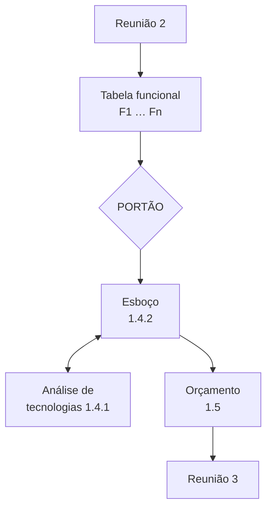
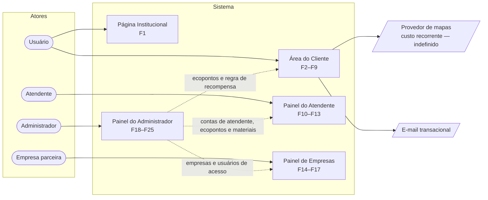
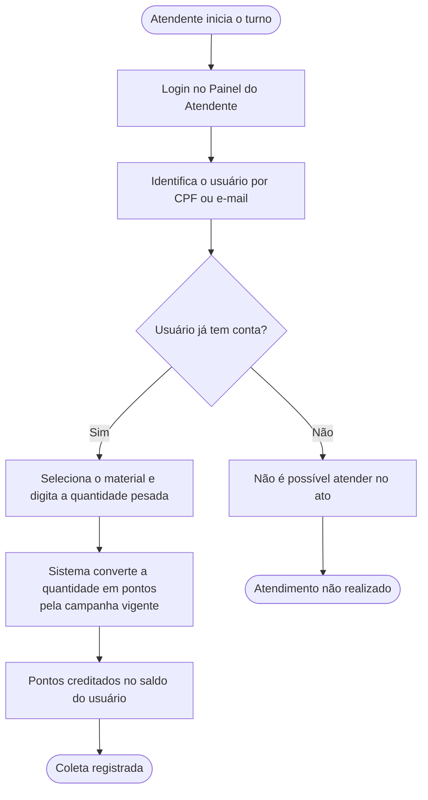
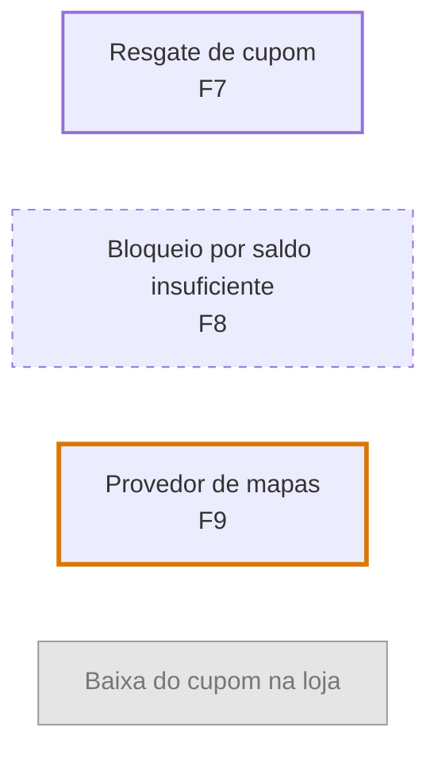
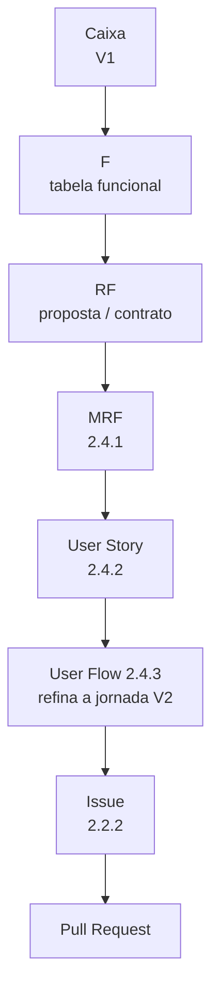
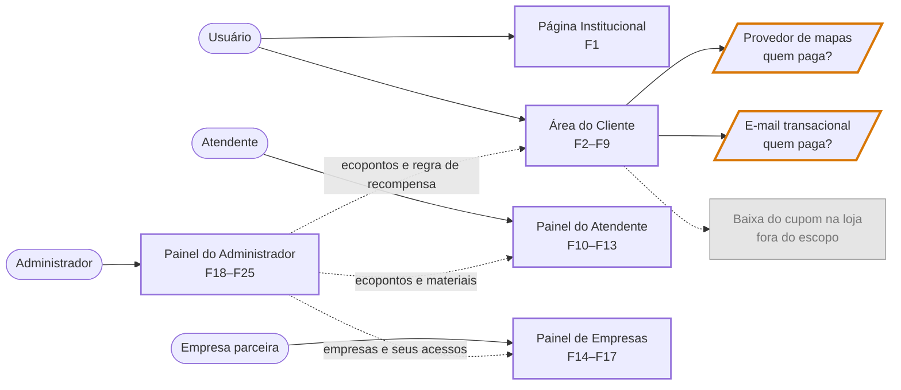
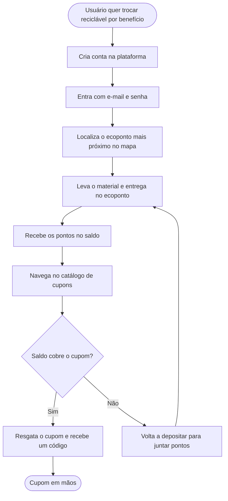
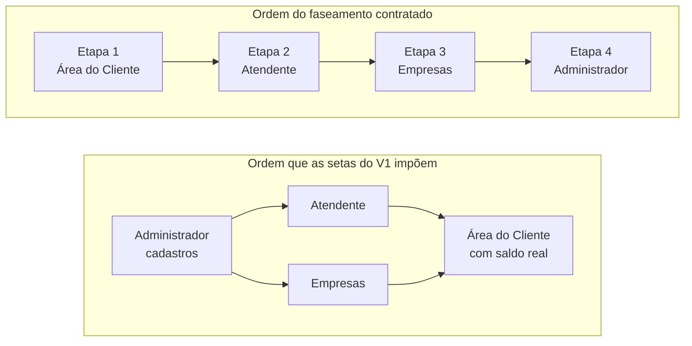

### 1.4.2 Esboço de projeto: “Diagrama de caixinhas”

> **Status:** seção de **propriedade conjunta** Comercial × Projetos (ver `1.4`).
> Onde este texto propõe algo que ainda não é prática consolidada da IDE, isso está dito
> explicitamente. Números de tempo (`§1.4.2.3`) são **proposta a calibrar**, não medição.

---

#### Por que esta seção existe

O objetivo declarado do capítulo 1 é *“remover o gargalo de comunicação entre o que o cliente pede
e o que o desenvolvedor entende”*. O esboço de projeto é o artefato que faz isso de forma visível:
é onde o escopo deixa de ser uma lista de frases e passa a ser um **mapa que as duas partes
conseguem olhar ao mesmo tempo**.

O custo de não ter essa etapa padronizada não é hipotético. O contrato **Impacto Ambiental**
(orçamento aceito em 18/08/2026, R$ 38.500,00, 35 requisitos funcionais) chegou à Proposta Formal
com quatro problemas que um mapa de caixinhas desenhado **antes do preço** teria exposto:

| # | O que aconteceu | Evidência |
| :---: | :------------------------------------------------------- | :-------------- |
| 1 | **10 dos 35 requisitos funcionais (~29%) não estavam no orçamento aceito** — 8 `[DER]` (derivados por necessidade técnica, incluídos sem acréscimo de valor) e 2 `[DEF]` (decididos após o aceite). Entre eles: o login de um ator inteiro (`RF-ADM-01`), recuperação de senha (`RF-USR-03`), logout (`RF-USR-04`) e quatro cadastros administrativos. | Proposta Formal §13 |
| 2 | **O faseamento inverteu uma dependência.** `RF-ADM-07/08/09/10` estão na Etapa 4, mas são pré-requisito operacional das Etapas 2 e 3 — `RF-ADM-09` provisiona exatamente as contas que `RF-EMP-01` autentica. A solução registrada foi “carga técnica”: trabalho manual não previsto e não precificado. | Proposta Formal §9.2 |
| 3 | **A apresentação prometeu mais do que o orçamento precificou** — autocadastro de empresas e gestão de usuários pelo lojista. Resolvido em favor do orçamento e convertido em duas exclusões contra a expectativa do cliente. | `RE-03`, `RE-04` |
| 4 | **8 pendências continuaram abertas na assinatura** (`C-01`…`C-08`), incluindo um item expressamente orçado, aceito e depois retirado, com o preço da etapa (R$ 9.625,00) não reconciliado. | `RE-26` / `C-08` |

Nenhum desses quatro é erro de programação. Todos os quatro são **erros de mapa**.

---

#### 1.4.2.1 O que é o esboço

O esboço de projeto é o **farol** do projeto. Ele tem dois leitores e três funções.

**Dois leitores:**

* **A IDE** — é o guia dos próximos passos e a trava contra divergir do escopo combinado.
* **O cliente** — é o que torna a proposta compreensível para quem não lê especificação de
  software.

**Três funções:**

1. **Mapa de próximos passos.** Depois de assinado, Projetos não começa do zero: as caixas viram
   linhas da Matriz de Requisitos Funcionais (`2.4.1`).
2. **Trava de escopo.** O que não tem caixa não tem requisito; o que não tem requisito não entra
   em sprint, entra em termo aditivo.
3. **Elucidação comercial.** Em projetos grandes, um mapa bem-feito demonstra o caráter formal da
   IDE de um jeito que texto não demonstra — e é o insumo que permite dividir a entrega em etapas
   e sprints.

**E o que ele não é.** É um **esboço**, não uma especificação. A regra é *apegar-se à ideia e ao
esboço para ser útil, não estar corretíssimo na formalidade*. Isso não é licença para ser vago: é
uma decisão de **onde parar**, e essa decisão está escrita como regra em `§1.4.2.6`. Um esboço que
tentou ser especificação queimou horas de pré-venda não pagas e enviesou a arquitetura antes da
hora; um esboço que não chegou ao nível da tela não serve para estimar nada.

---

#### 1.4.2.2 Quando fazer: o portão de entrada

> **Regra dura: o esboço só é desenhado depois da extração do escopo, de forma estruturada e
> completa.** Desenhar antes disso produz um mapa do sistema que a dupla imaginou, não do sistema
> que o cliente descreveu.

“Estruturada e completa” precisa ser verificável, senão vira opinião. O critério proposto reutiliza
o template que já existe no processo — a **tabela funcional** do método de análise — em vez de criar artefato novo:

**Portão de entrada — só passa se as cinco linhas estiverem verdadeiras:**

- [ ] Toda capacidade tem **id estável** (`F1`, `F2`, …).
- [ ] Toda capacidade tem **classificação Kano** (básico / performante / atrativo, `1.3`).
- [ ] Toda capacidade tem **tag de evidência**: `[DOC]` (o cliente disse), `[INFER]` (nós
      deduzimos), `[GAP]` (indefinido e relevante).
- [ ] O **back-office está na tabela** — se alguém precisa revisar, aprovar, cadastrar ou moderar
      algo, a ferramenta dessa pessoa é uma capacidade, não um detalhe.
- [ ] **Nenhum `[GAP]` está em cima de uma fronteira de módulo.** Gap dentro de uma tela é normal e
      vira pergunta. Gap que decide *se um painel inteiro existe* trava o esboço — resolva por
      e-mail antes de desenhar.

**Posição no pipeline:**



O `1.4` já avisa que `1.4.1` e `1.4.2` têm dependência recursiva e podem ocorrer misturados —
**é o comportamento esperado**: uma caixa muda a tecnologia, a tecnologia muda o desenho da caixa.
Continuam sendo dois relatórios distintos.

---

#### 1.4.2.3 Quem faz, como e em quanto tempo

**Quem:** a **dupla comercial × projetos**, em sessão conjunta, conforme `1.4`.

**Por que Projetos tem que estar na sala, e não apenas revisar depois:** a caixa é a **unidade de
estimativa**. O modelo de capacidade estima *por módulo, uma linha cada* — se as caixas foram
desenhadas por quem não vai construir, a estimativa é feita sobre uma divisão que não corresponde
ao trabalho real.

**Como:** ao vivo, desenhando junto, o Comercial narrando o que o cliente disse e Projetos
perguntando “isso é uma tela ou é um sistema?”. O `1.4` sugere emendar essa sessão logo após a
segunda reunião, enquanto a conversa está fresca. É a recomendação certa.

**Tempo — proposta a calibrar após dois projetos:**

| Porte | Referência | Sessão proposta | Camadas |
| :---------- | :-------------------------- | :---------------- | :-------------------- |
| Pequeno | Site institucional, 1 ator | ~1 h | V1 mínimo + fichas de tela |
| Padrão | 2–3 módulos, 2 atores | ~2 h | V1 + V2 + fichas |
| Grande | 4+ módulos, 3+ atores (porte Impacto Ambiental) | 2 sessões de ~2 h | V1 + V2 por ator + fichas |

**Projeto pequeno com a segunda reunião pulada** (atalho do `1.1`): o esboço não desaparece, ele
encolhe. V1 vira uma caixa e o esforço vai para o **MVP/mockup**, que o Manual já recomenda por
aumentar a taxa de fechamento. As **fichas de tela** (`§1.4.2.4.3`) continuam valendo a pena: são elas
que permitem estimar.

---

#### 1.4.2.4 As três camadas

O esboço desce em três altitudes. Cada uma responde uma pergunta diferente, e é normal que a
terceira só seja feita para parte das telas.

##### 1.4.2.4.1 V1 — Mapa de módulos e atores (“as caixinhas”)

**Pergunta:** *quantos produtos nós estamos construindo, e quem usa cada um?*

Esta é a camada que as pessoas costumam chamar de “diagrama de casos de uso”. Uma observação
importante de coerência interna: **a IDE não usa o Diagrama de Casos de Uso da UML** — o `2.4`
substitui esse diagrama pelos três pilares (MRF, User Stories, User Flow). O V1 entrega a *leitura*
que se espera de um caso de uso (quem é o ator, o que ele alcança) **sem ser** um diagrama UML de
casos de uso, e sem duplicar nada do capítulo 2.

**Regras do V1:**

1. **Toda caixa tem um ator.** Caixa sem ator é caixa esquecida — e a caixa que mais se esquece é
   a do administrador.
2. **Conte interfaces, não funcionalidades.** Dois perfis de usuário mais um back-office são
   **três produtos**. É o número que mais muda a percepção de tamanho do cliente — e o seu.
3. **O back-office é um produto, não um apêndice.** Se um humano precisa cadastrar, aprovar,
   revisar ou moderar algo, a ferramenta dele é caixa com preço.
4. **Setas de dependência são obrigatórias.** Se o módulo B não funciona sem um cadastro que mora
   no módulo A, desenhe a seta. É aqui que faseamento errado aparece antes de virar contrato.
5. **Dependências externas entram como caixa** (provedor de mapas, serviço de e-mail, gateway).
   Toda caixa externa carrega a pergunta: **quem paga e em nome de quem está a conta?**
6. **Nome de caixa é vocabulário do cliente**, não nome técnico. “Painel do Atendente”, não
   “módulo operacional”.

**Exemplo — V1 do Impacto Ambiental:**



**O que esse desenho diz em dez segundos, e que o orçamento não disse:**

* São **cinco produtos**, não “um sistema”.
* **Três setas saem do Painel do Administrador para os outros módulos.** Ele não é a última etapa:
  ele é pré-requisito das outras. Qualquer faseamento que o coloque por último cria trabalho manual
  não previsto — foi exatamente o que aconteceu.
* Existem **duas dependências externas com custo recorrente** e nenhuma delas tinha dono definido
  no momento do orçamento (`C-01`).

##### 1.4.2.4.2 V2 — Jornada do usuário (alto nível)

**Pergunta:** *o que essa pessoa faz, do início ao fim, para conseguir o que ela quer?*

Uma jornada **por ator**, caminho feliz, entre 5 e 9 caixas. Usa **exatamente o mesmo vocabulário
Mermaid do `2.4.3`** — `([pílula])` para início/fim, `[retângulo]` para tela/ação, `{losango}` para
decisão — para que o User Flow do capítulo 2 seja um **refinamento** desta jornada, e não um
desenho novo.

> **Regra do losango pré-contratual:** desenhe uma decisão **apenas quando os dois caminhos
> implicam módulos diferentes ou trabalho diferente**. Decisão que só muda mensagem, validação ou
> estado de tela é assunto do `2.3.8` e do `2.4.3` — durante o contrato.

**Exemplo — jornada do Atendente (Impacto Ambiental):**



**Por que esse losango específico vale ouro.** Ele obriga a pergunta *“e se o usuário não tiver
conta?”*. No Impacto Ambiental essa pergunta tinha resposta no orçamento — havia um item pago para
o atendente cadastrar o usuário no ecoponto — e esse item foi **retirado depois do aceite**
(`RE-26`), sem reconciliar o preço da etapa (`C-08`). O ramo “Não” é uma **consequência
operacional real**: o usuário precisa ter conta *antes* de ir ao ecoponto. Desenhar a jornada
força essa conversa com o cliente enquanto ela ainda é barata.

##### 1.4.2.4.3 V3 — Esboço da lógica de cada tela (“ficha de tela”)

**Pergunta:** *o que essa tela precisa para existir?* É aqui que o esboço **quebra nas partes mais
técnicas** — e é o que torna uma caixa estimável.

Não é wireframe. É meia página por tela, no seguinte formato:

| Campo | Conteúdo |
| :--------------------- | :--------------------------------------------------- |
| **Tela** | Registro de coleta |
| **Caixa (V1)** | Painel do Atendente |
| **Requisitos** | `F10`, `F11`, `F12` (viram `RF-ATD-02/03/04/05`) |
| **O que o usuário vê** | Busca de usuário; lista de materiais aceitos; campo de quantidade; pontos resultantes |
| **O que ele faz** | Digita CPF ou e-mail → confirma o usuário → escolhe o material → digita a quantidade pesada → confirma |
| **De onde vem o dado** | Usuários (autocadastro); materiais aceitos (**cadastro do administrador**); regra de conversão (**campanha vigente**) |
| **O que exige do sistema** | Busca por dois campos distintos; tabela de materiais parametrizável; regra de conversão configurável; escrita no saldo de pontos |
| **Depende de** | Cadastro de materiais e campanha vigente **precisam existir antes** desta tela funcionar |
| **Fora desta tela** | Leitura automática de peso; identificação por QR code; cadastro de usuário pelo atendente |

**Faça ficha para:** telas com regra de negócio, cálculo, permissão, dinheiro ou pontos; e para
toda tela que a dupla não consegue estimar olhando só para o V1.
**Não faça ficha para:** telas de listagem simples, páginas institucionais estáticas, login padrão.

Repare no que a linha **“Fora desta tela”** produziu: os três itens viraram `RE-02`, `RE-18` e
`RE-26` na Proposta Formal. **A lista de exclusões nasce aqui**, de graça, durante o desenho — não
depois, sob pressão, quando o cliente já criou expectativa.

---

#### 1.4.2.5 Convenções visuais

O esboço carrega a mesma disciplina de evidência da análise, de forma visível:

| Convenção | Significa | Mermaid |
| :------------------ | :-------------------------------- | :---------------------- |
| Borda contínua | `[DOC]` — o cliente disse | padrão |
| **Borda tracejada** | `[INFER]` — nós deduzimos; **precisa confirmação** | `stroke-dasharray: 5 5` |
| Borda destacada | `[GAP]` — indefinido e relevante para o preço | `stroke-width:3px` |
| **Cinza** | **Fora de escopo** — mostrado de propósito | preenchimento neutro |



**Duas consequências práticas, e são o motivo da convenção existir:**

* **Toda caixa tracejada é uma pergunta da terceira reunião.** *“Entendemos que o sistema deve
  bloquear o resgate quando o saldo não cobre o cupom — confere?”* Confirmado, vira `[DOC]` antes
  da assinatura. É a redução de risco mais barata disponível no processo inteiro. No Impacto
  Ambiental, `RF-USR-08` (esse mesmo bloqueio) entrou como `[DER]`: ninguém tinha perguntado.
* **Toda caixa cinza é escopo negativo já registrado.** `Won't Have` não é lixeira — é o registro
  escrito do que foi excluído, e a semente da próxima proposta.

**Ferramenta:** Mermaid, editável em `mermaid.live`, com o código-fonte versionado junto aos
documentos do projeto. O `2.4` já padroniza Mermaid para User Flow e Diagrama de Classes — usar o
mesmo formato aqui sai de graça e faz o desenho pré-contratual sobreviver à rotatividade, porque
diagrama que é texto entra no repositório e diagrama que é imagem não.

---

#### 1.4.2.6 Onde o esboço para

Esta seção é a tradução de *“não se apegar à formalidade”* em regra verificável.

**O esboço NÃO contém:**

| Não entra | Onde isso mora |
| :------------------------------------------ | :------------------------------ |
| Design visual, cor, tipografia, layout | `2.3` — durante contrato |
| Modelo de dados, entidades, diagrama de classes | `2.4.4` — durante contrato |
| Estados de carregamento, vazio, erro, confirmação | `2.3.8` — durante contrato |
| Ramificação por cenário de critério de aceite | `2.4.3` — durante contrato |
| Critérios de aceite em BDD | `2.4.2` — durante contrato |
| Nomes técnicos, tabelas, endpoints | capítulo 2 inteiro |

**O teste da caixa — as duas perguntas que decidem o tamanho certo:**

> 1. **Projetos consegue estimar essa caixa em sprints?** Se não, ela está grossa demais: quebre.
> 2. **Comercial consegue explicar essa caixa ao cliente em uma frase?** Se não, ela está fina
>    demais ou técnica demais: funda com a vizinha ou renomeie.

Uma caixa que passa nas duas está do tamanho certo. Uma caixa que falha nas duas geralmente não é
uma caixa — é um módulo disfarçado ou um detalhe de implementação.

O `2.4.4` já registra o princípio para o Diagrama de Classes, e ele vale igual aqui: **modele a
arquitetura e o fluxo principal, não superdetalhe** — detalhe excessivo vira viés e burocracia na
implementação. No pré-contrato o custo é ainda maior, porque essas horas **não são pagas**.

---

#### 1.4.2.7 Do esboço ao orçamento e às etapas

O esboço é o que torna possível dividir o projeto. A conversão é direta:

```
caixa do V1  →  linha do modelo de capacidade (squad-sprints)  →  candidata a etapa/entrega
```

**Três testes antes de fechar o faseamento:**

1. **Teste de independência.** Para cada etapa: *“se o cliente parar aqui, o que ele tem e isso é
   utilizável?”* Toda etapa precisa responder que sim. Se uma não responde, **a divisão está
   errada — conserte a divisão**, não a explicação.
2. **Teste de dependência.** Siga as setas do V1. **Ordene as etapas por dependência, não por
   entusiasmo do cliente.** No Impacto Ambiental as setas apontam do Painel do Administrador para
   os Painéis do Atendente e de Empresas, e mesmo assim o administrador ficou na Etapa 4 — as
   Etapas 2 e 3 passaram a depender de “carga técnica” manual para funcionar.
3. **Teste de conciliação.** Antes de montar a apresentação, confira as três listas lado a lado:

   | Caixa do V1 | Id `F` na tabela funcional | Linha no orçamento |
| :------------------- | :---------------------------- | :------------------------- |

   **As três colunas têm que fechar.** Caixa sem linha de preço é escopo não pago. Linha de preço
   sem caixa é promessa sem desenho. E quando um item precificado sai do escopo, **o preço da
   etapa tem que ser reconciliado explicitamente** — foi essa conciliação que faltou em `C-08`,
   onde a Etapa 2 permaneceu em R$ 9.625,00 com escopo reduzido.

---

#### 1.4.2.8 O esboço na terceira reunião

O esboço vai para a apresentação **antes do preço** — o preço é sempre o último assunto (`1.1`).

**Mostre:** o V1 completo, as jornadas (V2) dos atores principais e as caixas cinzas de exclusão.
**Não mostre:** fichas de tela (V3). Elas são insumo interno de estimativa; em reunião, viram
discussão de detalhe antes da hora.

**Duas regras que evitam o erro mais caro desta etapa:**

> **Regra 1 — toda caixa exibida ao cliente corresponde a uma linha precificada.**
> Se aparece no slide, está no orçamento. Se não está no orçamento, aparece **em cinza**, marcada
> como fora do escopo.
>
> **Regra 2 — o esboço ilustra o escopo; ele não define o escopo.**
> A definição contratual é a **lista enumerada de requisitos**. Em caso de divergência entre o
> desenho e a lista, **prevalece a lista**. Diga isso na reunião e registre no documento.

A Regra 1 é a correção direta de `RE-03` e `RE-04`: a apresentação descreveu autocadastro de
empresas e gestão de usuários pelo lojista, o orçamento não previa nenhum dos dois, e a divergência
foi resolvida meses depois **contra a expectativa do cliente**. Uma caixa cinza na apresentação —
*“gestão de usuários pelo próprio lojista: fora desta proposta”* — teria custado uma frase.

**Enquadramento ao apresentar:** *“este é o mapa do que vamos construir, no nível de módulos e
jornadas. Não é o design das telas — o design é feito com vocês na primeira fase do projeto.”*
O desenho é deliberadamente esquemático (sem cor, sem layout) **justamente para não ser lido como
promessa visual**. Essa é a diferença entre o esboço e o mockup do atalho de projeto pequeno: o
mockup existe para o cliente imaginar o produto; o esboço existe para as duas partes concordarem
sobre o tamanho dele.

---

#### 1.4.2.9 Riscos e gargalos

| Risco | Como se manifesta | Mitigação |
| :---------------- | :----------------------------- | :--------------------------- |
| **Detalhamento excessivo** | A dupla gasta dias desenhando; vira um pré-projeto não pago e enviesa a arquitetura antes do capítulo 2 | Regras de parada (`§1.4.2.6`) + time-box (`§1.4.2.3`) + teste da caixa |
| **Cliente lê como promessa de design** | *“mas na apresentação essa tela tinha o campo X”* | Estilo esquemático; enquadramento da Regra 2 (`§1.4.2.8`); design é `2.3`, durante contrato |
| **Esboço diverge do orçamento** | Caixa apresentada sem linha de preço (`RE-03`/`RE-04`); item precificado retirado sem reconciliar valor (`RE-26`/`C-08`) | Teste de conciliação (`§1.4.2.7.3`) obrigatório antes de montar a apresentação |
| **Esboço envelhece** | O que foi combinado na terceira reunião não volta para o desenho; Projetos recebe um mapa errado | O esboço é **versionado junto com o orçamento**; o que se repassa é a versão aceita |
| **Caixa sem ator** | O back-office some e reaparece como trabalho não previsto (`RF-ADM-01/07/08/09/10`) | Regra 1 do V1: toda caixa tem ator; quem revisa/aprova/cadastra tem ferramenta |
| **O membro desenha o sistema que ele construiria** | Requisito inferido é apresentado como pedido do cliente; ninguém percebe seis semanas depois | Borda tracejada para `[INFER]`; toda caixa tracejada vira pergunta na terceira reunião |
| **Escopo criado pela própria IDE** | Um item excluído reaparece em documento técnico interno — aconteceu com um e-mail de comprovante de depósito, excluído por `RE-17`, que entrou na proposta de stack | Caixa sem id `F` não existe; conferir o esboço contra a lista de exclusões antes do repasse |
| **Tecnologia fora da pilha aparece tarde** | O Research Card vira custo de cronograma descoberto **depois** da assinatura — foi o caso da troca de pilha do Impacto Ambiental | Flag de pilha por caixa (`§1.4.2.10`) preenchida na mesma sessão, junto com `1.4.1` |
| **Requisito de volume/desempenho nunca perguntado** | O orçamento menciona 500.000 usuários e nenhum requisito não funcional de carga foi levantado (`C-05`) | A linha *“de onde vem o dado”* da ficha de tela (`§1.4.2.4.3`) expõe volume; o que ela expuser volta para as perguntas performantes do `1.3` |

**Um risco que o esboço não resolve, e é honesto dizer:** ele não corrige elicitação ruim. Se a
segunda reunião não aconteceu ou não atacou os requisitos performantes, o esboço vai ser um mapa
bonito de um escopo incompleto. O portão do `§1.4.2.2` existe para impedir isso, mas ele só funciona se
alguém o aplicar de verdade.

---

#### 1.4.2.10 Alinhamento Comercial × Projetos: o repasse

O esboço é o **pacote de repasse** do Comercial para Projetos. Se ele estiver certo, a Matriz de
Requisitos Funcionais é um refinamento; se estiver errado ou ausente, Projetos refaz a análise do
zero — e refazer análise é o custo que o Manual inteiro existe para evitar.

**Cadeia de rastreabilidade completa:**



O `2.4` já exige que **toda Issue rastreie até um `RF`**. O esboço é o que garante que todo `RF`
rastreie de volta até uma **caixa que o cliente viu e entendeu**.

**Flag de pilha por caixa.** Na mesma sessão, Projetos marca cada caixa contra a pilha padrão:

| Flag | Significa | Consequência comercial |
| :---------: | :----------------------- | :----------------------------------------- |
| ✅ | Dentro da pilha padrão | Nenhuma |
| ⚠️ | Dentro da pilha, mas incomum | Avaliar **adiar** antes de adotar — costuma ser mais barato |
| ❌ | Fora da pilha padrão | **Research Card**, que é **custo de cronograma**, não formalidade. Precisa estar no prazo e no preço |

É esse flag que endereça o caso mais caro do Impacto Ambiental: a pilha do projeto acabou sendo
**NestJS + React** em vez de **Django + Next.js**, o que exige Research Card aprovado antes da
Sprint 1 e uma reemissão de `RNF-03` pelo Comercial — decisões tomadas *depois* da assinatura, sobre
um requisito não funcional já contratado. Uma coluna de flag preenchida durante `1.4.1`/`1.4.2`
teria colocado essa decisão antes do preço.

**Definition of ready — o que Projetos recebe para poder começar:**

- [ ] V1 com atores, dependências internas e dependências externas
- [ ] V2 para cada ator principal
- [ ] Fichas de tela das telas com regra de negócio, permissão, cálculo, dinheiro ou pontos
- [ ] Tabela funcional com ids `F`, Kano e tags de evidência
- [ ] Flags de pilha por caixa, com os ❌ nomeados como Research Card
- [ ] Lista de caixas cinzas (o escopo negativo)
- [ ] Lista de perguntas em aberto, ordenada por quanto cada uma mexe no preço
- [ ] Versão do esboço **igual** à versão do orçamento aceito

---

#### 1.4.2.11 Estudo de caso: o que o esboço teria pego

Aplicando o método retroativamente ao Impacto Ambiental:

| Achado real | Camada que pega | Como |
| :------------------------- | :-------------- | :-------------------------------- |
| `RF-ADM-01` — login do administrador não orçado | **V1** | Regra “toda caixa tem ator”: o ator Administrador existe, logo o acesso dele é caixa |
| `RF-ADM-07/08/09/10` — quatro cadastros não orçados | **V1** | Setas de dependência: os outros painéis não funcionam sem eles |
| Etapas 2 e 3 dependendo da Etapa 4 | **V1 + `§1.4.2.7.2`** | Teste de dependência sobre as setas, antes de fechar o faseamento |
| `RF-USR-03`, `RF-USR-04` — recuperação de senha e logout | **V2** | A jornada do usuário tem começo e fim; “sair” e “esqueci a senha” aparecem ao percorrê-la |
| `RF-USR-08` — bloqueio por saldo insuficiente | **V3** | A ficha de “Resgate de cupom” pergunta o que o sistema exige; a regra aparece |
| `RE-03`/`RE-04` — apresentação prometendo além do orçamento | **`§1.4.2.8`, Regra 1** | Caixa exibida sem linha de preço não passa na conciliação |
| `RE-26`/`C-08` — item retirado com preço não reconciliado | **`§1.4.2.7.3`** | Teste de conciliação: caixa ↔ `F` ↔ linha de preço |
| `C-01` — provedor de mapas sem dono de custo | **V1** | Dependência externa é caixa, e caixa externa carrega a pergunta “quem paga?” |
| Troca de pilha exigindo Research Card pós-assinatura | **`§1.4.2.10`** | Flag ❌ por caixa durante `1.4.1` |
| `RE-17` — item excluído reaparecendo em documento técnico | **`§1.4.2.10`** | Caixa sem id `F` não existe |

**Dois achados que o esboço NÃO teria pego,** e vale registrar para não vender o artefato como mais
do que ele é:

* **`C-02` — o orçamento informa “21 de fevereiro” sem o ano.** É revisão de documento comercial,
  assunto do `1.5`.
* **`C-05` — ausência de requisitos de carga e desempenho.** É falha de elicitação (`1.3`,
  requisitos performantes). O esboço no máximo *sugere* a pergunta pela linha “de onde vem o dado”;
  quem tinha que fazê-la era a segunda reunião.

---

#### 1.4.2.12 Checklist de conclusão

Rodar **antes** de montar o orçamento (`1.5`):

- [ ] Portão do `§1.4.2.2` passou — tabela funcional fechada, com ids, Kano e tags
- [ ] V1 desenhado, com todos os atores, incluindo o back-office
- [ ] Número de interfaces declarado por extenso (“são N produtos”)
- [ ] Todas as dependências entre módulos desenhadas como seta
- [ ] Dependências externas desenhadas, cada uma com dono de custo definido ou marcada `[GAP]`
- [ ] V2 desenhado para cada ator principal, caminho feliz, vocabulário do `2.4.3`
- [ ] Fichas de tela feitas para toda tela com regra, permissão, cálculo, dinheiro ou pontos
- [ ] Caixas `[INFER]` tracejadas e transformadas em perguntas da terceira reunião
- [ ] Caixas de exclusão em cinza, prontas para virar escopo negativo
- [ ] Flag de pilha em toda caixa; todo ❌ nomeado como Research Card com prazo
- [ ] Teste de independência e teste de dependência aplicados ao faseamento proposto
- [ ] Conciliação caixa ↔ `F` ↔ linha de orçamento fechando nas três colunas
- [ ] Esboço revisado pela outra metade da dupla
- [ ] Versão do esboço registrada e igual à do orçamento que será apresentado

---

#### 1.4.2.13 Exemplo prático: o processo completo, do início ao fim

As seções anteriores ensinam o método em partes. Esta mostra **uma execução inteira, na ordem em que
acontece**, com os artefatos que a dupla deve entregar ao final. Use como **modelo da saída
esperada** desta etapa.

O caso é o **Impacto Ambiental** — plataforma de incentivo à reciclagem, orçamento aceito por
**R$ 38.500,00**, que a Proposta Formal viria a enumerar como **35 requisitos funcionais, 12 não
funcionais e 31 exclusões**. O exemplo é uma reconstrução: mostra o que **teria sido produzido** se
o esboço existisse à época. No fim, o placar honesto do que ele teria pego.

> **Custo da sessão:** cerca de 2 h da dupla Comercial × Projetos (`§1.4.2.3`). Ferramentas:
> `mermaid.live` e um documento de texto. Nada além disso.

---

##### Passo 0 — Verificar o portão

Antes de desenhar qualquer coisa, a tabela funcional precisa estar fechada (`§1.4.2.2`). **Sem
ela, a sessão não começa.** Recorte do que entrou:

| Id | Função, no vocabulário do cliente | Ator | Kano | Evidência |
| :--- | :--------------------------------------- | :----------- | :---------- | :---------------- |
| `F1` | Apresentar o projeto ao público | Visitante | Básico | `[DOC]` ORÇ IV.5 |
| `F2` | Criar conta e entrar na plataforma | Usuário | Básico | `[DOC]` ORÇ IV.1.A |
| `F3` | Ver quantos pontos eu tenho | Usuário | Básico | `[DOC]` ORÇ IV.1.C |
| `F4` | Ver os cupons que posso resgatar | Usuário | Básico | `[DOC]` ORÇ IV.1.B |
| `F5` | Resgatar um cupom | Usuário | Performante | `[DOC]` ORÇ IV.1.B |
| `F6` | Ver meu histórico de trocas e depósitos | Usuário | Básico | `[DOC]` ORÇ IV.1.C |
| `F9` | Achar o ecoponto mais perto de mim | Usuário | Atrativo | `[DOC]` ORÇ IV.1.D |
| `F10` | Identificar quem está entregando material | Atendente | Básico | `[DOC]` ORÇ IV.2 |
| `F11` | Registrar o material e a quantidade pesada | Atendente | Básico | `[DOC]` ORÇ IV.2 |
| `F18` | Acompanhar a operação dos ecopontos | Administrador | Básico | `[DOC]` ORÇ IV.4.A |
| `F21` | Definir quantos pontos vale cada material | Administrador | Básico | `[DOC]` ORÇ IV.4.B |
| … | *(25 funções no total, `F1`–`F25`)* | | | |

**Leitura do portão:** 25 funções, 4 atores, tudo com evidência `[DOC]`. Nenhuma linha `[INFER]`
ainda — elas vão aparecer *durante* o desenho, e é justamente esse o valor do desenho.

---

##### Passo 1 — V1: desenhar o mapa

Quatro movimentos, nesta ordem. Não pule o terceiro.

1. **Liste os atores.** Usuário, Atendente, Empresa parceira, Administrador. *Quem aprova, cadastra
   ou revisa alguma coisa?* — essa pergunta é o que impede o back-office de sumir.
2. **Agrupe as funções em interfaces.** Cada grupo que um ator opera de ponta a ponta é uma caixa.
3. **Desenhe as setas de dependência.** *Este módulo funciona sem nenhum cadastro que mora em
   outro?* Se não funciona, a seta existe.
4. **Acrescente as dependências externas**, cada uma com a pergunta de custo.



**O que o movimento 1 já produziu:** o Administrador é ator, logo **o acesso dele é caixa**. Esse
único passo produz `RF-ADM-01` — que não estava no orçamento aceito.

**O que o movimento 3 já produziu:** as três setas tracejadas saindo do Painel do Administrador. Os
cadastros que elas representam — ecopontos, contas de atendente, empresas, materiais — viraram
`RF-ADM-07`, `RF-ADM-08`, `RF-ADM-09` e `RF-ADM-10`. **Nenhum dos quatro estava no orçamento
aceito.**

**O que o movimento 4 já produziu:** duas caixas `[GAP]` de custo recorrente sem dono. Uma delas
permanece em aberto até hoje (`C-01`).

---

##### Passo 2 — Declarar o número de produtos

> **“São cinco produtos, não um sistema.”**

Uma frase, dita em voz alta, antes de qualquer estimativa. É o momento em que o tamanho real do
projeto entra na cabeça das duas partes — inclusive na de quem vai orçar.

---

##### Passo 3 — V2: percorrer a jornada de cada ator

Uma jornada por ator, caminho feliz, 5 a 9 caixas, vocabulário do `2.4.3`. A jornada do Atendente
está em `§1.4.2.4.2`; abaixo, a do **Usuário** — a maior etapa do contrato.



**Três requisitos nascem de percorrer esta jornada, e nenhum deles estava no orçamento:**

* **A jornada tem um começo antes do começo.** *E se a pessoa esquecer a senha?* → `RF-USR-03`.
* **A jornada tem um fim depois do fim.** *E como ela sai?* → `RF-USR-04`.
* **O losango não é decorativo.** *E se o saldo não cobrir?* → `RF-USR-08`.

O mesmo exercício, aplicado às outras jornadas, produz `RF-ATD-06` (o atendente precisa conferir o
que registrou no turno) e `RF-EMP-05` (a empresa precisa poder tirar um cupom do ar).

> **Atenção ao losango do Atendente** (`§1.4.2.4.2`): o ramo *“usuário não tem conta”* é uma
> consequência operacional real. O item que resolveria isso foi retirado do escopo depois do aceite
> (`RE-26`) **sem reconciliar o preço da etapa** (`C-08`). Desenhar a jornada força essa conversa
> enquanto ela ainda é barata.

---

##### Passo 4 — V3: ficha das telas com regra de negócio

Só para as telas com regra, cálculo, permissão, dinheiro ou pontos. A ficha de *Registro de coleta*
está em `§1.4.2.4.3`; abaixo, a de **Resgate de cupom** — a tela onde os pontos viram valor.

| Campo | Conteúdo |
| :------------------------- | :------------------------------------------------------------- |
| **Tela** | Resgate de cupom |
| **Caixa (V1)** | Área do Cliente |
| **Requisitos** | `F4`, `F5` (viram `RF-USR-06`, `RF-USR-07`, `RF-USR-08`) |
| **O que o usuário vê** | Catálogo de cupons com o custo em pontos; saldo atual; detalhe do cupom |
| **O que ele faz** | Navega no catálogo → escolhe um cupom → confirma o resgate → recebe um código |
| **De onde vem o dado** | Cupons (**cadastro da empresa parceira**); saldo (**soma das coletas registradas**); custo em pontos (**definido pela empresa**) |
| **O que exige do sistema** | Débito atômico do saldo; emissão de código único; **verificação de saldo suficiente antes de debitar** |
| **Depende de** | A empresa parceira precisa existir e ter cupons cadastrados; o usuário precisa ter saldo, logo o fluxo do atendente precisa existir |
| **Fora desta tela** | Baixa do cupom na loja; qualquer pagamento ou conversão de pontos em dinheiro |

**A linha “o que exige do sistema” produziu `RF-USR-08`** — o bloqueio por saldo insuficiente.
Ninguém tinha perguntado; a ficha perguntou sozinha.

**A linha “fora desta tela” produziu duas exclusões**, `RE-05` (baixa do cupom no
estabelecimento) e `RE-09` (qualquer processamento financeiro). **A lista de exclusões nasce aqui**,
de graça, e não depois, sob pressão, com o cliente já esperando.

---

##### Passo 5 — Marcar a pilha, caixa por caixa

Preenchido junto com o `1.4.1`, na mesma sessão:

| Caixa | Flag | Observação |
| :---------------------- | :---: | :------------------------------------------------------- |
| Página Institucional | ✅ | Conteúdo estático |
| Área do Cliente | ✅ | Pilha padrão |
| Painel do Atendente | ✅ | Pilha padrão |
| Painel de Empresas | ✅ | Pilha padrão |
| Painel do Administrador | ✅ | Pilha padrão |
| Mapa de ecopontos | ⚠️ | Provedor a definir; **custo recorrente sem dono** (`C-01`) |
| Busca geográfica “mais próximo de mim” | ❌ | Cálculo de proximidade exige extensão geoespacial — **Research Card** |

**É este o passo que teria evitado o erro mais caro do projeto.** A pilha acabou sendo **NestJS +
React** em vez de **Django + Next.js**, decisão tomada *depois* da assinatura, sobre um requisito
não funcional já contratado — exigindo Research Card aprovado antes da Sprint 1 e reemissão de
`RNF-03` pelo Comercial. Um ❌ nesta tabela põe essa decisão **antes do preço**, que é onde ela
custa barato.

---

##### Passo 6 — Conciliar: caixa ↔ `F` ↔ linha de orçamento

O teste do `§1.4.2.7.3`, feito **antes** de montar a apresentação. As três colunas têm que fechar:

| Caixa (V1) | Ids `F` | Linha do orçamento | Valor | Fecha? |
| :---------------------- | :------- | :--------------------- | ---------------: | :---: |
| Área do Cliente | `F2`–`F9` | Etapa 1 | R$ 13.750,00 | ✅ |
| Painel do Atendente | `F10`–`F13` | Etapa 2 | R$ 9.625,00 | ✅ |
| Painel de Empresas | `F14`–`F17` | Etapa 3 | R$ 9.625,00 | ✅ |
| Painel do Administrador | `F18`–`F25` | Etapa 4 | R$ 5.500,00 | ✅ |
| **Página Institucional** | **`F1`** | **sem linha própria** | **—** | ❌ |
| | | **Total** | **R$ 38.500,00** | |

**A linha que não fecha é o achado.** A página institucional existe no orçamento como item `IV.5`,
mas não tem linha na tabela de valores — foi alocada à Etapa 4 por decisão posterior, e isso virou
a pendência `C-04`. Uma caixa sem linha de preço é **escopo não pago**; uma linha de preço sem
caixa é **promessa sem desenho**. Cinco minutos de conciliação encontram as duas.

---

##### Passo 7 — Testar o faseamento antes de propor

**Teste de independência** — *se o cliente parar aqui, o que ele tem funciona?*

| Etapa | Entrega | Utilizável sozinha? |
| :---- | :---------------------- | :------------------ |
| 1 | Área do Cliente | Parcialmente — sem coletas registradas, o saldo é sempre zero |
| 2 | Painel do Atendente | Não — depende de ecopontos, materiais e contas de atendente |
| 3 | Painel de Empresas | Não — depende de empresas cadastradas e seus acessos |
| 4 | Painel do Administrador | Sim |

**Teste de dependência** — siga as setas do V1. Elas apontam **do** Painel do Administrador **para**
os outros três módulos. A ordem que o desenho impõe é o inverso da ordem contratual:



**As duas ordens são opostas, e foi isso que aconteceu.** O Administrador ficou na Etapa 4, e as
Etapas 2 e 3 passaram a depender de *“carga técnica”* — trabalho manual não previsto e não
precificado, para criar à mão os cadastros que o módulo da Etapa 4 criaria sozinho.

> **Ordene as etapas por dependência, não por entusiasmo do cliente.** Se o cliente quer ver a Área
> do Cliente primeiro, a resposta não é inverter a construção — é explicar, com o V1 na tela, que
> ela precisa dos cadastros para mostrar qualquer coisa que não seja zero.

---

##### Passo 8 — Desenhar o escopo negativo

Tudo que a dupla discutiu e decidiu **não** fazer vira caixa cinza — visível na apresentação,
nomeada, e semente da lista de exclusões:

| Caixa cinza | Virou |
| :------------------------------------------- | :------ |
| Baixa do cupom no estabelecimento | `RE-05` |
| Qualquer pagamento, cashback ou saque | `RE-09`, `RE-10` |
| Identificação por QR code, cartão ou biometria | `RE-18` |
| Leitura automática de peso por balança | `RE-02` |
| Aplicativo móvel nativo e PWA instalável | `RE-01` |
| Autocadastro de empresas parceiras | `RE-03` |
| Gestão de usuários pelo próprio lojista | `RE-04` |

**As duas últimas linhas são a lição mais cara desta tabela.** A apresentação prometeu as duas; o
orçamento não previa nenhuma. A divergência foi resolvida meses depois, contra a expectativa do
cliente. **Uma caixa cinza no slide teria custado uma frase.**

---

##### Passo 9 — Transformar todo `[INFER]` em pergunta

Toda caixa tracejada vira pergunta da terceira reunião, **ordenada por quanto mexe no preço**:

| # | Pergunta ao cliente | Se a resposta for “sim”, muda |
| :-: | :--------------------------------------------------------- | :---------------------------- |
| 1 | Quem contrata e paga o provedor de mapas? | Custo recorrente e responsável |
| 2 | O atendente precisa cadastrar quem chega sem conta? | Escopo e preço da Etapa 2 |
| 3 | O sistema deve bloquear o resgate quando faltar saldo? | Regra de negócio da Etapa 1 |
| 4 | Quantos usuários simultâneos no pico? | Requisito de carga, hoje inexistente |
| 5 | A empresa parceira cadastra os próprios funcionários? | Existência de um módulo inteiro |

Confirmada, cada caixa vira `[DOC]` **antes da assinatura**. É a redução de risco mais barata do
processo inteiro.

---

##### Passo 10 — Fechar o pacote de repasse

A *definition of ready* do `§1.4.2.10`, preenchida:

- [x] V1 com atores, dependências internas e externas
- [x] V2 para Usuário, Atendente, Empresa parceira e Administrador
- [x] Fichas de tela: Registro de coleta, Resgate de cupom, Definição da campanha
- [x] Tabela funcional `F1`–`F25` com Kano e tags de evidência
- [x] Flags de pilha, com o ❌ da busca geográfica nomeado como Research Card
- [x] Lista de caixas cinzas — 7 itens, sementes dos `RE`
- [x] Perguntas em aberto, ordenadas por impacto no preço
- [x] Versão do esboço registrada, igual à do orçamento a ser apresentado

---

##### O que esta sessão produziu

**Duas horas de trabalho, contra o que de fato aconteceu.** Dos **35 requisitos** da Proposta Formal,
**10 não estavam no orçamento aceito** — 8 derivados por necessidade técnica (`[DER]`) e 2 definidos
depois do aceite (`[DEF]`). Onde cada um teria aparecido:

| Requisito ausente do orçamento | Passo que o pega |
| :------------------------------------------------ | :--------------- |
| `RF-ADM-01` — login do administrador | Passo 1, movimento 1 |
| `RF-ADM-07` — cadastro de ecopontos | Passo 1, movimento 3 |
| `RF-ADM-08` — contas de atendente | Passo 1, movimento 3 |
| `RF-ADM-09` — empresas parceiras e seus acessos | Passo 1, movimento 3 |
| `RF-ADM-10` — materiais recicláveis aceitos | Passo 1, movimento 3 |
| `RF-USR-03` — recuperação de senha | Passo 3 |
| `RF-USR-04` — logout | Passo 3 |
| `RF-USR-08` — bloqueio por saldo insuficiente | Passo 4 |
| `RF-ATD-06` — coletas registradas no turno | Passo 3 |
| `RF-EMP-05` — desativação de cupom próprio | Passo 3 |

**Dez de dez.** Somam-se a isso a pendência `C-04` (Passo 6), o faseamento invertido (Passo 7), as
divergências `RE-03` e `RE-04` (Passo 8) e o Research Card da pilha (Passo 5).

**E o que ele não teria pego**, porque nenhum artefato pega tudo: `C-02`, o ano ausente na data de
entrega, que é revisão de documento comercial (`1.5`); e `C-05`, a ausência de requisitos de carga,
que é falha de elicitação (`1.3`). O Passo 9 no máximo *sugere* a segunda, na pergunta 4 — quem
tinha que fazê-la era a segunda reunião.

> **A conclusão que interessa ao membro que vai executar isto:** nenhum dos dez achados exigiu
> conhecimento técnico avançado. Todos saíram de quatro perguntas mecânicas — *quem é o ator desta
> caixa?*, *o que precisa existir antes?*, *como essa jornada começa e termina?* e *o que esta tela
> exige do sistema?*. O esboço não é talento. É método aplicado por duas horas, antes do preço.
