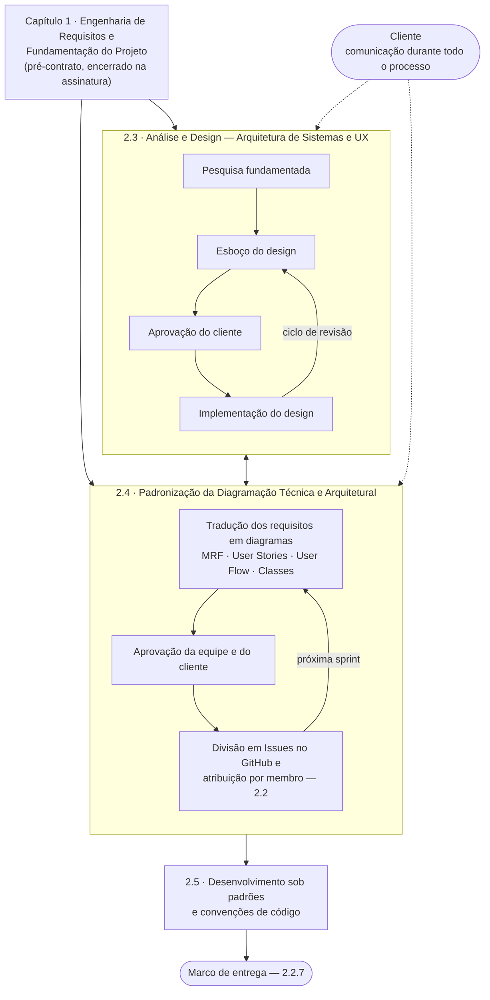

## 2.1 Introdução: Visão geral {#sec-2-1-introducao}

Após cessada a etapa pré-contratual com sucesso, isto é, após o contrato assinado e as equipes montadas, inicia-se a segunda etapa do ciclo de vida de um projeto: A etapa **durante** contrato. Para ilustrar o processo, deixamos abaixo um diagrama que tenta simbolizar esse período. Vale ressaltar que ele não necessariamente deve ser seguido na rigidez na qual foi desenhado. De modo que, por exemplo, é possível que ambas partes do processo se misturem. No entanto, aqui, deixamos separados para fins didáticos e para fins organizacionais ideias.

*Figura 2 — O período durante contrato. As duas faixas centrais correm em paralelo e se
retroalimentam; a separação é didática, não sequencial.*

De maneira resumida, os capítulos seguintes cobrem, nesta ordem:

* **2.2 GitHub:** onde o trabalho é registrado, dividido, revisado e integrado;
* **2.3 Design de sistemas:** como os requisitos se transformam em experiência de uso antes de virarem código;
* **2.4 Diagramação Técnica e Arquitetural:** como os requisitos e o design se transformam em escopo rastreável e arquitetura, alimentando as Issues do capítulo 2.2;
* **2.5 Padrões e convenções de desenvolvimento:** como o código em si deve ser escrito.
