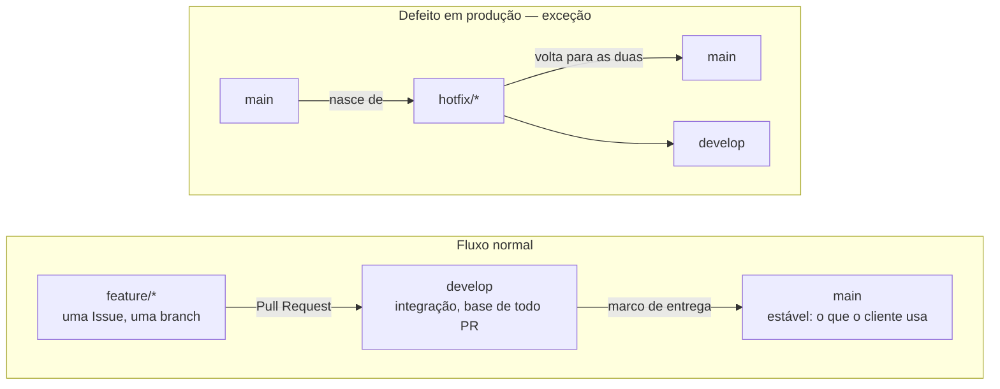

## 2.2 GitHub: Guia sobre uso em projetos

Durante o desenvolvimento, **o GitHub não é apenas o local de armazenamento do código: é a ferramenta central de organização, rastreabilidade e revisão do projeto**. Ao olhar o repositório, qualquer membro identifica o que está sendo desenvolvido, quem responde por cada tarefa, o que já foi concluído e o que aguarda revisão. O histórico fica no repositório — não em grupos de mensagens, reuniões ou na memória dos envolvidos.

O fluxo adotado é:

**Issue → branch `feature/` → Desenvolvimento → Pull Request → Revisão → Merge em `develop` → Próxima Issue**

Issues, branches e Pull Requests não são burocracia: impedem que membros diferentes alterem o mesmo código ao mesmo tempo, ligam cada alteração a uma tarefa definida e garantem revisão antes que qualquer mudança entre na versão principal.

### 2.2.1 Criação e configuração inicial do repositório

O repositório central no GitHub é a fonte oficial do código durante todo o desenvolvimento. Quem o cria é o **líder ou responsável técnico do projeto**.

Configuração inicial:

* nome curto, descritivo e sem espaços;  
* descrição que identifique brevemente o projeto;  
* visibilidade definida conforme a natureza do projeto;  
* `README.md` com o necessário para compreender e executar o projeto;  
* `.gitignore` das tecnologias utilizadas, barrando arquivos gerados automaticamente ou sensíveis;  
* branch `develop` criada a partir de `main`;  
* `main` e `develop` protegidas: sem push direto e sem self-merge;  
* todos os membros que participarão do desenvolvimento adicionados ao repositório.

**Regra geral: nenhum membro desenvolve uma versão paralela do projeto em um repositório próprio. O código oficial permanece centralizado no repositório definido pela equipe.**

Com o acesso, cada desenvolvedor clona o repositório e trabalha a partir dessa cópia local.

### 2.2.2 Issues: transformando o projeto em tarefas

O desenvolvimento é dividido em **Issues** — unidades de trabalho atribuíveis a um membro: uma funcionalidade, uma correção de bug, um ajuste ou uma tarefa técnica.

Uma boa Issue responde a três perguntas:

**O que precisa ser feito?**  
**Por que precisa ser feito?**  
**Quando a tarefa pode ser considerada concluída?**

Evite títulos vagos como **“Login”**. Prefira:

**“Implementar autenticação do usuário por e-mail e senha”**  
**“Corrigir redirecionamento após realização do login”**

A descrição deve bastar para que outro membro compreenda a tarefa sem reconstruir o contexto por mensagens privadas. Quando pertinente, adicione:

* **Assignee:** responsável pela execução;  
* **Labels:** classificação da tarefa — bug, feature, frontend, backend;  
* referências a outras Issues;  
* imagens ou exemplos;  
* critérios de aceite;  
* informações técnicas relevantes.

**Regra geral: toda tarefa relevante tem um responsável claramente definido.**

A divisão em Issues se apoia na diagramação e decomposição técnica do capítulo 2.4.

### 2.2.3 Branches e modelo de ramificação

Nenhum desenvolvimento acontece diretamente em `main` ou `develop`. Toda tarefa vive em uma branch própria.

#### O que é Gitflow

**Gitflow** é o modelo de ramificação proposto por Vincent Driessen (2010). Ele organiza o repositório em branches com papéis fixos:

| Branch | Papel | Vida |
| :------------ | :---------------------------------------------- | :-------------- |
| `main` | versão estável — o que está, ou pode ir, em produção | permanente |
| `develop` | integração do trabalho concluído, ainda não publicado | permanente |
| `feature/*` | uma funcionalidade em desenvolvimento; nasce de `develop` e volta para `develop` | temporária |
| `release/*` | preparação de uma versão: correções finais, sem novas funcionalidades; nasce de `develop`, vai para `main` e `develop` | temporária |
| `hotfix/*` | correção urgente em produção; nasce de `main`, vai para `main` e `develop` | temporária |

A ideia central do modelo: **`main` nunca recebe código diretamente de uma feature.** O que separa `main` de `develop` é risco validado — `develop` acumula o que foi integrado, `main` guarda apenas o que já foi aprovado como entregável.

#### O modelo adotado pela IDE

O Gitflow completo foi desenhado para produtos com releases versionadas e várias versões em manutenção simultânea. Nossos projetos não têm esse problema: duram um semestre, têm equipes pequenas e um único ambiente de publicação. Por isso adotamos uma versão reduzida do modelo:

* **`main`** — protegida. Recebe merge apenas de `develop`, em marcos de entrega, ou de `hotfix/*`.  
* **`develop`** — branch de integração corrente. **Alvo padrão de todo Pull Request.**  
* **`feature/<número-da-issue>-<slug>`** — uma Issue, uma branch. Nasce de `develop` e volta para `develop` via Pull Request.  
* **`hotfix/<slug>`** — exceção para defeito em produção ou homologação. Nasce de `main` e é integrada a **`main` e `develop`**.  
* **`release/*`** — apenas em projetos com versionamento formal. Na maioria dos nossos projetos, não é utilizada.

Antes de iniciar uma tarefa, atualize a branch de integração e crie a branch da Issue a partir dela:

```
git checkout develop
git pull origin develop
git checkout -b feature/23-login-usuario
```

Isso evita começar sobre uma versão desatualizada e mantém cada conjunto de alterações isolado até estar pronto para revisão.

O modelo, visualmente:



Os nomes das branches indicam claramente sua finalidade:

```
feature/23-login-usuario
feature/31-corrige-navbar-mobile
feature/47-dashboard-administrador
feature/52-integracao-api-pagamento
hotfix/corrige-envio-de-email
```

**Regra geral: uma branch corresponde a uma Issue, ou a um conjunto pequeno e coerente de alterações.**

Uma branch aberta por mais de uma sprint é falha de planejamento, não de programação: a Issue era grande demais e deveria ter sido fatiada. Branches longas, ou que acumulam funcionalidades não relacionadas, dificultam a revisão e multiplicam conflitos.

### 2.2.4 Commits

As mudanças são registradas em commits:

```
git add .
git commit -m "Mensagem do commit"
git push
```

A mensagem indica objetivamente o que foi alterado.

Evite:

```
"mudanças"
"teste"
"funcionando"
"coisas novas"
"commit final"
```

Prefira:

```
"Implementa validação do formulário de cadastro"
"Corrige responsividade da navbar"
"Adiciona endpoint de criação de usuário"
```

O histórico precisa ser compreensível depois: pela equipe atual e por quem assumir a manutenção do sistema.

### 2.2.5 Pull Requests

Concluído o trabalho na branch, **não integre as alterações por conta própria**: abra um **Pull Request (PR)**. O PR é a entrega da tarefa para revisão.

**A base do Pull Request é `develop`.** A única exceção é `hotfix/*`, cujo PR tem `main` como base e é replicado em `develop` após a integração.

O título resume a alteração; a descrição fornece contexto suficiente para o revisor.

Todo PR que resolve uma Issue é relacionado a ela:

```
Closes #23
Fixes #23
Resolves #23
```

Assim o GitHub associa a implementação à tarefa e fecha a Issue automaticamente após o merge.

Antes de abrir o PR, verifique se:

* a tarefa solicitada foi efetivamente concluída;  
* não há arquivos desnecessários sendo enviados;  
* nenhum segredo, token, senha ou arquivo sensível foi incluído;  
* o projeto continua executando corretamente;  
* as alterações correspondem ao objetivo da Issue.

### 2.2.6 Revisão de código

Todo Pull Request relevante passa **por revisão antes do merge**, sempre que houver outro membro tecnicamente apto disponível.

O revisor verifica não apenas se “o código funciona”, mas se:

* a implementação resolve a Issue proposta;  
* não foram introduzidos comportamentos inesperados;  
* o código está suficientemente claro;  
* a solução segue a organização definida pelo projeto;  
* não existem trechos desnecessariamente duplicados ou complexos;  
* a alteração não compromete outras partes do sistema.

O GitHub permite comentar linhas específicas e oferece três formas de avaliação:

* **Comment:** dúvidas ou observações que não impedem a integração;  
* **Approve:** a alteração pode ser integrada;  
* **Request changes:** existem ajustes necessários antes da integração.

Um pedido de alteração não é reprovação do membro. **A revisão é controle de qualidade do projeto e transferência de conhecimento entre os desenvolvedores.**

### 2.2.7 Merge e encerramento da tarefa

Aprovado o Pull Request e resolvidos os conflitos, o código é integrado a `develop`. A `main` recebe `develop` nos marcos de entrega — quando a versão é publicada ou apresentada ao cliente.

As estratégias disponíveis — merge commit, squash and merge, rebase and merge — variam conforme o projeto. O essencial: **o merge é um ato consciente após a revisão**, não consequência automática do término da implementação.

Depois do merge:

1. verifique se a Issue correspondente foi encerrada;  
2. exclua a branch de trabalho;  
3. atualize sua cópia local de `develop`;  
4. selecione a próxima Issue.

O ciclo reinicia.

### 2.2.8 Divisão de responsabilidades

Existem duas funções nesse fluxo.

**Responsável técnico/líder:**

1. estrutura o repositório;  
2. auxilia na transformação do projeto em Issues;  
3. distribui ou valida a distribuição das tarefas;  
4. acompanha o desenvolvimento;  
5. revisa Pull Requests ou garante que sejam revisados;  
6. protege a integridade de `main` e `develop`.

**Desenvolvedor responsável pela Issue:**

1. compreende a tarefa;  
2. atualiza sua cópia local de `develop`;  
3. cria a branch `feature/`;  
4. implementa a solução;  
5. realiza commits coerentes;  
6. envia a branch;  
7. abre o Pull Request;  
8. responde à revisão e realiza os ajustes solicitados.

Esses papéis são funções, não cargos fixos — em equipes pequenas o mesmo membro alterna entre eles. O que não pode faltar: para cada tarefa, está claro quem executa e quem valida.

#### Resumo

O procedimento padrão:

**1. Criar Issue → 2. Atribuir responsável → 3. Atualizar `develop` → 4. Criar branch `feature/` → 5. Desenvolver → 6. Commitar → 7. Abrir PR com base em `develop` → 8. Revisar → 9. Corrigir, se necessário → 10. Aprovar → 11. Fazer merge em `develop` → 12. Excluir branch → 13. Iniciar próxima Issue.**

**`main` recebe `develop` nos marcos de entrega. Defeito em produção é a única exceção: `hotfix/` nasce de `main` e volta para `main` e `develop`.**
