## 2.4 Diagramação Técnica e Arquitetural: Orquestrando o desenvolvimento do projeto

> **Status:** onde este texto propõe algo que **ainda não é prática consolidada da IDE**, isso está
> dito explicitamente no corpo da seção.

Os capítulos anteriores estabeleceram **onde o trabalho é registrado** (*capítulo 2.2*) e **como a
experiência do usuário é definida** (*capítulo 2.3*). Falta ainda o elo que converte requisitos
levantados em **escopo rastreável e arquitetura implementável** — isto é, naquilo que efetivamente
vira uma Issue atribuída a uma pessoa.

É esse o papel da diagramação técnica.

O ponto de partida é reconhecer o que ela **não** é. Diagramar não é produzir anexos bonitos para
uma pasta que ninguém abre depois. Um diagrama que não muda uma decisão, não resolve uma discussão
ou não economiza uma reescrita é custo puro — e este capítulo trata explicitamente de quando **não**
desenhar (*seção “Qual diagrama, quando”* e *capítulo 2.4.9*).

Diagramar, na IDE, resolve quatro problemas concretos e verificáveis.

---

### Por que diagramar: as quatro funções

**1. Alinhar cliente e equipe sobre a mesma coisa.**
Texto corrido admite leituras divergentes; um diagrama, muito menos. Quando o cliente lê “o sistema
terá um painel administrativo” e a equipe lê a mesma frase, as duas leituras coincidem por sorte. Um
mapa que ambos olham ao mesmo tempo torna a divergência visível **antes** de virar retrabalho.

**2. Prevenir gargalos arquiteturais.**
O custo de uma decisão de arquitetura errada cresce com o tempo em que ela permanece invisível.
Descobrir na Sprint 6 que dois módulos disputam a mesma tabela, ou que uma funcionalidade depende de
um serviço que ninguém provisionou, é caro. Descobrir isso em um diagrama desenhado na Sprint 0 é
barato. **A mesma lógica de custo que justifica o esboço de design no *capítulo 2.3* justifica o
diagrama de arquitetura aqui.**

**3. Reduzir o custo de entrada de um novo membro.**
Esta é a função mais subestimada e, para a IDE, a mais importante. A *Motivação* deste Manual é
explícita: a empresa opera com um quadro majoritariamente composto por **estudantes em semestres
iniciais** e o SDLC existe como **mecanismo de transferência de conhecimento e proteção contra a
perda de capital intelectual decorrente da alta rotatividade**.

Um diagrama é conhecimento que sobrevive à saída de quem o desenhou. Uma explicação dada em uma
chamada de voz não sobrevive nem à semana seguinte.

**4. Garantir rastreabilidade até a Issue.**
Todo trabalho executado precisa ser rastreável até um requisito acordado com o cliente. Os artefatos
deste capítulo são os elos dessa corrente: **um requisito que não vira Issue não é entregue, e uma
Issue que não rastreia até um requisito é aumento silencioso de escopo.**

> **REGRA GERAL DO CAPÍTULO —** Todo diagrama produzido na IDE deve responder a uma pergunta que
> alguém realmente fez. Diagrama que não responde pergunta nenhuma não deve ser desenhado; diagrama
> que responde a uma pergunta e está desatualizado é pior do que diagrama nenhum, porque mente com
> aparência de autoridade.

---

### Do esboço ao escopo: o que muda quando o contrato é assinado

O *capítulo 1.4.2* já introduziu um artefato visual na fase pré-contratual: o **esboço de projeto**,
o “diagrama de caixinhas”. É legítimo perguntar por que a IDE desenha duas vezes. A resposta é que
os dois artefatos têm **naturezas opostas**, e confundi-los é uma fonte concreta de prejuízo.

| | **Esboço de projeto (*1.4.2*)** | **Diagramação técnica (*2.4*)** |
| :--------------- | :----------------------------- | :---------------------------- |
| **Quando** | Antes do preço, antes da assinatura | Depois da assinatura, antes do código |
| **Objetivo** | Tornar a proposta compreensível e estimável | Tornar a execução inequívoca e rastreável |
| **Precisão exigida** | Deliberadamente baixa — vale a ideia, não a formalidade | Alta — é a base do que será construído e revisado |
| **Valor contratual** | **Nenhum.** Ilustra o escopo, não o define | A MRF é o registro operacional do escopo contratado |
| **Unidade** | Módulo (a “caixinha”) | Requisito, história, tela, classe, mensagem |
| **Quem produz** | Dupla Comercial × Projetos | Departamento de Projetos |
| **Erro típico** | Detalhar demais e queimar horas não pagas | Detalhar de menos e mandar para a sprint algo ambíguo |

**A transição entre os dois é o momento em que a postura da equipe inverte.** Na fase
pré-contratual, o excesso de detalhe é desperdício. Na fase de execução, a falta de detalhe é
defeito. Cada “caixinha” do esboço deve reaparecer aqui decomposta em requisitos com ID, e nenhum
requisito deve aparecer aqui sem ter existido, de alguma forma, lá — se aparecer, é escopo novo e
segue o rito contratual de aditivo, não o rito da sprint.

---

### A cadeia de artefatos

O encadeamento entre os artefatos não é sugestão de ordem: é o que garante que cada linha de código
escrita rastreie até algo que o cliente aceitou pagar.

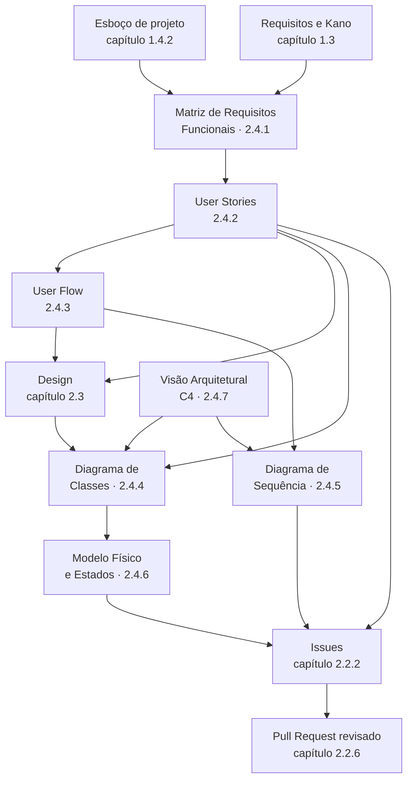
```mermaid
graph TD
    ESB["Esboço de projeto<br/>capítulo 1.4.2"] --> MRF["Matriz de Requisitos<br/>Funcionais · 2.4.1"]
    REQ["Requisitos e Kano<br/>capítulo 1.3"] --> MRF
    MRF --> US["User Stories<br/>2.4.2"]
    US --> UF["User Flow<br/>2.4.3"]
    US --> DES["Design<br/>capítulo 2.3"]
    UF --> DES
    UF --> SEQ["Diagrama de<br/>Sequência · 2.4.5"]
    US --> CLS["Diagrama de<br/>Classes · 2.4.4"]
    DES --> CLS
    CLS --> ERD["Modelo Físico<br/>e Estados · 2.4.6"]
    C4["Visão Arquitetural<br/>C4 · 2.4.7"] --> CLS
    C4 --> SEQ
    US --> ISS["Issues<br/>capítulo 2.2.2"]
    SEQ --> ISS
    ERD --> ISS
    ISS --> PR["Pull Request revisado<br/>capítulo 2.2.6"]
```

Em forma linear, para consulta rápida:

**Requisitos (*1.3*) → Matriz de Requisitos Funcionais (*2.4.1*) → User Stories (*2.4.2*) →
User Flow (*2.4.3*) e Design (*2.3*) → Diagrama de Classes (*2.4.4*) → Issues (*2.2.2*)**

Os artefatos das seções 2.4.5 a 2.4.7 **não são uma quinta etapa dessa fila** — são aprofundamentos
acionados por necessidade. A seção seguinte define exatamente quando cada um é acionado.

---

### Qual diagrama, quando

Esta é a tabela mais importante do capítulo. Um erro recorrente de equipes iniciantes é tratar
diagramação como um pacote fechado: desenha-se tudo, para todo projeto, e o resultado é um conjunto
de documentos que envelhece na primeira semana. **Diagramação é uma escolha por artefato, e cada
escolha precisa de justificativa.**

| Artefato | Pergunta que responde | Obrigatório quando | Desperdício quando |
| :------------- | :------------------- | :--------------------- | :------------------ |
| **Matriz de Requisitos** (*2.4.1*) | O que será entregue, com qual prioridade, em qual fase? | **Sempre.** Não há exceção | Nunca |
| **User Story** (*2.4.2*) | Para quem isso serve e quando está pronto? | Todo requisito que virará Issue | Nunca — mas um requisito puramente técnico admite história enxuta |
| **User Flow** (*2.4.3*) | Que caminho o usuário percorre e onde ele pode falhar? | Jornada com ao menos uma decisão ou mais de três telas | Tela isolada, sem ramificação e sem estado alternativo |
| **Diagrama de Classes** (*2.4.4*) | Como o sistema é estruturado por dentro? | Há herança, interface, ou mais de cinco entidades relacionadas | CRUD de uma única entidade sem regra de negócio |
| **Diagrama de Sequência** (*2.4.5*) | Em que ordem os componentes conversam, e o que acontece quando falham? | Múltiplos serviços, integração externa, transação, concorrência ou idempotência | Fluxo linear tela → controller → banco → tela |
| **Modelo Físico / ERD** (*2.4.6*) | Como os dados são persistidos e quais regras o banco garante? | Alguma regra de negócio é garantida por restrição de banco, ou há mais de oito tabelas | Protótipo descartável, sem persistência relevante |
| **Máquina de Estados** (*2.4.6*) | Quais estados esta entidade assume e o que autoriza cada transição? | Entidade com três ou mais estados e regra própria por transição | Campo booleano ativo/inativo |
| **C4 — Contexto e Contêiner** (*2.4.7*) | Onde o sistema começa e termina? De que peças ele é feito? | Mais de um ator, **ou** qualquer dependência externa | Script interno de uso único |
| **C4 — Componente** (*2.4.7*) | Como o módulo crítico se organiza por dentro? | Apenas no módulo que concentra a regra de negócio | Módulos de CRUD, que se explicam sozinhos |
| **Diagrama de Implantação** (*2.4.7*) | Onde isso roda, quanto custa e quem é dono das credenciais? | **Todo projeto que será hospedado** | Entrega de código-fonte sem responsabilidade de deploy |

**Regra de bolso:** na dúvida entre desenhar e não desenhar, pergunte se alguém da equipe já
precisou explicar aquilo em voz alta mais de uma vez. Se sim, desenhe. Se não, não desenhe ainda.

---

---

**PARTE A — ESCOPO E COMPORTAMENTO**

**Nota do Capítulo:**

A IDE **não utiliza o Diagrama de Casos de Uso tradicional**. Ele foi substituído por uma abordagem
ágil dividida em três pilares, que reduz a burocracia técnica sem perder precisão de escopo:

* **Matriz de Requisitos Funcionais:** validação prática de escopo com o cliente.

* **User Stories:** detalhamento do comportamento do sistema para a equipe de desenvolvimento.

* **User Flow:** mapeamento visual da jornada do usuário e das telas.

A esses três pilares soma-se o **Diagrama de Classes** (*2.4.4*), responsável por descrever a
arquitetura interna e as entidades do sistema. Enquanto os três primeiros descrevem *o que* o
sistema faz e *como o usuário o percorre*, o Diagrama de Classes descreve *como o sistema é
estruturado por dentro*.

**Esta substituição é deliberada e permanece válida.** O Diagrama de Casos de Uso tradicional
concentra em uma única figura aquilo que a IDE prefere distribuir entre três artefatos com leitores
distintos: o cliente lê a Matriz, o desenvolvedor lê a User Story, o designer lê o User Flow. Um
diagrama que serve a três leitores costuma não servir bem a nenhum.

---

### 2.4.1 Matriz de Requisitos Funcionais

A Matriz de Requisitos Funcionais (MRF) é uma ferramenta visual para registrar as funcionalidades do
sistema de forma simples, objetiva e mensurável. Ela funciona como o **pilar central do projeto**,
auxiliando no alinhamento de escopo com o cliente, na organização das sprints e na priorização do
desenvolvimento.

Sua importância decorre de uma propriedade que nenhum outro artefato deste capítulo possui: **a MRF
é o único documento técnico que o cliente lê e valida diretamente.** Ela é a tradução operacional do
que foi contratado — e, por isso, a fronteira entre entregar o combinado e absorver escopo não
previsto.

**Nota sobre Padronização:**

Embora existam normas formais e extensas para a especificação de requisitos (como as normas
ISO/IEEE), adotamos aqui um padrão enxuto e prático. O objetivo é reduzir a burocracia e focar na
utilidade real para a equipe de desenvolvimento e na validação com o cliente.

**Elementos de uma Matriz de Requisitos Funcionais**

| Campo | Descrição | Exemplo |
| :------------------ | :------------------------------- | :----------------------- |
| ID | Código único de identificação do Requisito Funcional | RF001, RF002 |
| Módulo/Categoria | Agrupamento lógico da funcionalidade dentro do sistema | Autenticação, Financeiro, Catálogo |
| Descrição | O que o sistema deve fazer (sempre iniciando com verbo no infinitivo) | Permitir o cadastro de novos usuários |
| Prioridade | Grau de importância do requisito (utilizando a técnica MoSCoW) | Must, Should, Could, Won’t |
| Fase/Escopo | Entrega ou sprint a que o requisito pertence | MVP, Sprint 1, Fase 2 |
| User Story Relacionada | Relação com a User Story que detalha o comportamento do requisito | US001, US002 |

**Método MoSCoW**

Para definir o que entra no sistema e em qual ordem, utilizamos o método MoSCoW, que categoriza os
requisitos em quatro níveis de prioridade:

* **Must Have (Obrigatório):** requisitos essenciais para o funcionamento do sistema. Sem eles, o
  produto não pode ser entregue ou lançado (compõem o MVP).

* **Should Have (Importante):** requisitos de alta relevância que agregam bastante valor. O sistema
  funciona sem eles, mas de forma limitada ou com contornos manuais.

* **Could Have (Desejável):** funcionalidades “encantadoras” que agregam valor extra. Serão
  desenvolvidas apenas se houver tempo e recurso sobrando na sprint.

* **Won’t Have (Fora do Escopo Atual):** funcionalidades alinhadas como não prioritárias para a
  entrega ou contrato atual. Ficam registradas para propostas ou versões futuras.

Vale ressaltar a relação com o **Modelo Kano** do *capítulo 1.3*: o Kano classifica o requisito
quanto ao **impacto na satisfação do cliente**, e o MoSCoW o classifica quanto à **obrigatoriedade
de entrega**. Os requisitos básicos levantados na etapa pré-contratual tendem a se tornar Must Have;
os performantes, Should Have; e os atrativos, Could Have ou Won’t Have.

**Regra geral:** a categoria **Won’t Have não deve ser tratada como lixeira**. Registrar
explicitamente o que ficou de fora é a principal proteção da equipe contra o aumento silencioso de
escopo durante o contrato e serve de insumo para propostas futuras.

Na prática, a lista de exclusões cumpre um papel defensivo concreto. Ela é o que permite responder a
um pedido de meio de sprint — *“já que vocês estão mexendo nessa tela, dava para…”* — sem
constrangimento e sem improviso: o item não está fora por esquecimento, está fora por decisão
registrada. **Construir um item excluído “de graça” custa a sprint e, pior, comunica que a lista de
exclusões é decorativa.**

**Exemplo de uma Matriz de Requisitos Funcionais**

Para visualizar como a Matriz funciona na prática, imagine o sistema de uma loja online (como Amazon
ou Mercado Livre). A tabela a seguir organiza os requisitos funcionais do projeto, definindo
prioridades, entregas e rastreabilidade:

| ID | Módulo/Categoria | Descrição | Prioridade | Fase/Escopo | User Story Relacionada |
| :------ | :---------- | :------------------------- | :-------- | :----------- | :------------ |
| RF001 | Autenticação | Permitir login de usuários via e-mail e senha. | Must | MVP / Sprint 1 | US001 |
| RF002 | Produtos | Permitir o cadastro, edição e inativação de produtos no catálogo. | Must | MVP / Sprint 1 | US002 |
| RF003 | Autenticação | Oferecer a opção “Esqueci minha senha” com envio de token por e-mail. | Should | MVP / Sprint 2 | US003 |
| RF004 | Carrinho | Permitir adicionar, remover e alterar a quantidade de itens no carrinho de compras. | Must | MVP / Sprint 2 | US004 |
| RF005 | Busca e Filtros | Permitir a busca de produtos por nome e filtragem por categoria e faixa de preço. | Must | MVP / Sprint 2 | US005 |
| RF006 | Checkout | Permitir a finalização do pedido com opção de pagamento via Pix e Cartão de Crédito. | Must | MVP / Sprint 3 | US006 |
| RF007 | Pedidos | Permitir ao cliente visualizar o histórico de compras e o status de entrega do pedido. | Should | MVP / Sprint 4 | US007 |
| RF008 | Avaliações | Permitir que clientes que compraram um produto enviem uma nota (1 a 5 estrelas) e um comentário. | Could | Fase 2 / Sprint 5 | US008, US009 |
| RF009 | Recomendação | Exibir recomendações automáticas de produtos usando Inteligência Artificial. | Won’t | Fora de Escopo / V2 | US010 |

**Duas verificações antes de considerar a Matriz pronta**

1. **Todo ator tem entrada.** Se o sistema possui um perfil administrativo, ele precisa de um
   requisito de autenticação próprio. Módulos administrativos são a omissão mais comum em levantamento
   de escopo, porque o cliente descreve o sistema pela ótica de quem o usa, não de quem o opera.
2. **A ordem das fases respeita as dependências.** Um requisito que provisiona os dados de que outro
   depende **não pode** estar em uma fase posterior a ele. Quando isso acontece, a equipe é obrigada a
   suprir a lacuna com trabalho manual não previsto — custo real, invisível no orçamento.

---

### 2.4.2 User Stories

Uma User Story é uma descrição simples e objetiva de uma funcionalidade do sistema, escrita a partir
da perspectiva do usuário final. Enquanto a Matriz de Requisitos foca no escopo do projeto (“o
quê”), a User Story traduz o valor de negócio e a jornada do usuário (“quem”, “como” e “por quê”).

**Identificação e Conexão (Rastreabilidade)**

Para manter a rastreabilidade do projeto e evitar que funcionalidades fiquem “soltas” no backlog,
toda User Story deve possuir os seguintes campos de conexão com a Matriz de Requisitos:

* **ID da História:** identificador único da história (ex.: US001, US002).

* **Requisito Relacionado:** identificador do(s) requisito(s) correspondente(s) na Matriz (ex.: RF001).

* **Título:** nome simples e objetivo da funcionalidade (ex.: Busca e Filtragem de Produtos).

**Estrutura de uma User Story**

Toda história deve seguir o formato clássico **Connextra**, que responde às três perguntas
fundamentais de uma funcionalidade:

* Como \[papel / tipo de usuário\],

* Eu quero \[ação / funcionalidade\],

* Para que \[benefício / razão de negócio\].

Em inglês:

* As a \[type of user\],

* I want to \[do something\],

* So that \[reason or benefit\].

O terceiro campo é o que costuma ser preenchido com pressa e é o mais valioso. **É o “para que” que
permite ao desenvolvedor propor uma solução melhor do que a que foi pedida** — e que permite à
equipe perceber quando uma história perdeu o sentido e deveria ser descartada em vez de
implementada.

**Critérios de Aceite**

Se a história descreve o objetivo do usuário, os Critérios de Aceite definem exatamente o que o
sistema precisa fazer para a tarefa ser considerada concluída (*Done*). Eles servem como guia
inequívoco para o desenvolvedor implementar e para o revisor validar.

Utilizamos a estrutura do **BDD (Behavior-Driven Development)**:

* Dado que \[contexto inicial ou pré-condição\]

* Quando \[ação realizada pelo usuário\]

* Então \[resultado esperado ou comportamento do sistema\]

**Exemplo de User Story**

Retomando o requisito RF001 da Matriz (“Permitir login de usuários via e-mail e senha”), veja como
ele é traduzido em uma User Story completa:

**ID:** US001 | **Requisito Relacionado:** RF001
**Título:** Login de Usuário via E-mail e Senha
**Descrição:**
Como cliente cadastrado na loja,
Eu quero realizar login informando meu e-mail e senha,
Para que eu possa acessar meu perfil e realizar compras com segurança.

**Critérios de Aceite:**

**Cenário 1:** Login com sucesso
Dado que o usuário está na tela de login e informou e-mail e senha válidos,
Quando clicar no botão “Entrar”,
Então o sistema deve autenticar o usuário e redirecioná-lo para a página inicial com seu nome
visível no cabeçalho.

**Cenário 2:** Credenciais inválidas
Dado que o usuário inseriu uma senha incorreta ou e-mail não cadastrado,
Quando clicar no botão “Entrar”,
Então o sistema deve exibir a mensagem de erro “E-mail ou senha inválidos” e manter o usuário na
mesma tela.

**Cenário 3:** Campos obrigatórios vazios
Dado que o usuário deixou o campo de e-mail ou senha em branco,
Quando tentar submeter o formulário,
Então o botão “Entrar” deve permanecer desabilitado ou destacar os campos em vermelho.

**Como escrever uma boa User Story?**

Para avaliar se uma User Story foi bem escrita ou se acabou abrangendo mais do que deveria,
utilizamos o checklist do princípio **INVEST**. Toda história de qualidade deve atender aos seis
critérios da sigla:

**I (Independent / Independente):** a história pode ser desenvolvida sem depender obrigatoriamente da
conclusão de outra?

**N (Negotiable / Negociável):** ela deixa espaço para a equipe discutir e definir a melhor solução
técnica junto ao cliente?

**V (Valuable / Valiosa):** ela entrega um valor perceptível e claro para o usuário final ou para o
negócio?

**E (Estimable / Estimável):** a equipe de desenvolvimento consegue compreender o escopo a ponto de
estimar o esforço de implementação?

**S (Small / Pequena):** ela é enxuta o suficiente para ser desenvolvida e testada dentro de uma
única sprint?

**T (Testable / Testável):** existem critérios de aceite objetivos para validar se a funcionalidade
funciona corretamente?

O critério **S** merece calibração explícita. Na IDE, uma sprint tem **duas semanas, com os dois
últimos dias reservados** para revisão, compartilhamento de conhecimento e planejamento — ou seja,
cerca de **oito dias efetivos de desenvolvimento**, executados por membros em regime de tempo
parcial. “Cabe em uma sprint” deve ser lido contra esse número, não contra uma semana de trabalho em
tempo integral.

**Épicos (EPIC): quando a história é grande demais**

Nem toda funcionalidade nasce pronta para virar uma User Story. Um **Épico** é uma funcionalidade de
grande porte ou de alto nível que abrange um conjunto complexo de tarefas e não cabe em uma única
sprint.

**Como identificar um Épico?**
Ao aplicar o princípio INVEST em uma ideia, se ela falhar no critério **S (Small)** por ser grande ou
complexa demais, classifique-a como Épico.

Os Épicos são extremamente úteis nas fases iniciais do projeto, pois permitem registrar capacidades
estratégicas do sistema na Matriz de Requisitos antes mesmo de a equipe conhecer todos os detalhes
técnicos.

**Como fatiar um Épico?**
A regra para resolver um Épico é o **fatiamento**: à medida que o projeto avança e os detalhes ficam
claros, quebre o Épico em User Stories menores, independentes e que entreguem valor individualmente.

O fatiamento correto é **vertical**, não horizontal. Fatiar por camada — “uma história para o banco,
uma para a API, uma para a tela” — produz três histórias das quais nenhuma entrega valor sozinha e
nenhuma pode ser demonstrada ao cliente. Fatiar por caminho de uso — “cadastrar com dados válidos”,
depois “tratar duplicidade”, depois “recuperar senha” — produz histórias que atravessam todas as
camadas e são individualmente demonstráveis.

**Definição de Pronto para Iniciar (Definition of Ready)**

O INVEST responde se a história está bem escrita. A **Definição de Pronto para Iniciar** responde se
ela pode entrar em uma sprint. Uma Issue só deve ser puxada para a sprint quando **todos** os itens
abaixo forem verdadeiros:

1. Ela rastreia até ao menos um **ID de requisito** da Matriz.
2. Sua **User Story existe** e passa no INVEST — em particular no **S**; se não passa, é Épico e
   precisa ser fatiada antes.
3. Seus **critérios de aceite estão escritos em BDD** e são objetivamente verificáveis por quem não
   escreveu o código.
4. Seus **caminhos não felizes estão especificados**: carregamento, vazio, erro, entrada inválida e
   ação não autorizada (*capítulo 2.3.8*).
5. **A tela de que ela depende existe no design aprovado.** Sem tela, não há Issue.
6. Suas **dependências** já foram integradas ou estão explicitamente listadas.
7. Ela tem **exatamente um responsável**.

**Ligação com o *capítulo 2.2*:** uma User Story que atende ao INVEST já está, na prática, pronta
para virar uma Issue. Seu título vira o título da Issue, sua descrição vira o corpo, e **os
critérios de aceite viram a definição de pronto usada pelo revisor do Pull Request**
(*capítulo 2.2.6*).

---

### 2.4.3 User Flow

O User Flow é um diagrama visual que mapeia a jornada e os caminhos que o usuário pode percorrer
para realizar uma tarefa no sistema. Ele funciona como **ponte entre as User Stories e a
prototipagem de interface (UI)**, detalhando a lógica de navegação, as transições de telas e os
pontos de decisão da aplicação.

**Formas Básicas**

**Início / Fim:** marca o ponto de entrada ou de saída de uma jornada. Representado por um nó com
formato arredondado (pílula).

**Ação / Tela:** representa uma etapa, página, componente ou ação executada pelo usuário ou pelo
sistema. Representado por um nó retangular.

**Decisão:** indica um ponto de validação do sistema com múltiplos caminhos (como Sim/Não ou
Aprovado/Recusado). Representado por um nó em formato de losango.

> **Regra de Ouro do User Flow —** Um diagrama de User Flow deve mapear **apenas uma jornada
> específica do usuário por vez** (por exemplo: a recuperação de senha, ou a finalização de uma
> compra). Tentar descrever o sistema inteiro em um único diagrama tornará o mapa ilegível e
> inviabilizará seu uso prático pela equipe.

**User Flow no Mermaid**

O Mermaid não possui um tipo de diagrama nomeado exclusivamente como “User Flow”, mas é possível
representá-lo perfeitamente utilizando um fluxograma padrão e ajustando o formato de cada nó.

Para indicar ao Mermaid que faremos um fluxo orientado de cima para baixo, iniciamos o código com o
comando:

```
graph TD
```

**Declarando os Nós**

Para criar cada elemento, informamos primeiro o ID interno do nó (nome utilizado apenas no código,
para fazer as ligações) seguido do seu formato e do texto visível:

**Nós de Início / Fim:** declarados utilizando parênteses com colchetes internos.

* Sintaxe:

```
ID([Texto Visível])
```

* Exemplo:

```
Inicio([Acessa a aplicação])
```

**Nós de Ação / Tela:** declarados utilizando apenas colchetes.

* Sintaxe:

```
ID[Texto Visível]
```

* Exemplo:

```
TelaLogin[Tela de Login]
```

**Nós de Decisão:** declarados utilizando apenas chaves.

* Sintaxe:

```
ID{Texto Visível}
```

* Exemplo:

```
Validacao{Credenciais Válidas?}
```

**Conectando os Nós**

Com os nós declarados, criamos as conexões e os caminhos de navegação utilizando setas:

* **Conexão simples:** liga a saída de um nó à entrada do seguinte utilizando `-->`

```
Inicio --> TelaLogin
```

* **Conexão com rótulo (pontos de decisão):** ao sair de um nó de decisão, **é obrigatório indicar a
  condição do caminho** (como Sim/Não ou Aprovado/Recusado). Para inserir texto no arco, colocamos o
  rótulo entre hífens e setas.

Sintaxe:

```
NoDecisao -- Rótulo --> NoDestino
```

Exemplos:

```
Validacao -- Sim --> Dashboard
Validacao -- Não --> MensagemErro
```

**Exemplo completo**

Reunindo os elementos acima, o fluxo correspondente à User Story US001 (*capítulo 2.4.2*) fica
assim:

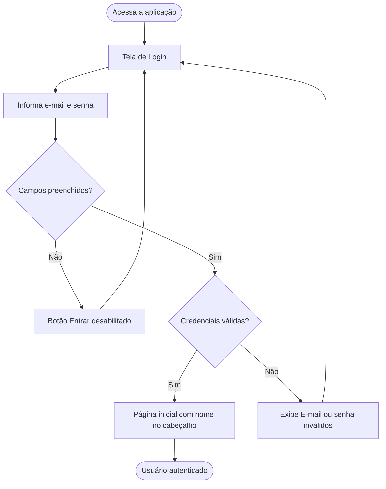
```mermaid
graph TD
    Inicio([Acessa a aplicação]) --> TelaLogin[Tela de Login]
    TelaLogin --> Preenche[Informa e-mail e senha]
    Preenche --> Campos{Campos preenchidos?}
    Campos -- Não --> Bloqueia[Botão Entrar desabilitado]
    Bloqueia --> TelaLogin
    Campos -- Sim --> Validacao{Credenciais válidas?}
    Validacao -- Sim --> Home[Página inicial com nome no cabeçalho]
    Validacao -- Não --> MensagemErro[Exibe E-mail ou senha inválidos]
    MensagemErro --> TelaLogin
    Home --> Fim([Usuário autenticado])
```

**Os três cenários dos critérios de aceite da US001 aparecem no diagrama como caminhos distintos.**
Essa correspondência não é coincidência: é o teste de completude do artefato.

> **REGRA —** Se um cenário previsto na User Story não possui caminho no User Flow, então falta uma
> tela, uma mensagem ou um estado no design (*capítulo 2.3.8*). Se um caminho existe no User Flow e
> não corresponde a nenhum cenário da User Story, então falta um critério de aceite — ou o caminho é
> escopo que ninguém contratou.

**Os caminhos infelizes são desenhados, não subentendidos.** É tentador desenhar apenas o percurso
de sucesso, porque é o mais curto e o mais agradável de mostrar. Mas o caminho de sucesso raramente
é o que consome tempo de desenvolvimento: o que consome é a entrada inválida, a sessão expirada, o
registro que já existe, a lista vazia e a ação sem permissão. **Um User Flow com um único caminho
quase sempre indica que a análise parou cedo demais.**

---

### 2.4.4 Diagrama de Classes

Um diagrama de classes descreve a arquitetura básica do projeto e a relação entre suas entidades.
Ele mostra os atributos e métodos de cada classe, além das restrições que se aplicam à forma como os
objetos se conectam.

Enquanto os artefatos anteriores respondem *o que* o sistema faz, este responde **com quais
abstrações ele faz**. É o artefato que impede que cada desenvolvedor invente sua própria versão do
mesmo conceito — três nomes diferentes para a mesma entidade em três módulos diferentes é um custo
de manutenção que se paga até o fim do projeto.

**Anatomia de uma Classe**

Uma classe é representada por uma caixa dividida em três setores principais:

* **Nome da Classe (topo):** identifica a entidade. Deve seguir a convenção da linguagem adotada
  pelo projeto (na maioria dos casos, PascalCase — ex.: `UsuarioService`).

* **Atributos (meio):** dados e propriedades que a classe armazena.
  - **Estrutura:** declara-se o nome do atributo seguido do seu tipo (primitivo ou outra classe).
  - **Convenção:** segue a convenção da linguagem (geralmente camelCase — ex.: `dataNascimento: Date`).

* **Métodos (base):** ações e comportamentos que a classe executa.
  - **Estrutura:** declara-se o nome do método, os parâmetros com seus respectivos tipos dentro dos
    parênteses e o tipo de retorno. Caso não haja retorno, indica-se `: void` para melhorar a clareza.
  - **Convenção:** segue a convenção da linguagem (geralmente camelCase — ex.:
    `calcularDesconto(porcentagem: double): double`).

**Modificadores de Visibilidade**

Os símbolos posicionados antes de cada atributo ou método indicam seu nível de encapsulamento,
definindo quais partes do sistema têm permissão para acessá-los:

**`+` Público (Public):** acessível por qualquer classe ou componente do sistema.

**`-` Privado (Private):** acessível exclusivamente dentro da própria classe.

**`#` Protegido (Protected):** acessível na própria classe e por todas as suas subclasses (via herança).

**`~` Pacote (Package / Default):** acessível por qualquer classe localizada no mesmo pacote (grosso
modo, na mesma pasta do projeto).

**Constantes e Valores Iniciais em UML**

As constantes devem ser declaradas no setor de atributos e seguem a mesma estrutura básica das
variáveis. Contudo, seu nome difere da convenção padrão de variáveis, adotando geralmente o formato
UPPER\_SNAKE\_CASE (letras maiúsculas separadas por *underline*).

Para definir um valor inicial (tanto para variáveis quanto para constantes), utiliza-se o sinal de
igual (`=`) seguido do valor desejado:

```
+ EX_CONST: int = 2
- exVar: String = ""
```

**Interfaces em UML**

Para representar uma interface em UML, insere-se a indicação **\<\<interface\>\>** (estereótipo)
logo acima do seu nome.

**Sem atributos:** por definição, interfaces declaram apenas o contrato de comportamentos que outras
classes devem implementar. Por isso, a seção central (reservada a atributos) deve permanecer vazia.

**Visibilidade pública implícita:** como os métodos de uma interface servem justamente para definir
contratos públicos, a visibilidade `+` fica subentendida. Portanto, não é necessário incluir o sinal
`+` antes das assinaturas dos métodos.

**Classes Abstratas em UML**

Uma classe abstrata serve como modelo parcial para a criação de outras classes. Ela possui ao menos
um método abstrato (ou seja, um método apenas com contrato, sem implementação), o que impede que ela
seja instanciada diretamente no sistema.

**Estereótipo \<\<abstract\>\>:** posicionado logo acima do nome da classe para identificá-la.

**Presença de atributos:** ao contrário das interfaces, as classes abstratas podem declarar
atributos com qualquer modificador de visibilidade.

**Métodos em itálico:** os métodos abstratos devem obrigatoriamente ser grafados em itálico para
diferenciá-los dos métodos concretos (aqueles que já possuem implementação).

**Enumerações em UML**

Quando um atributo admite apenas um conjunto fixo e conhecido de valores — um papel de usuário, uma
unidade de medida, um tipo de transação — representá-lo como texto livre é impreciso e convida ao
erro. Nesses casos, utiliza-se o estereótipo **\<\<enumeration\>\>**, listando os valores possíveis
no setor central.

> **Nota:** a inclusão da enumeração é um acréscimo desta revisão. O texto anterior do capítulo
> declarava explicitamente que *enums*, dependências e notas em bloco estavam fora do seu escopo —
> uma limitação do guia, não uma proibição. A prática de projeto já vinha adotando o estereótipo por
> ganho de precisão, e esta revisão apenas o formaliza.

**Representando Relacionamentos em UML**

A UML estabelece padrões visuais específicos para demonstrar como as classes se conectam, interagem
e dependem umas das outras.

**Multiplicidade (Cardinalidade)**

Nas relações de Associação, Agregação e Composição, a multiplicidade indica a quantidade de
instâncias de uma classe que podem estar vinculadas a uma instância de outra classe.

As notações mais comuns são:

* **1 (exatamente um):** um pedido deve estar associado a exatamente um cliente.

* **0..1 (zero ou um / opcional):** um pedido pode ter ou não um único cupom de desconto aplicado.

* **\* ou 0..\* (zero ou muitos):** um cliente pode não ter realizado nenhum pedido, mas não há
  limite máximo de pedidos que ele pode fazer.

* **1..\* (um ou muitos):** um pedido precisa ter pelo menos um item para existir, sem limite máximo.

Para manter o diagrama limpo e legível, a indicação de multiplicidade é **opcional**. Ela deve ser
inserida nas extremidades das linhas apenas quando for crucial deixar explícita uma regra de negócio
do sistema.

**Associação**

A associação representa um vínculo entre duas classes independentes. Pelo menos uma das classes tem
conhecimento da existência da outra e interage com ela. Por serem independentes, os objetos possuem
ciclos de vida próprios: a exclusão de uma classe não provoca a exclusão da outra do sistema.

A associação pode ser dividida em dois tipos principais:

**1. Associação Unidirecional**
Ocorre quando apenas uma das classes conhece e acessa a outra.

**Representação visual:** linha sólida com uma seta aberta na ponta, saindo da classe que conhece e
apontando para a classe conhecida.

* A classe `Pedido` possui um atributo do tipo `CupomDesconto` para calcular o valor final da compra.
  O `Pedido` não é “dono” do cupom, apenas o utiliza. Se o pedido for cancelado ou apagado, a classe
  `CupomDesconto` continuará existindo normalmente no sistema.

**2. Associação Bidirecional**
Ocorre quando ambas as classes se conhecem e mantêm referências mútuas.

**Representação visual:** linha sólida simples conectando as duas classes (sem setas nas extremidades).

* A classe `Medico` armazena uma lista de pacientes, e a classe `Paciente` armazena uma lista de
  médicos (1..\* para 1..\*). As duas entidades são plenamente independentes: se um médico deixar a
  clínica e for apagado do sistema, o cadastro do paciente continua existindo e pode ser associado a
  outros médicos.

**Dica de leitura:** note que em ambos os casos foi utilizado um verbo sobre a linha de conexão
(*possui* e *atende*). Adicionar um verbo explicativo no centro da associação é excelente prática
para tornar a leitura do diagrama mais natural e intuitiva.

**Agregação**

A agregação é uma variação especial da associação que representa uma relação de **“Todo / Parte”**
(ou “Todo / Conteúdo”). Embora exista essa ideia de pertencimento, as duas classes possuem ciclos de
vida independentes: se a classe principal (“Todo”) for excluída do sistema, a classe contida
(“Parte”) continuará existindo normalmente.

**Representação visual:** linha sólida com um losango vazado (diamante transparente) na extremidade
conectada à classe principal (“dona” ou “Todo”).

A classe `Jogador` faz parte da classe `Time`, mas possui existência própria. Se o `Time` for apagado
do sistema, o cadastro de cada `Jogador` continuará salvo — mantendo seus dados como CPF, nome e
posição, mas temporariamente sem time.

**Composição**

A composição é uma relação de “Todo / Parte” com **posse exclusiva e dependência forte**. Ao
contrário da agregação, as partes na composição não possuem existência independente: o ciclo de vida
da parte está estritamente atrelado ao ciclo de vida do “Todo”. Se a classe principal for excluída
do sistema, todas as suas partes vinculadas serão destruídas automaticamente em cascata.

**Representação visual:** linha sólida com um losango preenchido (diamante preto) na extremidade
conectada à classe principal (“Todo”).

A classe `Pedido` é composta por objetos da classe `ItemPedido`. Caso um pedido seja removido do
sistema, seus itens associados perderão o sentido e serão excluídos junto com ele.

**Multiplicidade no diagrama:** um `Pedido` deve conter um ou mais itens (1..\*). Já um `ItemPedido`
pertence estritamente a exatamente um `Pedido` (1).

**Generalização (Herança)**

A generalização representa o conceito de herança da Programação Orientada a Objetos, estabelecendo
uma relação do tipo **“É um”** (*is-a*). Nela, uma classe filha (subclasse) herda automaticamente
todos os atributos e métodos da classe pai (superclasse), podendo adicionar membros exclusivos ou
sobrescrever comportamentos.

**Representação visual:** linha sólida com uma seta triangular vazada (branca) na ponta, partindo da
subclasse e apontando para a superclasse.

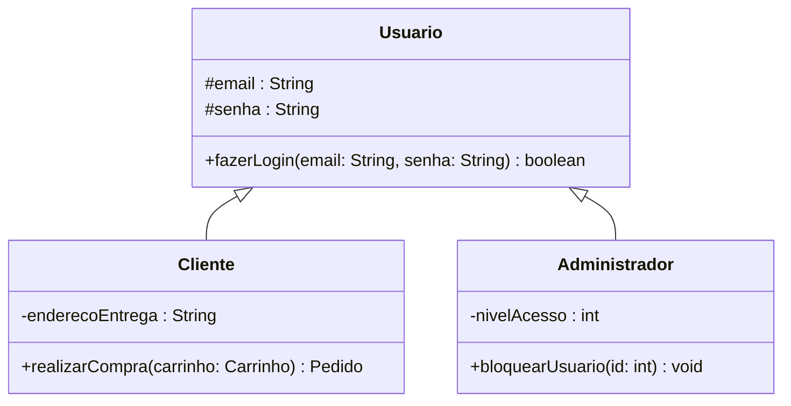
```mermaid
classDiagram
    class Usuario {
        #email : String
        #senha : String
        +fazerLogin(email: String, senha: String) boolean
    }
    class Cliente {
        -enderecoEntrega : String
        +realizarCompra(carrinho: Carrinho) Pedido
    }
    class Administrador {
        -nivelAcesso : int
        +bloquearUsuario(id: int) void
    }
    Usuario <|-- Cliente
    Usuario <|-- Administrador
```

* Tanto `Cliente` quanto `Administrador` são tipos específicos de `Usuario`.
* A superclasse `Usuario` centraliza os dados e comportamentos em comum (como `#email`, `#senha` e
  `+fazerLogin()`).
* As subclasses mantêm essa base e adicionam apenas suas particularidades: `Cliente` acrescenta
  `-enderecoEntrega` e `+realizarCompra()`, enquanto `Administrador` acrescenta `-nivelAcesso` e
  `+bloquearUsuario()`.

**Realização (Implementação)**

A realização ocorre quando uma classe concreta implementa o contrato definido por uma interface. A
classe assume a obrigação de fornecer a lógica interna de todos os métodos exigidos, permitindo que
o sistema interaja com ela sem precisar conhecer seus detalhes de funcionamento.

**Representação visual:** linha tracejada com uma seta triangular vazada (branca) na ponta, partindo
da classe que implementa e apontando para a interface.

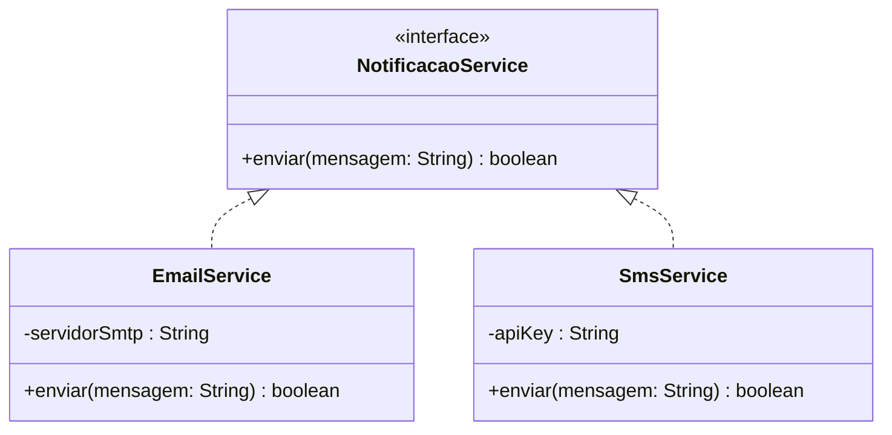
```mermaid
classDiagram
    class NotificacaoService {
        <<interface>>
        +enviar(mensagem: String) boolean
    }
    class EmailService {
        -servidorSmtp : String
        +enviar(mensagem: String) boolean
    }
    class SmsService {
        -apiKey : String
        +enviar(mensagem: String) boolean
    }
    NotificacaoService <|.. EmailService
    NotificacaoService <|.. SmsService
```

* A interface `NotificacaoService` define o contrato comum: o método `+enviar(mensagem: String): boolean`.
* Tanto `EmailService` quanto `SmsService` realizam essa interface, pois ambos possuem a capacidade
  de enviar notificações.
* Cada classe executa o envio à sua maneira: `EmailService` utiliza a propriedade interna
  `-servidorSmtp`, enquanto `SmsService` utiliza `-apiKey`.

**Sintaxe Mermaid para Diagrama de Classes**

Para criar um diagrama de classes, utilizar a anotação a seguir antes de descrever as classes e
relacionamentos:

```
classDiagram
```

Abaixo estão os elementos mostrados neste guia utilizando a sintaxe do Mermaid:

**Classes**

```
class Exemplo{
    +atributoPublico : int
    -atributoPrivado : String
    ~metodoPackage(parametro: int) char
    #metodoProtegido() void
}
```

**Interfaces**

```
class Interface <<interface>>{
    +isValid(parametro : int) boolean
}
```

**Classes abstratas**

```
class ClasseAbstrata <<abstract>>{
    -atributo : char
    +metodoAbstrato() int*
}
```

**Enumerações**

```
class Papel <<enumeration>>{
    USUARIO
    ATENDENTE
    EMPRESA
    ADMINISTRADOR
}
```

**Associação unidirecional**

```
Pedido --> CupomDesconto : possui
```

**Associação bidirecional**

```
Medico "1..*" -- "1..*" Paciente : atende
```

**Agregação**

```
Time "0..1" o-- "0..*" Jogador : possui
```

**Composição**

```
Pedido "1" *-- "1..*" ItemPedido : composto por
```

**Generalização**

```
Usuario <|-- Cliente
Usuario <|-- Administrador
```

**Realização**

```
NotificacaoService <|.. EmailService
NotificacaoService <|.. SmsService
```

**Legenda de notação no Mermaid**

**Texto após os dois pontos (`:`):** é o rótulo exibido no meio da linha (utilizado para o verbo que
descreve a relação).

**Texto entre aspas nas pontas (`"1..*"`):** indica a multiplicidade posicionada na extremidade
correspondente da linha.

**Exemplo consolidado**

Reunindo os relacionamentos acima em um único modelo do domínio da loja online:

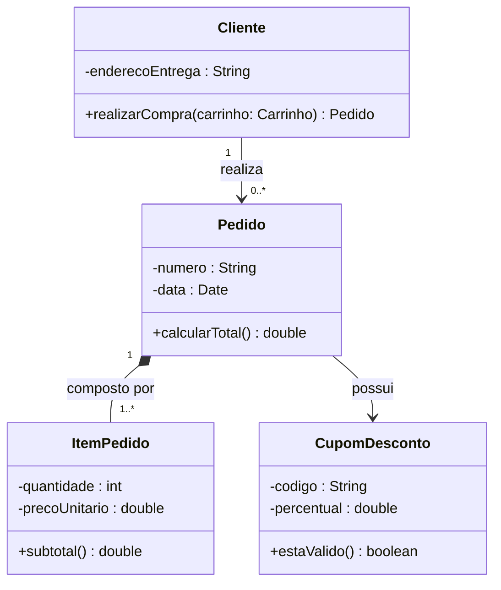
```mermaid
classDiagram
    class Pedido {
        -numero : String
        -data : Date
        +calcularTotal() double
    }
    class ItemPedido {
        -quantidade : int
        -precoUnitario : double
        +subtotal() double
    }
    class CupomDesconto {
        -codigo : String
        -percentual : double
        +estaValido() boolean
    }
    class Cliente {
        -enderecoEntrega : String
        +realizarCompra(carrinho: Carrinho) Pedido
    }

    Cliente "1" --> "0..*" Pedido : realiza
    Pedido "1" *-- "1..*" ItemPedido : composto por
    Pedido --> CupomDesconto : possui
```

**Considerações finais e boas práticas**

**Diretriz de modelagem:** o detalhamento excessivo das classes pode gerar viés ou burocracia
desnecessária durante a implementação. O objetivo do diagrama é **mapear a arquitetura e o fluxo
principal com as abstrações corretas**, servindo como guia prático para o projeto — não como
especificação antecipada de cada linha de código.

**Escopo do guia:** a linguagem UML possui diversos outros elementos e anotações (como dependências
e notas em bloco). Este capítulo prioriza os componentes essenciais para cobrir a maioria dos
cenários de desenvolvimento.

**O que o diagrama de classes não consegue mostrar.** Ele descreve a estrutura estática do sistema.
Ele não descreve **em que ordem** os objetos conversam entre si (isso é o *capítulo 2.4.5*), nem
**quais regras o banco de dados garante fisicamente** (isso é o *capítulo 2.4.6*), nem **em quais
processos e servidores tudo isso executa** (isso é o *capítulo 2.4.7*). Tentar espremer essas três
respostas dentro de um diagrama de classes é a causa mais comum de diagramas ilegíveis.

---

---

**PARTE B — ARQUITETURA E EXECUÇÃO**

As quatro seções anteriores descrevem **o que** o sistema faz, **para quem**, **por onde o usuário
passa** e **com quais abstrações** ele é construído. Nada disso responde a três perguntas que
aparecem invariavelmente na primeira semana de desenvolvimento:

* *Em que ordem os componentes conversam quando alguma coisa dá errado no meio?*
* *Quais regras o banco de dados garante, e quais dependem de o programador lembrar?*
* *Onde isso tudo executa, e quem paga a conta?*

As seções desta parte respondem a essas três perguntas. **Elas não são obrigatórias em todo
projeto** — a tabela *“Qual diagrama, quando”* define o gatilho de cada uma.

---

### 2.4.5 Diagrama de Sequência

O Diagrama de Sequência é um **diagrama comportamental** responsável por descrever a **ordem
temporal dos eventos** em um processo, mapeando a troca de mensagens entre os elementos envolvidos.

Cada diagrama foca em uma funcionalidade específica. Embora a literatura tradicional o associe aos
Diagramas de Casos de Uso, no padrão de documentação da IDE **cada Diagrama de Sequência é
construído a partir de um User Flow**, tomando a User Story correspondente como base para as regras
de negócio.

**Pontos iniciais importantes**

Nem toda User Story exige um Diagrama de Sequência. Em fluxos simples, a combinação da User Story
com o User Flow já é suficiente para orientar o desenvolvimento.

**Quando criar um Diagrama de Sequência?**

Recomenda-se elaborar o diagrama principalmente nas seguintes situações:

* **Comunicação entre serviços:** quando a requisição transita por múltiplos serviços ou
  microsserviços.

* **Integração com APIs externas:** quando há consumo de serviços terceiros (ex.: gateways de
  pagamento, autenticação, APIs de mapas).

* **Regras de negócio complexas:** cenários que envolvem a orquestração de várias classes e
  processamento assíncrono.

A esses três acrescentamos dois gatilhos que a experiência de projeto tornou evidentes:

* **Operações que alteram estado sob concorrência** — saldos, estoques, reservas. O diagrama é onde
  fica visível se duas requisições simultâneas podem produzir um resultado inconsistente.

* **Operações que podem ser repetidas pelo usuário** — o clique duplo, o botão pressionado de novo
  depois de a conexão cair. O diagrama expõe se a repetição gera efeito duplicado.

**Nota sobre o escopo:** esta seção aborda os elementos essenciais do Diagrama de Sequência. Embora
a notação UML inclua recursos mais avançados, os conceitos apresentados aqui cobrem a vasta maioria
das necessidades dos projetos práticos da empresa júnior.

**Elementos de um Diagrama de Sequência**

**Ator:** entidade externa (geralmente um usuário ou outro sistema) que origina a ação inicial
descrita no fluxo. É representado visualmente por uma figura humana estilizada (*stick figure*).

**Participantes (Linhas de Vida):** módulos internos do sistema que interagem para concretizar a
funcionalidade — classes, serviços, *controllers* ou repositórios. A representação padrão é um
retângulo contendo o nome do componente, mas também podem ser utilizados ícones específicos para
identificar papéis no sistema.

**Mensagens:** descrevem a comunicação e a troca de dados entre o ator e os participantes ao longo
do tempo. As principais são:

* **Mensagem Direta / Síncrona (Chamada):** requisição de uma ação ou execução de um método. O
  elemento de origem envia a solicitação e aguarda o processamento. Representada por uma **linha
  contínua com seta**.

* **Mensagem de Retorno (Resposta):** dados ou confirmações devolvidos após a conclusão de uma
  chamada. Representada por uma **linha pontilhada com seta**.

* **Autochamada (Autodelegação):** execução de uma regra de negócio ou método interno dentro do
  próprio participante antes de emitir uma resposta. Representada por uma **linha contínua que parte
  e retorna ao mesmo elemento**.

**Ciclo de vida de um participante**

Cada participante possui um ciclo de vida representado por uma **linha vertical tracejada** (a Linha
de Vida), que se estende a partir do seu bloco de identificação no topo até a conclusão do processo.

Um participante pode existir desde o início da execução ou ser instanciado ao longo do fluxo por
meio de uma mensagem de criação. Da mesma forma, seu ciclo pode se encerrar ao final do diagrama ou
por destruição explícita — embora o encerramento explícito seja raramente utilizado na prática, já
que linguagens modernas contam com gerenciamento automático de memória (*Garbage Collector*).

**Mensagem Construtora (Criação):** instancia um novo participante no decorrer do fluxo (equivalente
ao operador `new`). É representada por uma linha contínua com seta apontando diretamente para o
bloco do novo participante.

**Convenções de notação para mensagens**

Para garantir a padronização e a legibilidade dos diagramas, siga as seguintes regras de
nomenclatura:

* **Mensagens Diretas, Construtoras e Autochamadas:** devem conter uma descrição no infinitivo,
  seguida de dois pontos e da assinatura do método.
  - **Sintaxe:** `Ação no infinitivo: nomeDoMetodo(parametros)`
  - **Exemplo:** `Validar regra do cupom: validarCupom(codigo)`

* **Mensagens de Retorno:** devem descrever a ação de entrega no infinitivo, seguida de dois pontos e
  do **tipo de dado** retornado (sem o nome de variáveis).
  - **Sintaxe:** `Ação no infinitivo: TipoDoRetorno`
  - **Exemplo:** `Retornar cupom encontrado: Cupom`

A razão da regra é dupla: a descrição em português torna o diagrama legível por quem não vai
programar aquele trecho, e a assinatura torna o diagrama utilizável por quem vai. **Um diagrama que
tem apenas a assinatura vira código mal escrito; um que tem apenas a descrição vira ata de reunião.**

**Controle de fluxo no diagrama**

**Alt (Condicionais e Fluxos Alternativos):** bloco utilizado para representar ramificações de lógica
(equivalente ao `if/else`). Descreve cenários e caminhos alternativos que o sistema pode seguir
dependendo do resultado de uma validação.

**Loops (Repetições):** bloco que delimita um conjunto de mensagens executadas repetidamente
(equivalente ao `for/while`), seja para iterar sobre uma coleção, seja para repetições sob condição.

**Parallel (Execução Paralela):** bloco que representa chamadas ou tarefas executadas de forma
simultânea por *threads* ou serviços assíncronos distintos.

**Activations (Barras de Ativação):** retângulos verticais sobre a linha de vida de um participante
que indicam o período exato em que aquele componente está ocupado processando uma requisição.

---

**Sintaxe Mermaid para Diagrama de Sequência**

Para criar um diagrama de sequência, inclua a diretiva `sequenceDiagram` na primeira linha do
código.

**1. Atores e Participantes**

É boa prática declarar todos os atores e participantes no topo do arquivo, para definir a ordem em
que aparecerão no diagrama (da esquerda para a direita).

**Atores e *aliases*:** utilize a chave `actor` para pessoas ou sistemas externos. O operador `as`
define um *alias* — o nome amigável exibido no diagrama, enquanto o código usa uma identificação
curta.

```
actor C as Cliente
```

**Participantes genéricos:** utilize a chave `participant` para módulos, serviços ou classes.

```
participant T as TelaCarrinho
```

**Tipos especiais de participantes:** para atribuir uma identidade visual específica ao componente,
utilize a propriedade:

* **Boundary (Fronteira/Interface):** representa os pontos de contato do sistema com o mundo externo.
  Utilizado para elementos de interface com o usuário ou portas de entrada de uma API (ex.:
  `TelaLogin`, `FormularioCheckout`, `UsuarioController`).

```
participant T@{"type": "boundary"} as TelaLogin
```

* **Control (Controle/Regra de Negócio):** representa a camada intermediária que orquestra a lógica
  do sistema. Recebe os comandos da fronteira, aplica as regras de negócio e interage com as
  entidades (ex.: `AutenticacaoService`, `PagamentoProcessor`).

```
participant P@{"type": "control"} as PagamentoProcessor
```

* **Entity (Entidade/Dados):** representa os objetos estruturais do modelo de domínio que carregam as
  informações da aplicação e possuem estado persistente (ex.: `Usuario`, `Pedido`, `Produto`).

```
participant P@{"type": "entity"} as Pedido
```

* **Database (Banco de Dados):** representa o repositório final de persistência, onde as informações
  do sistema são armazenadas fisicamente.

```
participant DB@{"type": "database"} as DataBase
```

> **Atenção à versão do Mermaid.** A sintaxe de tipos de participante (`@{"type": ...}`) é um recurso
> **recente** da ferramenta e não é interpretada por renderizadores desatualizados — em versões
> antigas, o diagrama inteiro falha, não apenas o ícone. Antes de adotá-la em um projeto, valide-a no
> renderizador que a equipe realmente usa (o preview do GitHub, o editor do VS Code, o Mermaid Live
> Editor). **Havendo dúvida, use `participant` simples:** a estratificação
> fronteira → controle → entidade → banco continua legível pela nomenclatura e pela ordem dos
> participantes, que é o que de fato importa.

**2. Tipos de mensagens**

Mensagens diretas:

```
C->>T: Clicar em aplicar cupom: submeterCupom()
```

Mensagens de retorno:

```
R-->>S: Retornar cupom encontrado: Cupom
```

Autochamadas:

```
S->>S: Calcular valor do desconto: calcularDesconto(cupom)
```

**Mensagem construtora (criação de objeto):** para instanciar um participante no meio do fluxo,
utilize a palavra-chave `create` na linha anterior à mensagem de chamada:

```
create participant CUP as Cupom
S->>CUP: Criar cupom: createCupom(float)
```

**3. Controle de fluxo**

**Alt (condicional / *if-else*):** o texto após `alt` e `else` especifica as condições avaliadas.

```
alt Pagamento aprovado
      S-->>T: Retornar confirmação: Boolean
else Pagamento recusado
      S-->>T: Retornar falha: Exception
end
```

**Loop (repetição / *for-while*):** o texto após `loop` descreve a condição de parada ou a coleção
percorrida.

```
loop Para cada item do carrinho
      C->>I: Buscar dados do produto: buscarPorId(id)
      I-->>C: Retornar produto: Produto
end
```

**Parallel (execução simultânea / *threads*):** os blocos delimitados por `par` e `and` contêm as
ações executadas concorrentemente.

```
par Enviar e-mail de confirmação
      P->>N: Enviar e-mail: enviarEmail(pedidoId)
      N-->>P: Retornar status: Boolean
and Enviar mensagem via SMS
      P->>N: Enviar SMS: enviarSMS(pedidoId)
      N-->>P: Retornar status: Boolean
end
```

**Activations (barras de ativação):** o caractere `+` no envio ativa o tempo de processamento no
participante receptor, e o caractere `-` no retorno o desativa.

```
C->>+E: Reservar estoque: reservarItem(id, quantidade)
E-->>-C: Retornar confirmação: Boolean
```

**Exemplo completo**

Reunindo os elementos acima no fluxo de finalização de compra (RF006 / US006), derivado do User Flow
correspondente:

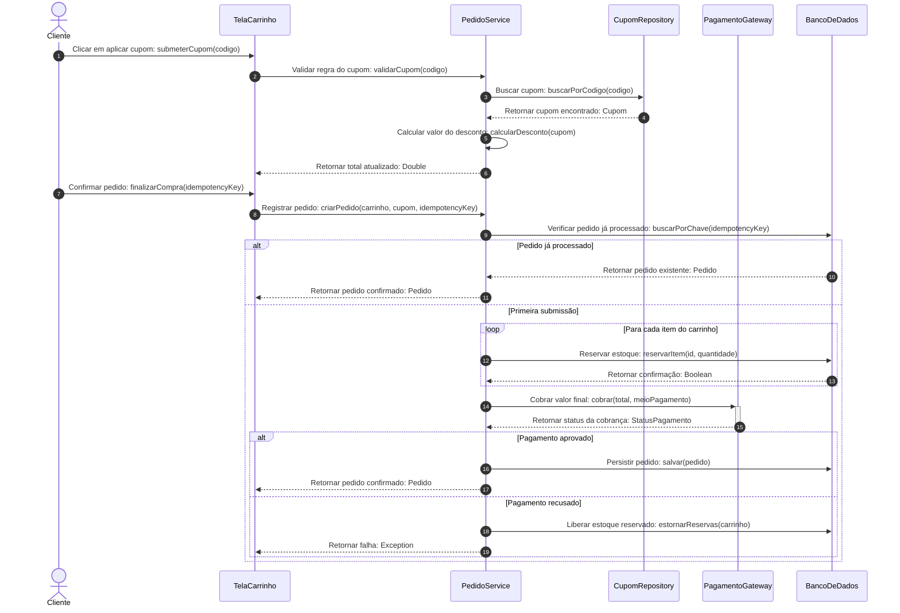
```mermaid
sequenceDiagram
    autonumber
    actor C as Cliente
    participant T as TelaCarrinho
    participant S as PedidoService
    participant R as CupomRepository
    participant P as PagamentoGateway
    participant DB as BancoDeDados

    C->>T: Clicar em aplicar cupom: submeterCupom(codigo)
    T->>S: Validar regra do cupom: validarCupom(codigo)
    S->>R: Buscar cupom: buscarPorCodigo(codigo)
    R-->>S: Retornar cupom encontrado: Cupom
    S->>S: Calcular valor do desconto: calcularDesconto(cupom)
    S-->>T: Retornar total atualizado: Double

    C->>T: Confirmar pedido: finalizarCompra(idempotencyKey)
    T->>S: Registrar pedido: criarPedido(carrinho, cupom, idempotencyKey)
    S->>DB: Verificar pedido já processado: buscarPorChave(idempotencyKey)

    alt Pedido já processado
        DB-->>S: Retornar pedido existente: Pedido
        S-->>T: Retornar pedido confirmado: Pedido
    else Primeira submissão
        loop Para cada item do carrinho
            S->>DB: Reservar estoque: reservarItem(id, quantidade)
            DB-->>S: Retornar confirmação: Boolean
        end
        S->>+P: Cobrar valor final: cobrar(total, meioPagamento)
        P-->>-S: Retornar status da cobrança: StatusPagamento
        alt Pagamento aprovado
            S->>DB: Persistir pedido: salvar(pedido)
            S-->>T: Retornar pedido confirmado: Pedido
        else Pagamento recusado
            S->>DB: Liberar estoque reservado: estornarReservas(carrinho)
            S-->>T: Retornar falha: Exception
        end
    end
```

**Três coisas que só este diagrama torna visíveis**

1. **A ordem entre reserva de estoque e cobrança.** Cobrar antes de reservar produz um cliente pago
   sem produto; reservar sem estornar produz estoque preso indefinidamente. O diagrama força a
   decisão a ser tomada e registrada.
2. **O tratamento da submissão repetida.** O `idempotencyKey` existe porque o cliente pode perder a
   conexão, não saber se o pedido passou e clicar de novo. Sem esse desvio, a repetição gera um
   segundo pedido e uma segunda cobrança — **um defeito que passa silenciosamente por revisão de
   código, porque cada trecho isolado está correto**.
3. **A fronteira com o serviço externo.** `PagamentoGateway` é a única linha de vida que a IDE não
   controla. Tudo que atravessa aquela seta pode falhar por motivos alheios ao código, e o diagrama
   mostra exatamente onde o tratamento de falha precisa existir.

**Boas práticas e dicas**

* **Numeração automática:** inclua a instrução `autonumber` logo após `sequenceDiagram` para enumerar
  os passos em ordem cronológica. É o que permite discutir o diagrama em uma revisão — *“o problema
  está no passo 7”* é uma frase útil; *“o problema está naquela seta ali”* não é.

* **Ordem de leitura:** as mensagens são desenhadas no diagrama na exata ordem vertical em que são
  declaradas no código.

* **Instanciação tardia:** declare no início do script apenas os componentes que existem desde o
  início do processo. Componentes instanciados dinamicamente devem ser introduzidos apenas via
  comando `create`.

* **Um diagrama, um fluxo.** A Regra de Ouro do User Flow (*2.4.3*) vale aqui igualmente. Um diagrama
  de sequência que tenta cobrir o cadastro, o login e a recuperação de senha ao mesmo tempo não será
  lido por ninguém.

* **A origem dos dados sensíveis vem do contexto autenticado, nunca do corpo da requisição.** Se um
  participante precisa saber *a qual unidade, loja ou organização* a operação pertence, esse dado
  deve ser derivado do token de quem chamou — não enviado pelo cliente. Quando o diagrama mostra esse
  dado chegando pela mensagem do ator, há uma falha de autorização desenhada em público.

**Referências desta seção**

GUEDES, Gilleanes T. A. *UML 2 — Uma Abordagem Prática*. Novatec Editora.

FOWLER, Martin. *UML Essencial: Um Breve Guia para a Linguagem-Padrão de Modelagem de Objetos*.
Bookman.

Documentação oficial do Mermaid — *Sequence Diagrams*.

---

### 2.4.6 Modelo Físico de Dados e Máquinas de Estado

> **Status desta seção:** acréscimo desta revisão. O Diagrama de Classes já era padrão da IDE; o
> modelo físico e as máquinas de estado vinham sendo produzidos em projeto por necessidade, sem
> estarem previstos no Manual. Esta seção formaliza a prática e define o gatilho de cada artefato.

#### Por que o Diagrama de Classes não basta

O Diagrama de Classes (*2.4.4*) descreve as abstrações do código. Ele **não tem onde representar as
garantias do banco de dados** — uma restrição de unicidade, uma verificação de valor, uma chave
estrangeira com exclusão em cascata, um índice que impede sobreposição de períodos.

Essa lacuna importa porque as duas camadas oferecem níveis de garantia radicalmente diferentes:

* Uma regra escrita **no código** vale enquanto todo caminho de escrita passar por aquele código.
  Uma rotina de importação, um script de correção ou um segundo *endpoint* escrito às pressas a
  contornam sem aviso.
* Uma regra escrita **no banco** vale sempre. O banco recusa a operação, independentemente de quem a
  tentou.

> **REGRA —** Quando uma regra de negócio é garantida por uma restrição de banco de dados, essa
> restrição **precisa estar visível em um diagrama**. Se ela existe apenas dentro de um arquivo de
> migração, ela deixará de ser conhecida assim que sair a pessoa que a escreveu — que é exatamente o
> risco estrutural que este Manual existe para mitigar.

#### Diagrama Entidade-Relacionamento (ERD)

O ERD descreve o **modelo físico**: as tabelas que existirão de fato, suas colunas, suas chaves e a
cardinalidade entre elas.

**Notação de cardinalidade no Mermaid**

A cardinalidade é escrita nas duas pontas do relacionamento. O símbolo mais próximo da entidade
descreve **quantas instâncias daquela entidade** participam da relação:

Lê-se de fora para dentro, no estilo *pé de galinha* (*crow's foot*):

* `|o` à esquerda, `o|` à direita — **zero ou um**
* `||` dos dois lados — **exatamente um**
* `}o` à esquerda, `o{` à direita — **zero ou muitos**
* `}|` à esquerda, `|{` à direita — **um ou muitos**

O traço central indica a força da dependência:

* `--` **relacionamento identificador** (linha sólida): a entidade filha não existe sem a mãe —
  equivale à composição do diagrama de classes.
* `..` **relacionamento não identificador** (linha tracejada): a filha existe independentemente.

**Marcadores de chave:** `PK` (chave primária), `FK` (chave estrangeira) e `UK` (chave única).

**Exemplo trabalhado**

Retomando a loja online, agora no nível físico:

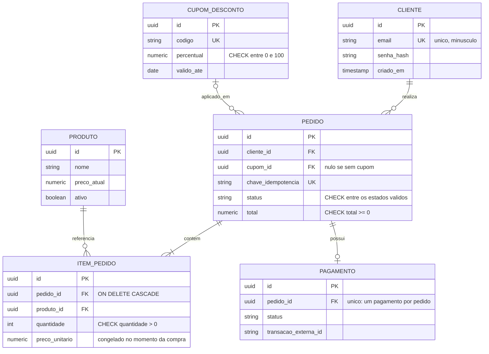
```mermaid
erDiagram
    CLIENTE ||--o{ PEDIDO : realiza
    PEDIDO ||--|{ ITEM_PEDIDO : contem
    PRODUTO ||--o{ ITEM_PEDIDO : referencia
    CUPOM_DESCONTO |o--o{ PEDIDO : aplicado_em
    PEDIDO ||--o| PAGAMENTO : possui

    CLIENTE {
        uuid id PK
        string email UK "unico, minusculo"
        string senha_hash
        timestamp criado_em
    }
    PEDIDO {
        uuid id PK
        uuid cliente_id FK
        uuid cupom_id FK "nulo se sem cupom"
        string chave_idempotencia UK
        string status "CHECK entre os estados validos"
        numeric total "CHECK total >= 0"
    }
    ITEM_PEDIDO {
        uuid id PK
        uuid pedido_id FK "ON DELETE CASCADE"
        uuid produto_id FK
        int quantidade "CHECK quantidade > 0"
        numeric preco_unitario "congelado no momento da compra"
    }
    PRODUTO {
        uuid id PK
        string nome
        numeric preco_atual
        boolean ativo
    }
    CUPOM_DESCONTO {
        uuid id PK
        string codigo UK
        numeric percentual "CHECK entre 0 e 100"
        date valido_ate
    }
    PAGAMENTO {
        uuid id PK
        uuid pedido_id FK "unico: um pagamento por pedido"
        string status
        string transacao_externa_id
    }
```

**Quatro decisões estão registradas nesse diagrama, e nenhuma delas caberia no diagrama de classes:**

1. `chave_idempotencia UK` — é a restrição de unicidade que **efetivamente** impede o pedido duplicado
   do *capítulo 2.4.5*. O código que verifica antes de inserir reduz a chance; a chave única elimina.
2. `preco_unitario` no item, e não apenas no produto — o preço é **congelado** no momento da compra.
   Sem isso, alterar o preço de um produto reescreve o histórico de todos os pedidos anteriores.
3. `ON DELETE CASCADE` em `ITEM_PEDIDO` — a composição do diagrama de classes traduzida em garantia
   real do banco.
4. `CHECK quantidade > 0` — a regra que o formulário valida na tela, aplicada também onde nenhuma
   tela alcança.

**Quando o ERD é obrigatório**

* Alguma regra de negócio é garantida por restrição de banco (o caso mais importante).
* O sistema tem mais de oito tabelas, ou possui chaves compostas.
* Há mais de um caminho de escrita para a mesma tabela.

**Quando é desperdício:** protótipo descartável, ou sistema cujo modelo é a tradução literal e sem
surpresas do diagrama de classes.

#### Máquinas de Estado

Nem toda entidade tem ciclo de vida. As que têm concentram uma quantidade desproporcional de defeitos
— porque a pergunta *“desse estado, para onde é permitido ir, e quem tem permissão de levar?”*
costuma ser respondida de forma diferente em cada tela que a manipula.

> **REGRA —** Uma entidade com **três ou mais estados**, e com regra própria em cada transição, tem
> uma máquina de estados desenhada. Um campo booleano `ativo/inativo` não tem — descrevê-lo em uma
> frase é suficiente.

**Sintaxe Mermaid**

```
stateDiagram-v2
    direction LR
    [*] --> EstadoInicial : evento que cria
    EstadoInicial --> OutroEstado : evento e condição
    OutroEstado --> [*]
```

`[*]` representa o início e o fim do ciclo de vida. **O rótulo de cada seta descreve o evento e a
condição que autorizam a transição** — uma seta sem rótulo é uma pergunta sem resposta.

**Exemplo trabalhado**

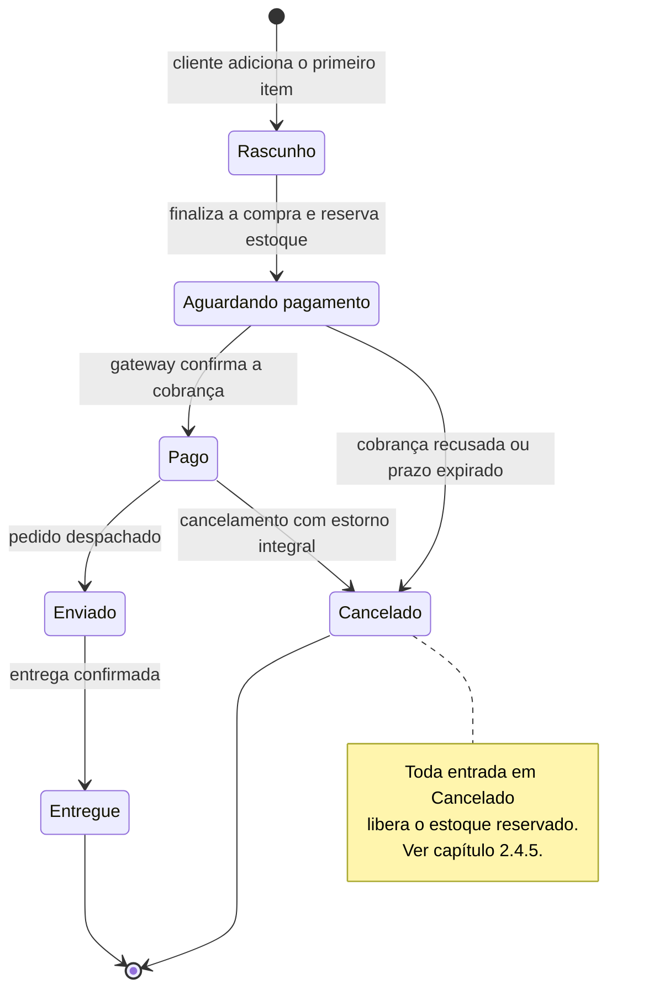
```mermaid
stateDiagram-v2
    direction TB
    state "Rascunho" as R
    state "Aguardando pagamento" as A
    state "Pago" as P
    state "Enviado" as E
    state "Entregue" as D
    state "Cancelado" as C

    [*] --> R : cliente adiciona o primeiro item
    R --> A : finaliza a compra e reserva estoque
    A --> P : gateway confirma a cobrança
    A --> C : cobrança recusada ou prazo expirado
    P --> E : pedido despachado
    E --> D : entrega confirmada
    P --> C : cancelamento com estorno integral
    D --> [*]
    C --> [*]

    note right of C
        Toda entrada em Cancelado
        libera o estoque reservado.
        Ver capítulo 2.4.5.
    end note
```

**O que este diagrama decide, e que de outro modo seria decidido em código, por acidente:**

* **`Entregue` não volta.** Não há seta saindo de `D`. Devolução, se existir, é outro processo, com
  outra entidade — e, se não foi contratada, é `Won’t Have`.
* **`Enviado` não pode ser cancelado.** A ausência da seta `E --> C` é uma regra de negócio, e é a
  ausência que a comunica. **Em máquinas de estado, as setas que não existem valem tanto quanto as
  que existem.**
* **O estorno está atrelado à transição, não ao botão.** Qualquer caminho que chegue a `Cancelado`
  libera o estoque — inclusive um caminho criado seis meses depois por outra pessoa.

---

### 2.4.7 Visão Arquitetural: o Modelo C4

> **Status desta seção:** acréscimo desta revisão, e **proposta de adoção**. O Manual não possuía
> nenhum artefato entre a jornada do usuário e o diagrama de classes. Na prática de projeto, essa
> lacuna já vinha sendo preenchida de forma espontânea — pacotes de definição recentes organizam a
> arquitetura exatamente nos níveis descritos abaixo, sem chamá-los pelo nome. Esta seção dá nome,
> notação e gatilho ao que a equipe já fazia por necessidade.

#### O problema que o C4 resolve

Peça a três desenvolvedores um “diagrama de arquitetura” e você receberá três desenhos em três
níveis de abstração diferentes: um mostrará servidores, outro mostrará classes, o terceiro mostrará
telas. Nenhum estará errado. Nenhum será comparável ao outro.

O **Modelo C4** (Simon Brown) resolve isso com uma ideia simples: **arquitetura se documenta em
níveis de zoom sucessivos**, como um mapa. Cada nível tem um público, uma pergunta e um grau de
detalhe definidos. Você não mistura escalas na mesma folha, assim como um mapa rodoviário não
desenha a planta das casas.

| Nível | Nome | Pergunta que responde | Público |
| :--------: | :------------ | :------------------------------ | :---------------------- |
| **1** | **Contexto** | O que é este sistema, quem o usa e com o que ele conversa? | Cliente, Comercial, equipe inteira |
| **2** | **Contêiner** | De que peças executáveis ele é feito e como elas se comunicam? | Toda a equipe técnica |
| **3** | **Componente** | Como um módulo específico se organiza por dentro? | Quem vai desenvolver aquele módulo |
| **4** | **Código** | Como as classes daquele componente se relacionam? | Quem está escrevendo aquele arquivo |

> **REGRA DE ADOÇÃO NA IDE —** Os **níveis 1 e 2 são obrigatórios** em qualquer projeto com mais de
> um ator ou com qualquer dependência externa. O **nível 3 é produzido apenas para o módulo que
> concentra a regra de negócio** do sistema — aquele que, se estiver errado, compromete o produto
> inteiro. O **nível 4 não é desenhado à mão**: ele já é o Diagrama de Classes do *capítulo 2.4.4*.

**Sobre a notação:** o Mermaid possui suporte nativo experimental a diagramas C4 (`C4Context`), mas
seu comportamento ainda varia entre versões. **A recomendação da IDE é desenhar os níveis com
`graph TB` e `subgraph`**, que é estável, universalmente renderizado e perfeitamente adequado. O
valor do C4 está na disciplina dos níveis, não na notação.

#### Nível 1 — Diagrama de Contexto

Uma única caixa para o sistema. Em volta, todos os atores humanos e todos os sistemas externos.
Nenhum detalhe interno.

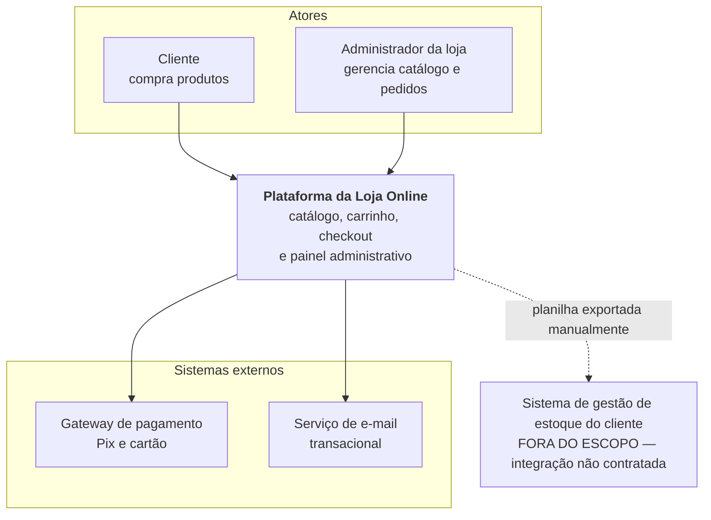
```mermaid
graph TB
    subgraph Atores
        CLI["Cliente<br/>compra produtos"]
        ADM["Administrador da loja<br/>gerencia catálogo e pedidos"]
    end

    SYS["<b>Plataforma da Loja Online</b><br/>catálogo, carrinho, checkout<br/>e painel administrativo"]

    subgraph Sistemas externos
        PAG["Gateway de pagamento<br/>Pix e cartão"]
        MAIL["Serviço de e-mail<br/>transacional"]
    end

    FORA["Sistema de gestão de estoque do cliente<br/>FORA DO ESCOPO — integração não contratada"]

    CLI --> SYS
    ADM --> SYS
    SYS --> PAG
    SYS --> MAIL
    SYS -.->|"planilha exportada manualmente"| FORA
```

**A caixa `FORA` é o elemento mais valioso deste diagrama.** Desenhar explicitamente o que está fora
da fronteira — em vez de simplesmente omitir — transforma a lista de exclusões da Matriz de
Requisitos (*2.4.1*) em imagem. É a diferença entre o cliente entender que a integração não existe e
o cliente descobrir isso na entrega.

> **REGRA —** No diagrama de contexto, **o que foi deliberadamente excluído é desenhado como
> excluído**, com linha tracejada e rótulo explícito. Omitir comunica esquecimento; desenhar
> excluído comunica decisão.

#### Nível 2 — Diagrama de Contêiner

Abre-se a caixa do sistema. Cada **contêiner** é uma unidade executável ou de armazenamento
independente: uma aplicação web, uma API, um banco de dados, um serviço agendado. **Contêiner aqui
não significa contêiner Docker** — significa “coisa que roda separadamente”.

Este é o nível em que a **pilha tecnológica padrão da IDE** aparece por escrito:

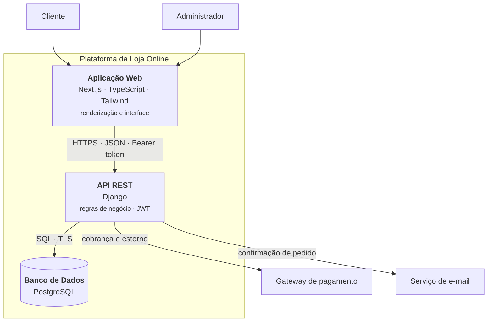
```mermaid
graph TB
    CLI["Cliente"]
    ADM["Administrador"]

    subgraph Sistema["Plataforma da Loja Online"]
        WEB["<b>Aplicação Web</b><br/>Next.js · TypeScript · Tailwind<br/><small>renderização e interface</small>"]
        API["<b>API REST</b><br/>Django<br/><small>regras de negócio · JWT</small>"]
        DB[("<b>Banco de Dados</b><br/>PostgreSQL")]
    end

    PAG["Gateway de pagamento"]
    MAIL["Serviço de e-mail"]

    CLI --> WEB
    ADM --> WEB
    WEB -->|"HTTPS · JSON · Bearer token"| API
    API -->|"SQL · TLS"| DB
    API -->|"cobrança e estorno"| PAG
    API -->|"confirmação de pedido"| MAIL
```

**Cada seta é rotulada com o protocolo e o propósito.** Uma seta sem rótulo entre dois contêineres é
uma decisão de integração que ainda não foi tomada.

**Este é também o diagrama que expõe as quebras de padrão.** A pilha da IDE é fixa por política —
Next.js/TypeScript/Tailwind, Django, PostgreSQL, Docker, JWT/OAuth, REST, Payload CMS. Qualquer caixa
neste diagrama que contenha uma tecnologia fora dessa lista exige um **Research Card aprovado**, e
esse Research Card é **custo real de cronograma**, não formalidade. Desenhar o nível 2 antes de
planejar as sprints é o que faz esse custo aparecer enquanto ainda dá tempo de absorvê-lo.

#### Nível 3 — Diagrama de Componente

Abre-se **um** contêiner — normalmente a API — e apenas no módulo que concentra a complexidade.

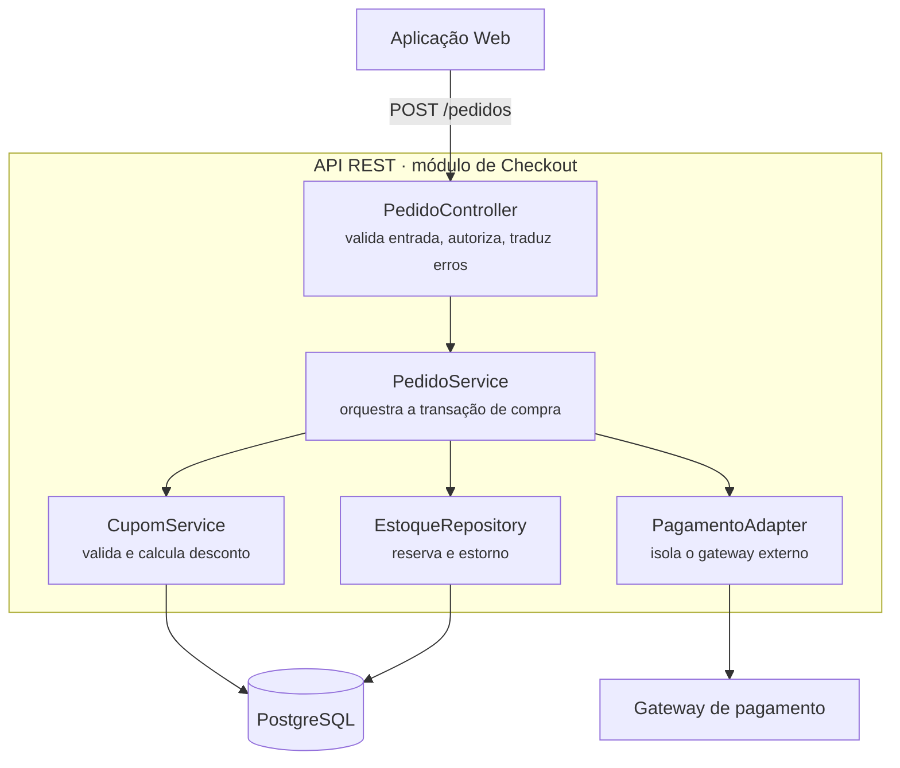
```mermaid
graph TB
    WEB["Aplicação Web"]

    subgraph API["API REST · módulo de Checkout"]
        CTRL["PedidoController<br/><small>valida entrada, autoriza, traduz erros</small>"]
        SRV["PedidoService<br/><small>orquestra a transação de compra</small>"]
        CUP["CupomService<br/><small>valida e calcula desconto</small>"]
        EST["EstoqueRepository<br/><small>reserva e estorno</small>"]
        ADP["PagamentoAdapter<br/><small>isola o gateway externo</small>"]
    end

    DB[("PostgreSQL")]
    PAG["Gateway de pagamento"]

    WEB -->|"POST /pedidos"| CTRL
    CTRL --> SRV
    SRV --> CUP
    SRV --> EST
    SRV --> ADP
    CUP --> DB
    EST --> DB
    ADP --> PAG
```

Duas convenções tornam este nível útil em vez de decorativo:

* **Componentes são nomeados por responsabilidade, não por camada.** `PagamentoAdapter` diz o que
  faz; `UtilsService` não diz nada e quase sempre indica que a responsabilidade ainda não foi
  decidida.
* **O adaptador que isola o serviço externo é desenhado explicitamente.** É ele que permite trocar
  de gateway sem reescrever a regra de negócio — e é a peça que um desenvolvedor iniciante costuma
  não criar, chamando o serviço externo direto de dentro da regra.

#### Nível 4 — Código

**Não desenhe.** Este nível é o Diagrama de Classes do *capítulo 2.4.4*, e mesmo ele deve ser mantido
no grau de abstração descrito lá: *“mapear a arquitetura e o fluxo principal com as abstrações
corretas”*. Um diagrama que reproduz classe por classe o conteúdo do repositório estará
desatualizado na primeira sprint e é trabalho jogado fora — o código é a documentação fiel desse
nível, por definição.

#### Diagrama de Implantação

Formalmente o C4 trata implantação como uma visão suplementar. **Na IDE ela é obrigatória para todo
projeto hospedado**, por uma razão prática e financeira: é o único diagrama que responde *quem paga a
conta depois que o contrato acabar*.

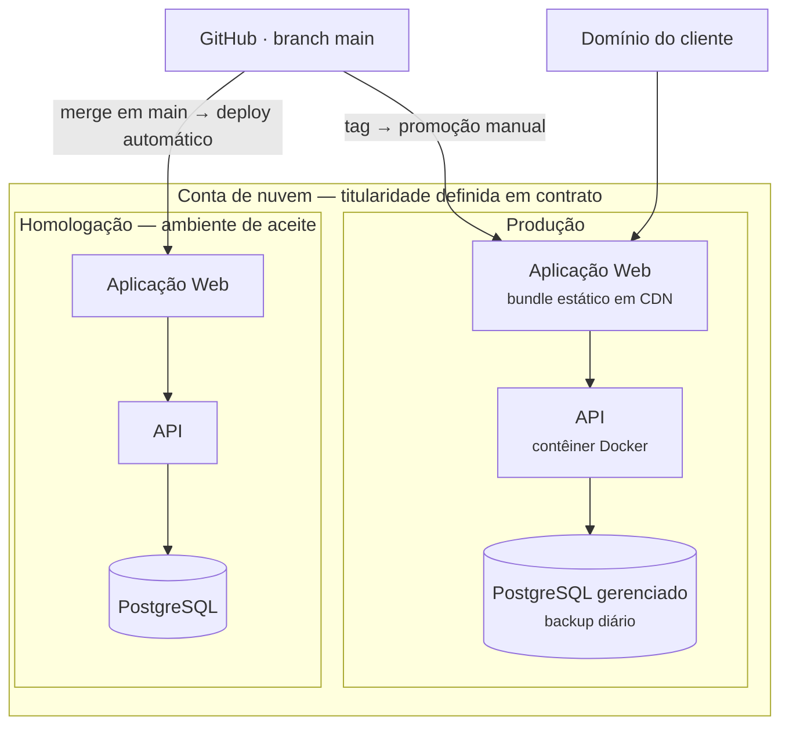
```mermaid
graph TB
    subgraph Conta["Conta de nuvem — titularidade definida em contrato"]
        subgraph Prod["Produção"]
            W["Aplicação Web<br/><small>bundle estático em CDN</small>"]
            A["API<br/><small>contêiner Docker</small>"]
            P[("PostgreSQL gerenciado<br/><small>backup diário</small>")]
        end
        subgraph Hom["Homologação — ambiente de aceite"]
            WH["Aplicação Web"]
            AH["API"]
            PH[("PostgreSQL")]
        end
    end

    DNS["Domínio do cliente"]
    GH["GitHub · branch main"]

    DNS --> W
    W --> A
    A --> P
    WH --> AH
    AH --> PH
    GH -->|"merge em main → deploy automático"| WH
    GH -->|"tag → promoção manual"| W
```

**Três regras que este diagrama obriga a decidir por escrito:**

1. **Titularidade da conta.** A IDE não deve manter credencial que não possa transferir ao cliente ao
   fim do contrato. Contas criadas em nome de um membro deixam a empresa junto com o membro.
2. **Custo recorrente tem dono nomeado.** Se a hospedagem, o serviço de e-mail ou a API de mapas
   geram cobrança mensal, **quem paga precisa estar escrito**. Custo recorrente sem responsável
   definido é um passivo que sobrevive ao contrato — e o diagrama de implantação é o lugar onde essa
   omissão fica impossível de ignorar.
3. **Produção é promovida por ato deliberado.** A automação vai até a homologação; a passagem para
   produção é decisão humana, pelo mesmo princípio do *capítulo 2.2.7*, onde o *merge* é ato
   consciente após revisão — e não consequência automática de o código ter compilado.

**Regra dos três ambientes:** local (`docker compose`), homologação (onde o cliente aceita) e
produção. **A homologação nunca recebe dados pessoais reais de produção** — cópia de base para
ambiente de teste é o vazamento de dados mais comum e mais evitável que uma equipe júnior pode
provocar.

---

### 2.4.8 Documentação como Código (*Docs-as-Code*)

> **Status desta seção:** acréscimo desta revisão, e **proposta de padronização**. A escolha do
> Mermaid já era prática da IDE nos capítulos 2.4.3 e 2.4.4; esta seção explicita *por quê*, e o que
> decorre disso para o fluxo de trabalho do *capítulo 2.2*.

#### O problema: o diagrama que mente

Todo diagrama neste capítulo tem o mesmo inimigo, e não é a notação errada: é o **desatualizado**.

Um diagrama desatualizado é pior que a ausência de diagrama, porque um membro novo confia nele. Ele
lê a arquitetura de seis meses atrás, implementa contra ela, e o defeito só aparece na integração.
A ausência de diagrama pelo menos obriga a pessoa a perguntar.

A causa raiz é quase sempre a mesma e é mecânica, não de disciplina: **o diagrama mora longe do
código que ele descreve.** Quando a figura é um PNG exportado de uma ferramenta de desenho, anexado
a uma pasta compartilhada, três coisas acontecem de forma previsível:

* Ninguém sabe onde está o arquivo-fonte editável, ou ele está na conta pessoal de quem já saiu.
* A alteração do código e a alteração da figura são dois atos separados, e o segundo é opcional.
* A revisão do Pull Request não vê a figura, logo não tem como cobrá-la.

#### A solução: o diagrama é código-fonte

**Documentação como Código** é o princípio de tratar a documentação técnica com as mesmas
ferramentas e o mesmo rigor do código: **texto puro, versionado no mesmo repositório, alterado no
mesmo *commit*, revisado no mesmo Pull Request.**

É exatamente por isso que este Manual especifica **Mermaid** e não uma ferramenta gráfica. Não é
preferência estética. As consequências são operacionais:

| Propriedade | Diagrama em Mermaid (texto) | Imagem exportada |
| :------------------ | :----------------------------- | :------------------------- |
| **Histórico** | Cada alteração aparece no `git log`, com autor e data | Um binário substitui o outro |
| **Revisão** | O revisor vê **exatamente o que mudou**, linha a linha | O revisor vê “imagem alterada” |
| **Fonte editável** | É o próprio arquivo, no repositório | Um `.fig`, `.drawio` ou `.pptx` em algum lugar |
| **Dependência de conta** | Nenhuma | A conta de quem criou o arquivo |
| **Custo de manter** | Editar uma linha | Abrir a ferramenta, reexportar, reanexar |
| **Renderização** | Nativa no GitHub, no VS Code e neste Manual | Precisa da imagem em si |

> **REGRA GERAL DA SEÇÃO —** Todo diagrama de projeto da IDE nasce como **texto Mermaid dentro do
> repositório do projeto**. Imagem exportada é aceitável como cópia para apresentação ao cliente,
> **nunca como fonte da verdade**.

#### A regra que faz o mecanismo funcionar

Versionar o diagrama junto ao código só resolve o problema se houver um momento em que a divergência
é detectada. Esse momento é a revisão do Pull Request (*capítulo 2.2.6*).

> **REGRA —** Um Pull Request que altera um **contrato** — uma entidade, um *endpoint*, uma máquina
> de estados, uma dependência externa, um relacionamento entre módulos — **altera o diagrama
> correspondente no mesmo Pull Request**. O revisor que aprova o código sem o diagrama atualizado
> aprovou a próxima desatualização.

Isso adiciona três itens verificáveis ao *checklist* de revisão já descrito no *capítulo 2.2.5*:

* O diagrama afetado foi atualizado no mesmo *commit*?
* O diagrama ainda renderiza? (um erro de sintaxe em Mermaid quebra o bloco silenciosamente no
  GitHub — ele simplesmente não aparece)
* A alteração introduziu alguma tecnologia ou dependência externa que não estava no diagrama de
  contêiner (*2.4.7*)?

#### Onde os diagramas moram

A organização abaixo é sugestão, não obrigação — o que é obrigatório é que os diagramas estejam
**dentro do repositório do projeto**, em texto, e que qualquer membro saiba onde procurar sem
perguntar:

```
docs/
├── 01-requisitos.md          ← Matriz de Requisitos Funcionais (2.4.1)
├── 02-user-stories.md        ← User Stories e critérios de aceite (2.4.2)
├── 03-user-flows.md          ← um diagrama por jornada (2.4.3)
├── 04-arquitetura.md         ← C4 níveis 1 a 3 e implantação (2.4.7)
├── 05-modelo-de-dominio.md   ← classes, ERD e máquinas de estado (2.4.4 e 2.4.6)
├── 06-sequencias.md          ← apenas os fluxos que exigem (2.4.5)
└── 07-decisoes.md            ← ADRs
```

#### PlantUML: quando o Mermaid não alcança

O Mermaid é o padrão porque renderiza nativamente onde a equipe já trabalha, sem instalar nada. Ele
tem limites: notações UML mais exóticas, diagramas de classes muito grandes, controle fino de
posicionamento.

**PlantUML** é a alternativa aceita nesses casos. Ele é mais expressivo e possui a biblioteca
`C4-PlantUML`, que implementa a notação C4 formalmente. Em contrapartida, **exige um servidor de
renderização ou uma extensão instalada** — ou seja, um passo a mais na configuração de cada máquina
da equipe.

> **REGRA —** O padrão é Mermaid. PlantUML é exceção justificada, adotada **por projeto** e
> registrada — nunca por preferência individual de um membro. Um repositório com metade dos diagramas
> em cada ferramenta tem o pior dos dois mundos.

#### O que nenhum diagrama consegue registrar: o ADR

Um diagrama mostra **o que foi decidido**. Ele é incapaz de mostrar **o que foi rejeitado e por quê**
— e essa é justamente a informação que se perde primeiro, e que custa mais caro quando falta.

O sintoma é conhecido: três meses depois, um membro pergunta *“por que não usamos simplesmente
X?”*. Se a resposta não estiver escrita em lugar nenhum, uma de duas coisas acontece — a discussão é
refeita do zero no meio de uma sprint, ou pior, a decisão é silenciosamente revertida dentro de um
Pull Request, por alguém que não sabia que ela havia sido tomada.

O **ADR (*Architecture Decision Record*)** é o registro que resolve isso. É um documento curto, um
por decisão, imutável depois de aceito — uma decisão que muda gera um **novo** ADR que supersede o
anterior, nunca uma edição do antigo. O histórico é o produto.

**Modelo mínimo:**

```markdown
# ADR-007 — Título curto e afirmativo da decisão

**Status:** Proposto | Aceito | Substituído por ADR-0NN
**Data:** AAAA-MM-DD

## Contexto
O que era verdade quando a decisão foi tomada: a restrição, o requisito,
o problema observado.

## Decisão
O que foi decidido, em uma ou duas frases, no presente do indicativo.

## Alternativas rejeitadas
- **Alternativa A** — por que não. Esta seção é o motivo de o documento existir.
- **Alternativa B** — por que não.

## Consequências
O que fica mais fácil e o que fica mais difícil a partir daqui, incluindo
o que a equipe passa a ser obrigada a fazer.
```

**Quando escrever um ADR:** quando a decisão é **cara de reverter** e **não é óbvia** — escolha de
biblioteca estruturante, modelo de autenticação, estratégia de persistência, adoção de tecnologia
fora da pilha padrão (que também exige Research Card), fronteira entre módulos.

**Quando não escrever:** decisões locais e reversíveis. Nomear uma variável não é um ADR.

> **A conexão com a rotatividade.** Todo este Manual existe porque a IDE opera com alta rotatividade
> de membros. **O ADR é o artefato mais diretamente antirrotatividade de todos** — é o único que
> preserva o raciocínio, e não apenas o resultado. Um diagrama transfere a arquitetura; um ADR
> transfere o julgamento.

---

### 2.4.9 Anti-padrões de diagramação

Os seis erros abaixo respondem pela maior parte do esforço desperdiçado com diagramas. Todos são
reconhecíveis antes de custarem caro.

| Anti-padrão | Como se manifesta | Correção |
| :-------------- | :--------------------------- | :------------------------------- |
| **O diagrama que ninguém atualizou** | Existe, é bonito, e descreve o sistema de três meses atrás. Um membro novo implementa contra ele | Diagrama vive no repositório e muda no mesmo Pull Request que muda o contrato (*2.4.8*) |
| **O sistema inteiro em uma folha** | Um único diagrama com todas as telas, todos os atores e todos os fluxos. Ilegível a partir da terceira semana | Regra de Ouro (*2.4.3*): um diagrama, uma jornada. Para visão geral, use o nível 1 do C4 (*2.4.7*) |
| **Detalhar antes de decidir** | Diagrama de classes com 40 classes e todos os *getters*, produzido antes de a arquitetura estar resolvida | *“Mapear a arquitetura e o fluxo principal com as abstrações corretas”* (*2.4.4*). Detalhe é consequência da decisão, não substituto dela |
| **Diagramar o óbvio** | Sequência de seis passos para um CRUD linear; máquina de estados para um booleano | Tabela *“Qual diagrama, quando”*. Se ninguém precisou explicar aquilo em voz alta, não desenhe |
| **A arquitetura de vitrine** | Microsserviços, filas e *cache* distribuído desenhados para um sistema de quatro telas, porque parece profissional | Cada caixa é custo de sprint e de manutenção. A pilha é fixa por política; sair dela exige Research Card aprovado, com custo de cronograma real |
| **O PNG órfão** | A figura está na apresentação; o arquivo editável estava na conta de quem saiu da empresa | Fonte da verdade é texto no repositório (*2.4.8*) |

Um sétimo, mais sutil e específico da fase de execução:

**O diagrama que promete escopo.** Um diagrama de contexto ou de contêiner apresentado ao cliente
comunica intenção, mesmo sem uma linha de texto. Se ele mostra uma integração que não foi contratada
— ainda que como possibilidade futura, ainda que em cinza —, essa integração passou a ser esperada.
**Todo elemento fora do escopo desenhado para o cliente deve estar rotulado como fora do escopo, de
forma inequívoca** (*2.4.7*, regra da fronteira).

---

### Checklist de diagramação

A percorrer **antes de a primeira sprint ser planejada**, e novamente ao fim de cada fase entregue.

**Escopo e comportamento**

- [ ] Todo requisito da Matriz tem ID, módulo, prioridade MoSCoW e fase.
- [ ] Todo ator do sistema — inclusive os administrativos — tem entrada própria na Matriz.
- [ ] Nenhuma fase depende operacionalmente de um requisito alocado a uma fase posterior.
- [ ] O que ficou de fora está registrado como `Won’t Have`, não omitido.
- [ ] Toda User Story passa no INVEST; as que falham em **S** foram fatiadas verticalmente.
- [ ] Todo critério de aceite está em BDD e é verificável por quem não escreveu o código.
- [ ] Cada jornada relevante tem um User Flow, e **cada cenário dos critérios de aceite tem um
      caminho nele** — inclusive os caminhos de erro.

**Arquitetura e execução**

- [ ] Existe Diagrama de Classes com as abstrações do domínio, sem detalhamento excessivo.
- [ ] Existem diagramas de sequência para os fluxos com serviço externo, transação, concorrência ou
      possibilidade de repetição pelo usuário.
- [ ] Toda regra de negócio garantida por restrição de banco está visível no ERD.
- [ ] Toda entidade com três ou mais estados tem máquina de estados, com evento rotulado em cada
      transição.
- [ ] Existem os níveis 1 e 2 do C4, e o nível 3 do módulo crítico.
- [ ] O diagrama de contexto desenha explicitamente o que está **fora** da fronteira.
- [ ] Toda tecnologia fora da pilha padrão aparece no diagrama de contêiner e tem **Research Card
      aprovado**, com o custo de cronograma já refletido no planejamento.
- [ ] O diagrama de implantação existe, e nele estão decididos: titularidade da conta, **dono do
      custo recorrente** e forma de promoção para produção.

**Sustentação**

- [ ] Todos os diagramas estão em **texto, no repositório do projeto**.
- [ ] Todos renderizam sem erro de sintaxe.
- [ ] As decisões caras de reverter têm ADR, com as **alternativas rejeitadas** escritas.
- [ ] Toda Issue criada rastreia até um ID de requisito (*capítulo 2.2.2*).

> **REGRA FINAL DO CAPÍTULO —** Um artefato deste capítulo só está pronto quando alguém que não
> participou da sua elaboração consegue usá-lo para tomar uma decisão sozinho. Enquanto for
> necessário que o autor esteja presente para explicá-lo, o artefato ainda não substitui o autor — e
> substituir a presença do autor é, precisamente, a função dele.

---

### Referências do capítulo

BROWN, Simon. *The C4 model for visualising software architecture*. Disponível em:
[https://c4model.com](https://c4model.com).

COCKBURN, Alistair. *Writing Effective Use Cases*. Addison-Wesley.

FOWLER, Martin. *UML Essencial: Um Breve Guia para a Linguagem-Padrão de Modelagem de Objetos*.
Bookman.

GUEDES, Gilleanes T. A. *UML 2 — Uma Abordagem Prática*. Novatec Editora.

KALBACH, Jim. *Mapping Experiences: A Complete Guide to Creating Value Through Journey Maps,
Diagrams, and Maps*. O’Reilly Media, 2020.

MOUNTAIN GOAT SOFTWARE. *User Stories and User Story Examples*. Disponível em:
[https://www.mountaingoatsoftware.com/agile/user-stories](https://www.mountaingoatsoftware.com/agile/user-stories).

NYGARD, Michael. *Documenting Architecture Decisions*. Disponível em:
[https://cognitect.com/blog/2011/11/15/documenting-architecture-decisions](https://cognitect.com/blog/2011/11/15/documenting-architecture-decisions).

Documentação oficial do **Mermaid** — *Flowchart*, *Sequence Diagram*, *Class Diagram*,
*Entity Relationship Diagram*, *State Diagram*.

Documentação oficial do **PlantUML** e da biblioteca **C4-PlantUML**.

---

### Exemplo prático: o capítulo aplicado a um requisito real

Os exemplos das seções anteriores vêm de projetos diferentes — uma loja online aqui, uma tela de
login ali, um pedido e um pagamento acolá. Cada um ilustra bem o seu artefato, e nenhum deles mostra
o que este capítulo realmente promete: **um mesmo requisito atravessando os nove artefatos**, do
contrato até a Issue atribuída a uma pessoa.

Este tópico faz isso. O fio condutor é **`RF-ATD-03` — o registro de coleta no ecoponto**, do
projeto Impacto Ambiental: o atendente recebe material reciclável, informa o que foi entregue e
quanto pesou, e o sistema converte aquilo em pontos no saldo do usuário. É a operação que cria valor
no sistema inteiro, e ela toca todos os artefatos do capítulo.

Há continuidade com o capítulo 1: a **ficha de tela** desse mesmo registro de coleta já aparece no
`§1.4.2.4.3`, como saída do esboço pré-contratual. Aqui ela vira escopo rastreável e arquitetura.

> **O que este exemplo é, e o que ele não é.** É um **modelo da saída esperada** — o que o capítulo
> 2.4, aplicado a este escopo contratado, deve produzir. **Não é** um retrato do que o projeto
> produziu: o pacote técnico do Impacto Ambiental ainda está em construção, e os artefatos abaixo
> foram escritos aqui, seguindo as regras deste capítulo.
>
> O que é fato verificável são os **requisitos**, que vêm da Proposta Formal assinada. Tudo o mais
> — User Story, User Flow, classes, sequência, modelo físico, C4 e ADR — é a aplicação da regra.

<details>
<summary>Abrir o exemplo completo — do requisito contratado à Issue</summary>

#### O ponto de partida: o que o contrato diz

Cinco requisitos funcionais compõem o fluxo do atendente, e um requisito **excluído** molda o
desenho tanto quanto os incluídos:

| Id | O que o contrato estabelece |
| :---------- | :------------------------------------------------------------------- |
| `RF-ATD-01` | Login restrito aos atendentes, com acesso segregado dos demais perfis |
| `RF-ATD-02` | Identificação do usuário por CPF ou e-mail digitado pelo atendente |
| `RF-ATD-03` | Registro de coleta: seleção do material e entrada manual da quantidade pesada |
| `RF-ATD-04` | Conversão automática da quantidade em pontos, pela regra da campanha vigente |
| `RF-ATD-05` | Persistência da operação e crédito imediato dos pontos ao saldo do usuário |
| `RE-26` | **Excluído:** cadastro de usuário pelo atendente no ecoponto |

**Leia a última linha com atenção.** Como o atendente não pode cadastrar ninguém, o usuário
**precisa já ter conta** quando chega ao ecoponto. Isso não é detalhe de implementação: é um ramo
do fluxo que precisa existir no desenho, e uma conversa que alguém vai ter com o cliente. Escopo
negativo vira desenho.

---

#### 1 · Matriz de Requisitos Funcionais

As seis colunas do `§2.4.1`, sem inventar nenhuma:

| ID | Módulo | Descrição | Prioridade | Fase/Escopo | User Story |
| :---------- | :--------- | :---------------------------------------------- | :--------- | :---------- | :--------- |
| `RF-ATD-01` | Atendente | Permitir o login do atendente com acesso restrito ao próprio ecoponto | Must | Etapa 2 | `US002` |
| `RF-ATD-02` | Atendente | Localizar o usuário por CPF ou e-mail digitado pelo atendente | Must | Etapa 2 | `US001` |
| `RF-ATD-03` | Coleta | Registrar o material recebido e a quantidade pesada | Must | Etapa 2 | `US001` |
| `RF-ATD-04` | Coleta | Converter a quantidade registrada em pontos conforme a campanha vigente | Must | Etapa 2 | `US001` |
| `RF-ATD-05` | Pontuação | Creditar os pontos ao saldo do usuário no momento do registro | Must | Etapa 2 | `US001` |

**Duas coisas para reparar, e a segunda é a que costuma ser feita errado.**

**A descrição começa sempre com verbo no infinitivo** — *permitir*, *localizar*, *registrar*,
*converter*, *creditar*. Não é preciosismo: uma linha que começa com substantivo (*"tela de
registro"*) descreve um artefato, e uma que começa com verbo descreve um comportamento. Só a
segunda é testável.

**Quatro requisitos apontam para a mesma User Story.** `RF-ATD-02`, `03`, `04` e `05` são o mesmo
ato do ponto de vista de quem usa: o atendente registra uma entrega. Separá-los em quatro histórias
produziria quatro pedaços que ninguém consegue entregar sozinho — e uma história que não entrega
valor sozinha falha o *I* de INVEST. **A MRF numera requisitos contratuais; a User Story agrupa o
que faz sentido como unidade de trabalho.** Os dois recortes não precisam coincidir.

> **Sobre o MoSCoW num contrato de escopo fechado.** Todos os cinco estão como `Must`, e isso
> parece inútil — uma coluna com tudo `Must` não prioriza nada. É consequência do contrato: todo
> requisito enumerado é obrigação, então não há `Could` legítimo. **Quando isso acontecer, a
> priorização real não vem do MoSCoW e sim da ordem de dependência** — o que precisa existir para
> que outra coisa funcione. É a coluna *Fase/Escopo* que carrega essa informação, e é ela que se
> discute no planejamento da sprint.

---

#### 2 · User Story

Formato Connextra, como manda o `§2.4.2`:

> **`US001` — Registro de coleta no ecoponto**
> **Requisitos relacionados:** `RF-ATD-02`, `RF-ATD-03`, `RF-ATD-04`, `RF-ATD-05`
>
> **Como** atendente de ecoponto,
> **Eu quero** registrar o material que recebi e a quantidade que pesei,
> **Para que** a entrega do usuário seja convertida em pontos na hora, com ele ainda no balcão.

O **"para que"** é o campo que costuma ser preenchido com pressa, e aqui ele carrega a informação
mais cara da história: *com ele ainda no balcão*. Isso descarta silenciosamente qualquer solução de
processamento assíncrono ou fila noturna — o crédito é síncrono porque o usuário confere o saldo
antes de ir embora. Sem essa frase, um desenvolvedor razoável poderia escolher o contrário.

**Critérios de aceite, em BDD:**

*Cenário 1 — Registro com sucesso*
**Dado que** confirmei o usuário e selecionei um material com regra vigente,
**Quando** eu informar uma quantidade maior que zero e confirmar,
**Então** o sistema deve gravar a coleta, creditar os pontos e exibir o total creditado e o novo
saldo do usuário.

*Cenário 2 — Usuário sem conta*
**Dado que** o CPF informado não corresponde a nenhum usuário cadastrado,
**Quando** eu tentar prosseguir,
**Então** o sistema deve informar que o atendimento não pode ser realizado e orientar o usuário a
criar a conta antes de retornar ao ecoponto.

*Cenário 3 — Quantidade inválida*
**Dado que** informei quantidade zero, negativa ou não numérica,
**Quando** eu tentar confirmar,
**Então** o sistema deve bloquear o registro e explicar o que é esperado no campo.

*Cenário 4 — Material sem campanha vigente*
**Dado que** o material selecionado não é premiado por nenhuma campanha vigente na data de hoje,
**Quando** eu tentar confirmar,
**Então** o sistema deve bloquear **apenas esse material**, mantendo os demais disponíveis.

*Cenário 5 — Falha de rede na confirmação*
**Dado que** a conexão caiu no instante em que confirmei,
**Quando** eu repetir a confirmação,
**Então** o sistema deve registrar a coleta **uma única vez**, sem creditar os pontos em
duplicidade.

**Validação INVEST, item a item:**

| Letra | Pergunta | Veredito |
| :---: | :--------------------------------------- | :------------------------------------------ |
| **I** | É independente? | Sim — depende de cadastros que já existem, não de outra história desta sprint |
| **N** | É negociável? | Sim — descreve o quê, não a tela nem a tecnologia |
| **V** | Entrega valor? | Sim — é a operação que faz o sistema existir |
| **E** | É estimável? | Sim — a equipe consegue dimensionar os cinco cenários |
| **S** | É pequena? | **Passa raspando** — ver abaixo |
| **T** | É testável? | Sim — os cinco cenários são o roteiro de teste |

**O `S` merece uma conversa honesta.** A sprint da IDE tem duas semanas, com os dois últimos dias
reservados para revisão e planejamento: sobram **cerca de oito dias efetivos de código**, executados
por estudantes em semestres iniciais e com disponibilidade parcial. Uma história com cinco cenários,
regra de conversão e garantia de não-duplicidade é grande para esse orçamento.

Ela **não** vira Épico porque os cenários não são separáveis: um registro que grava mas não credita
não entrega nada, e um que credita duas vezes é pior do que não existir. **O que se fatia é o
supérfluo, não o essencial** — o histórico do que o atendente registrou no turno, por exemplo, é
outra história e outra sprint. Se depois da fatia ela ainda não couber, o correto é dizer isso no
planejamento, não espremer.

---

#### 3 · User Flow

Uma jornada, um diagrama. Vocabulário do `§2.4.3` e nada além dele: `([pílula])` para início e fim,
`[retângulo]` para tela ou ação, `{losango}` para decisão, e **toda aresta que sai de um losango
leva rótulo**.

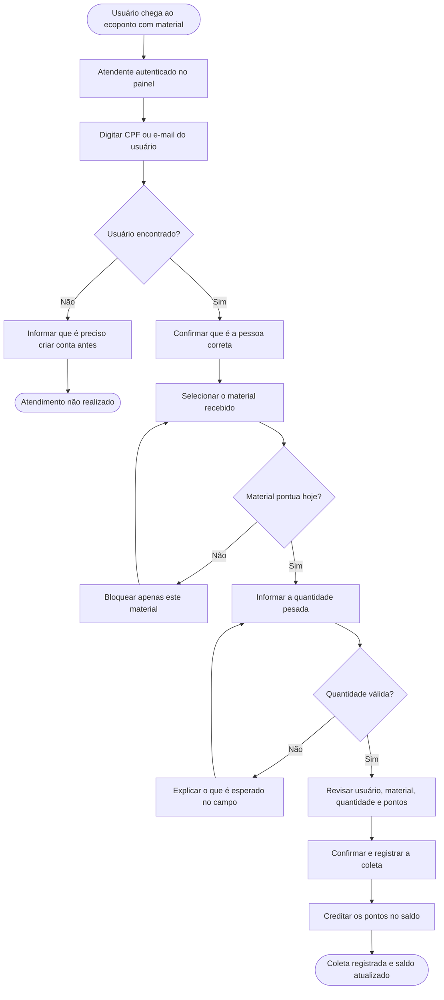
```mermaid
graph TD
    Inicio([Usuário chega ao ecoponto com material]) --> Login[Atendente autenticado no painel]
    Login --> Busca[Digitar CPF ou e-mail do usuário]
    Busca --> Existe{Usuário encontrado?}
    Existe -- Não --> Orienta[Informar que é preciso criar conta antes]
    Orienta --> FimSem([Atendimento não realizado])
    Existe -- Sim --> Confirma[Confirmar que é a pessoa correta]
    Confirma --> Material[Selecionar o material recebido]
    Material --> TemRegra{Material pontua hoje?}
    TemRegra -- Não --> Bloqueia[Bloquear apenas este material]
    Bloqueia --> Material
    TemRegra -- Sim --> Peso[Informar a quantidade pesada]
    Peso --> Valida{Quantidade válida?}
    Valida -- Não --> Erro[Explicar o que é esperado no campo]
    Erro --> Peso
    Valida -- Sim --> Revisa[Revisar usuário, material, quantidade e pontos]
    Revisa --> Efetiva[Confirmar e registrar a coleta]
    Efetiva --> Credita[Creditar os pontos no saldo]
    Credita --> Fim([Coleta registrada e saldo atualizado])
```

**Os cinco cenários do critério de aceite têm caminho no desenho** — é assim que se confere se o
fluxo está completo. Cenário 2 é o ramo *Não* de `Usuário encontrado?`; cenário 3 é o ramo *Não* de
`Quantidade válida?`; cenário 4 é o ramo *Não* de `Material pontua hoje?`. Se um cenário não tem
caminho, falta uma tela, uma mensagem ou um estado.

O cenário 5 — a falha de rede — **não aparece aqui, e está certo.** Ele não é uma escolha do
usuário, é uma condição técnica. Quem mostra isso é o Diagrama de Sequência.

**Repare no losango do meio.** *Material pontua hoje?* existe porque a conversão depende de uma
campanha vigente, e campanha é dado que muda. Um fluxo que assume que todo material sempre pontua
esconde a regra de negócio inteira dentro de uma seta.

---

#### 4 · Diagrama de Classes

O recorte que este fio toca — não o sistema inteiro. Visibilidade em `+ - # ~`, `<<enumeration>>`
para o conjunto fechado de valores, multiplicidade nas associações:

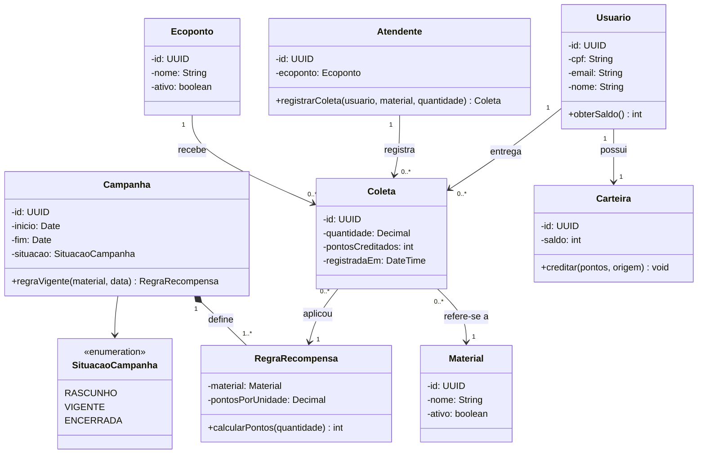
```mermaid
classDiagram
    class Usuario {
        -id: UUID
        -cpf: String
        -email: String
        -nome: String
        +obterSaldo() int
    }

    class Atendente {
        -id: UUID
        -ecoponto: Ecoponto
        +registrarColeta(usuario, material, quantidade) Coleta
    }

    class Ecoponto {
        -id: UUID
        -nome: String
        -ativo: boolean
    }

    class Material {
        -id: UUID
        -nome: String
        -ativo: boolean
    }

    class Campanha {
        -id: UUID
        -inicio: Date
        -fim: Date
        -situacao: SituacaoCampanha
        +regraVigente(material, data) RegraRecompensa
    }

    class RegraRecompensa {
        -material: Material
        -pontosPorUnidade: Decimal
        +calcularPontos(quantidade) int
    }

    class Coleta {
        -id: UUID
        -quantidade: Decimal
        -pontosCreditados: int
        -registradaEm: DateTime
    }

    class Carteira {
        -id: UUID
        -saldo: int
        +creditar(pontos, origem) void
    }

    class SituacaoCampanha {
        <<enumeration>>
        RASCUNHO
        VIGENTE
        ENCERRADA
    }

    Atendente "1" --> "0..*" Coleta : registra
    Usuario "1" --> "1" Carteira : possui
    Usuario "1" --> "0..*" Coleta : entrega
    Ecoponto "1" --> "0..*" Coleta : recebe
    Coleta "0..*" --> "1" Material : refere-se a
    Coleta "0..*" --> "1" RegraRecompensa : aplicou
    Campanha "1" *-- "1..*" RegraRecompensa : define
    Campanha --> SituacaoCampanha
```

**Três decisões de modelagem que o desenho torna visíveis, e que valem mais que o desenho:**

**`Coleta` guarda `pontosCreditados`, e não apenas a quantidade.** Poderia recalcular a partir da
regra — e estaria errado. A campanha muda; o que foi creditado ontem não pode mudar hoje. Guardar o
resultado congela o passado.

**`Coleta` aponta para a `RegraRecompensa` que aplicou.** Sem essa seta, ninguém consegue explicar
seis meses depois por que uma entrega valeu 40 pontos e outra igual valeu 25.

**A losango cheia entre `Campanha` e `RegraRecompensa` é composição, não agregação.** Uma regra não
existe fora da campanha que a define; apagada a campanha, as regras vão junto. A escolha entre `*--`
e `o--` não é estética.

> **E o que este diagrama deliberadamente não tem.** Nada de `getters` e `setters`, nada de campos
> de auditoria, nenhuma classe de infraestrutura. O `§2.4.4` é explícito: **modele a arquitetura e o
> fluxo principal, não superdetalhe** — detalhe excessivo aqui vira viés e burocracia na
> implementação.

---

#### 5 · Diagrama de Sequência

Nem toda User Story merece um. Esta merece por dois dos gatilhos do `§2.4.5`: há **regra de negócio
com cálculo** e há **uma operação que pode ser repetida pelo usuário** — o atendente que clica de
novo depois de a conexão cair.

Mensagens no formato do capítulo: `Ação no infinitivo: nomeDoMetodo(parametros)`, e retornos como
`Ação no infinitivo: TipoDoRetorno`.

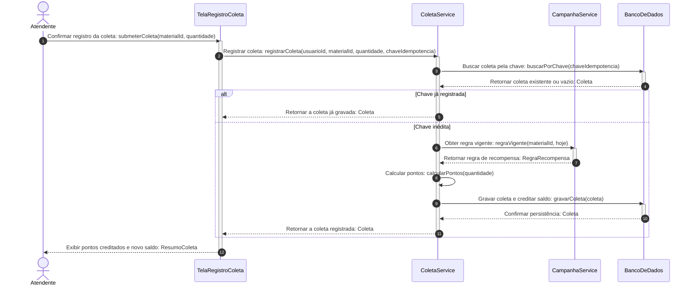
```mermaid
sequenceDiagram
    autonumber
    actor Atendente
    participant Tela as TelaRegistroColeta
    participant Servico as ColetaService
    participant Campanha as CampanhaService
    participant Banco as BancoDeDados

    Atendente->>Tela: Confirmar registro da coleta: submeterColeta(materialId, quantidade)
    activate Tela
    Tela->>Servico: Registrar coleta: registrarColeta(usuarioId, materialId, quantidade, chaveIdempotencia)
    activate Servico

    Servico->>Banco: Buscar coleta pela chave: buscarPorChave(chaveIdempotencia)
    activate Banco
    Banco-->>Servico: Retornar coleta existente ou vazio: Coleta
    deactivate Banco

    alt Chave já registrada
        Servico-->>Tela: Retornar a coleta já gravada: Coleta
    else Chave inédita
        Servico->>Campanha: Obter regra vigente: regraVigente(materialId, hoje)
        activate Campanha
        Campanha-->>Servico: Retornar regra de recompensa: RegraRecompensa
        deactivate Campanha

        Servico->>Servico: Calcular pontos: calcularPontos(quantidade)
        Servico->>Banco: Gravar coleta e creditar saldo: gravarColeta(coleta)
        activate Banco
        Banco-->>Servico: Confirmar persistência: Coleta
        deactivate Banco
        Servico-->>Tela: Retornar a coleta registrada: Coleta
    end

    deactivate Servico
    Tela-->>Atendente: Exibir pontos creditados e novo saldo: ResumoColeta
    deactivate Tela
```

**O `alt` é o diagrama inteiro.** Ele responde à pergunta que nenhum artefato anterior conseguiu
fazer: *o que acontece quando o atendente confirma duas vezes?* A resposta é a `chaveIdempotencia`,
gerada quando a tela abre e enviada junto com o registro. Se a chave já existe, o sistema devolve a
coleta que já gravou em vez de gravar outra.

**Repare de onde vem o ecoponto.** Ele **não** é parâmetro da chamada — vem do token do atendente
autenticado. Se fosse parâmetro, um atendente poderia registrar coleta em ecoponto alheio, e a
segregação de acesso do contrato (`RNF-04`) viraria uma sugestão. **Um diagrama de sequência mostra
não só o que é passado, mas o que deliberadamente não é.**

E note o que o desenho **não** tem: nada de HTTP, JSON, nomes de tabela ou de framework. As
participantes são papéis do domínio.

---

#### 6 · Modelo físico e máquina de estado

Aqui está o argumento central do `§2.4.6`, num caso concreto. O cenário 5 do critério de aceite
exige que uma repetição não credite em dobro. **Essa garantia não mora em nenhuma classe** — mora
numa restrição de unicidade no banco, e o Diagrama de Classes não tem onde desenhar uma restrição.

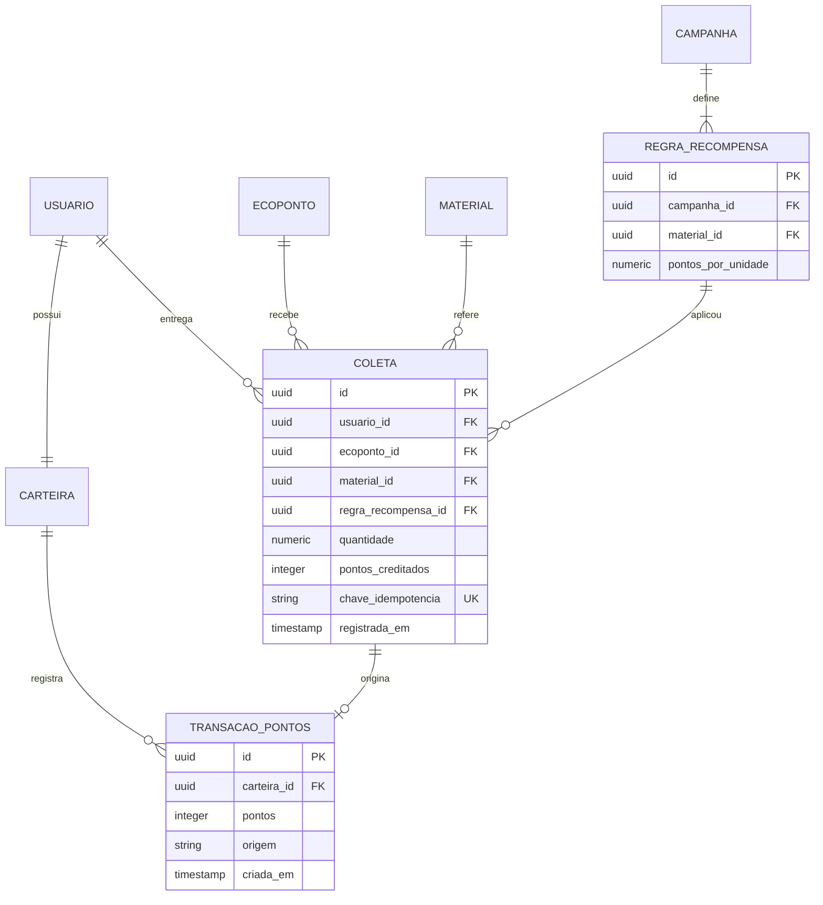
```mermaid
erDiagram
    USUARIO ||--|| CARTEIRA : possui
    USUARIO ||--o{ COLETA : entrega
    ECOPONTO ||--o{ COLETA : recebe
    MATERIAL ||--o{ COLETA : refere
    REGRA_RECOMPENSA ||--o{ COLETA : aplicou
    CAMPANHA ||--|{ REGRA_RECOMPENSA : define
    CARTEIRA ||--o{ TRANSACAO_PONTOS : registra
    COLETA ||--o| TRANSACAO_PONTOS : origina

    COLETA {
        uuid id PK
        uuid usuario_id FK
        uuid ecoponto_id FK
        uuid material_id FK
        uuid regra_recompensa_id FK
        numeric quantidade
        integer pontos_creditados
        string chave_idempotencia UK
        timestamp registrada_em
    }
    TRANSACAO_PONTOS {
        uuid id PK
        uuid carteira_id FK
        integer pontos
        string origem
        timestamp criada_em
    }
    REGRA_RECOMPENSA {
        uuid id PK
        uuid campanha_id FK
        uuid material_id FK
        numeric pontos_por_unidade
    }
```

**Três regras que só existem porque alguém desenhou o modelo físico:**

**`chave_idempotencia` é `UK`.** É a linha que implementa o cenário 5. Sem ela, a garantia de
não-duplicidade dependeria de o programador lembrar de checar — e "lembrar" não é um mecanismo.

**`pontos_creditados` é `integer`; `quantidade` e `pontos_por_unidade` são `numeric`.** Pontos são
inteiros, e a multiplicação de decimais tem de ser feita em aritmética decimal, com arredondamento
explícito, **nunca em ponto flutuante**. Essa decisão aparece no tipo da coluna e em lugar nenhum
antes dele. É exatamente o tipo de coisa que se descobre tarde e caro.

**`TRANSACAO_PONTOS` existe, e o saldo da carteira é derivado dela.** Guardar só um número em
`carteira.saldo` seria mais simples e impossível de auditar: quando o saldo divergir — e vai
divergir — não haveria como saber qual crédito faltou. O saldo é a soma das transações.

**Máquina de estado.** A campanha tem ciclo de vida com regra por transição, então ganha diagrama —
não um parágrafo:

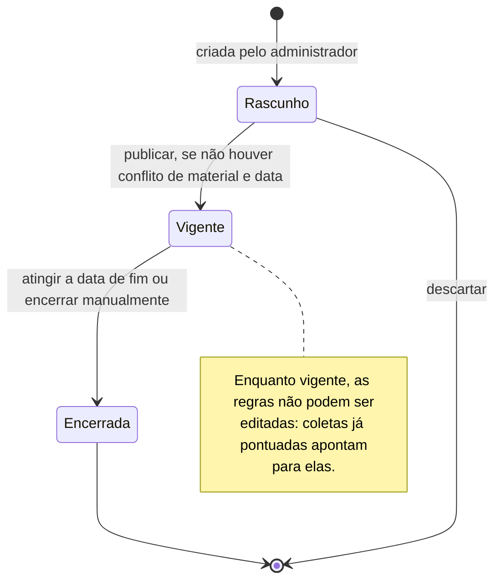
```mermaid
stateDiagram-v2
    [*] --> Rascunho : criada pelo administrador
    Rascunho --> Vigente : publicar, se não houver conflito de material e data
    Rascunho --> [*] : descartar
    Vigente --> Encerrada : atingir a data de fim ou encerrar manualmente
    Encerrada --> [*]
    note right of Vigente
        Enquanto vigente, as regras não podem ser
        editadas: coletas já pontuadas apontam
        para elas.
    end note
```

A transição `Rascunho → Vigente` carrega a regra mais delicada do modelo: **para um mesmo material,
numa mesma data, só pode haver uma regra em vigor.** Campanhas podem coexistir; o que não pode é
duas delas premiarem o mesmo material no mesmo dia, senão a conversão fica ambígua. Uma entidade com
mais de dois estados e uma regra por transição pede máquina de estado.

---

#### 7 · Visão arquitetural — C4

**Nível 1 — Contexto.** Quem usa e com o que o sistema conversa. Nada de tecnologia:

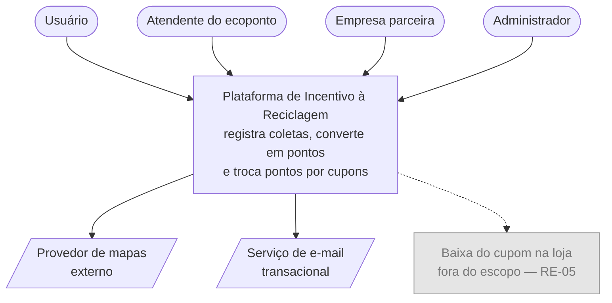
```mermaid
graph TB
    U([Usuário]) --> S
    A([Atendente do ecoponto]) --> S
    E([Empresa parceira]) --> S
    ADM([Administrador]) --> S

    S["Plataforma de Incentivo à Reciclagem<br/>registra coletas, converte em pontos<br/>e troca pontos por cupons"]

    S --> MAPA[/"Provedor de mapas<br/>externo"/]
    S --> MAIL[/"Serviço de e-mail<br/>transacional"/]

    FORA["Baixa do cupom na loja<br/>fora do escopo — RE-05"]
    S -.-> FORA

    classDef fora fill:#e5e5e5,stroke:#999,color:#777
    class FORA fora
```

**A caixa cinza é a disciplina que torna um diagrama de contexto útil.** Ela desenha o que está
deliberadamente **fora** da fronteira. O sistema emite o código do cupom e a responsabilidade dele
termina ali — quem honra o cupom no balcão da loja é a loja. Sem essa caixa, todo mundo assume que
"o sistema cuida do cupom" e a divergência aparece na entrega.

**Nível 2 — Contêiner.** Agora sim, tecnologia — a contratada em `RNF-03`, que é a pilha padrão da
IDE:

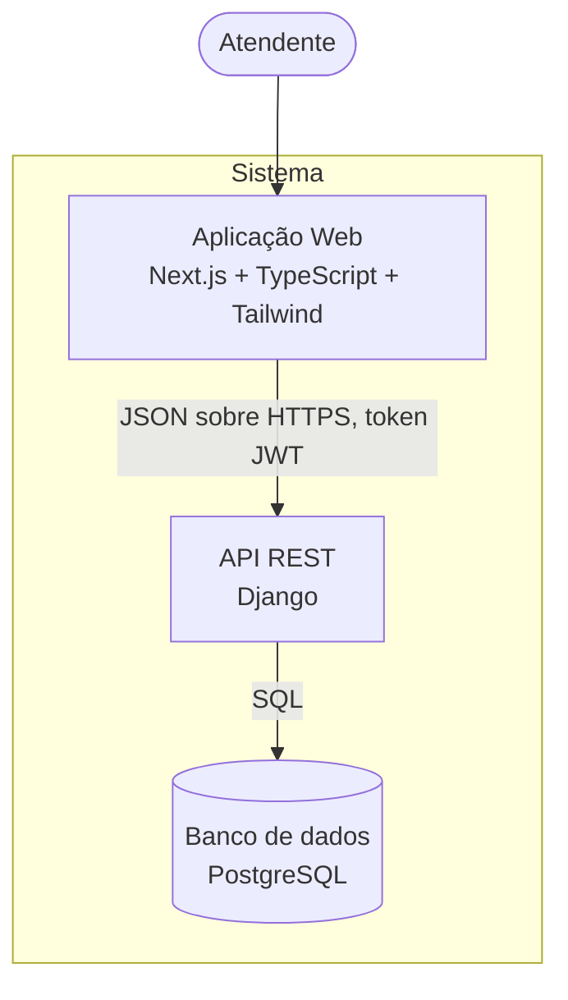
```mermaid
graph TB
    A([Atendente])

    subgraph Sistema
        WEB["Aplicação Web<br/>Next.js + TypeScript + Tailwind"]
        API["API REST<br/>Django"]
        DB[("Banco de dados<br/>PostgreSQL")]
    end

    A --> WEB
    WEB -- JSON sobre HTTPS, token JWT --> API
    API -- SQL --> DB
```

**Nível 3 — Componente.** Só vale a pena para o módulo que concentra regra de negócio. Aqui seria o
de coleta e pontuação: o serviço de coleta, o de campanha e o de carteira, com a dependência entre
eles. Para o módulo institucional, que serve conteúdo estático, desenhar componentes seria
burocracia.

**Nível 4 — Código.** **Não desenhe.** O `§2.4.7` é direto quanto a isso, e a razão é prática: o
nível 4 é a classe e o método, que já estão no código, mudam a cada sprint, e nenhum diagrama
acompanha. Um nível 4 desatualizado é pior que nenhum.

**Diagrama de implantação.** É o que força a pergunta que ninguém gosta de fazer: **quem paga a
conta depois que o contrato acabar?** No Impacto Ambiental o custo recorrente de hospedagem é
responsabilidade contratual do cliente, e o provedor de mapas continuava sem dono definido no
momento da proposta. Se essa pergunta não estiver em um diagrama, ela não está em lugar nenhum.

---

#### 8 · Documentação como código — o ADR

O diagrama mostra a `chave_idempotencia`. Ele é incapaz de mostrar **por que** ela foi escolhida em
vez das alternativas — e é essa a informação que se perde primeiro. No modelo mínimo do `§2.4.8`:

```markdown
# ADR-001 — Idempotência do registro de coleta por chave enviada pelo cliente

**Status:** Aceito
**Data:** AAAA-MM-DD

## Contexto
O atendente registra coletas em balcão, muitas vezes em rede instável. Uma
confirmação repetida após queda de conexão não pode creditar pontos duas vezes
(critério de aceite, cenário 5 da US001).

## Decisão
A tela gera uma chave de idempotência ao abrir e a envia no registro. A coluna
tem restrição de unicidade; uma chave repetida devolve a coleta já gravada.

## Alternativas rejeitadas
- **Bloquear o botão após o primeiro clique** — não resolve: a falha acontece
  entre o envio e a resposta, e o segundo clique vem de um recarregamento.
- **Deduplicar por usuário + material + quantidade + janela de tempo** — rejeita
  entregas legítimas: a mesma pessoa pode entregar o mesmo material duas vezes
  no mesmo dia.

## Consequências
Toda tela de registro passa a gerar e enviar a chave. Em troca, a repetição
deixa de ser um risco e o botão de confirmar pode ser clicado sem medo.
```

**Sem esse documento, a segunda alternativa volta.** Ela é mais simples, parece razoável, e alguém
vai propô-la daqui a três meses. Um diagrama transfere a arquitetura; um ADR transfere o
julgamento — e é o artefato mais diretamente antirrotatividade de todos.

---

#### 9 · A cadeia fechada

Do contrato à Issue, sem elo solto:

| Artefato | Instância |
| :---------------------- | :-------------------------------------------------- |
| Requisito contratado | `RF-ATD-02` a `RF-ATD-05` |
| Matriz de Requisitos | 5 linhas, módulos Atendente / Coleta / Pontuação |
| User Story | `US001`, 5 cenários BDD, INVEST validado |
| User Flow | `UF001`, 3 losangos, todos os cenários com caminho |
| Diagrama de Classes | 8 classes, 1 enumeração |
| Diagrama de Sequência | 1 `alt` — a idempotência |
| Modelo físico | `chave_idempotencia UK`, pontos em inteiro, saldo derivado |
| Máquina de estado | Ciclo de vida da campanha |
| C4 | Contexto e contêiner |
| ADR | `ADR-001` |
| **Issue** | *"Registrar coleta no ecoponto"*, fechando `RF-ATD-03` |

**A Issue rastreia até um `RF`, e o `RF` rastreia até uma linha do contrato.** É essa a propriedade
que o capítulo inteiro existe para garantir: qualquer pessoa consegue perguntar *"por que estamos
construindo isto?"* e chegar a uma resposta escrita.

**E os anti-padrões do `§2.4.9` que este exercício evitou:**

| Anti-padrão | Como foi evitado |
| :------------------------------------------ | :------------------------------------ |
| O diagrama do sistema inteiro numa folha | Cada artefato cobre **um** fio |
| Detalhar antes de decidir | Nível 4 do C4 não desenhado; classes sem `getters` |
| Diagramar o que já está óbvio no código | Nenhum diagrama de CRUD simples |
| O diagrama que ninguém atualizou | Tudo em Mermaid, versionado com o código |
| O diagrama que promete escopo | `RE-05` e `RE-26` aparecem como exclusão explícita |

> **O que o membro leva daqui.** Nenhum destes artefatos foi criado porque o processo mandava. Cada
> um respondeu a uma pergunta que os anteriores não conseguiam: a MRF diz *o que foi contratado*, a
> User Story diz *para quem e por quê*, o User Flow diz *por onde se passa*, as classes dizem *com
> que abstrações*, a sequência diz *em que ordem e o que acontece quando falha*, o modelo físico diz
> *quais regras o banco garante*, o C4 diz *onde isso roda*, e o ADR diz *o que foi rejeitado*.
> **Se um artefato não está respondendo a nenhuma pergunta nova, ele não precisava ter sido feito.**

</details>
