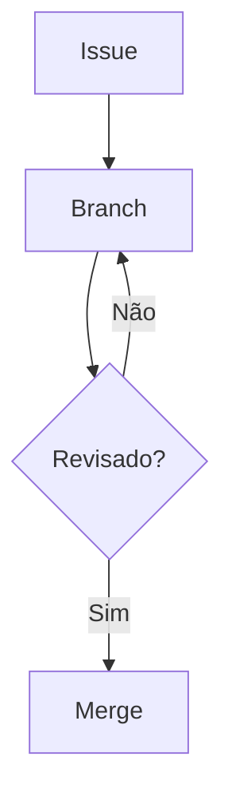

# Manual de Projetos — IDE

Padronização do ciclo de vida de desenvolvimento de software (SDLC) da IDE, a empresa júnior de
programação da UFRGS.

O manual existe porque a IDE opera com um quadro majoritariamente de estudantes em semestres
iniciais e alta rotatividade. O processo escrito é o mecanismo de **transferência de conhecimento**
e a proteção contra o desenvolvimento *ad-hoc* — não é burocracia administrativa.

**Para ler:** abra `manual.html` no navegador. É um arquivo único, funciona offline, não precisa
instalar nada.

---

## Como este repositório é organizado

O texto **não** vive num arquivo só. Cada seção é um arquivo em `capitulos/`, e o arquivo da raiz
apenas costura tudo:

```
Manual_de_projetos_final_version.md   ← roteador: capa, motivação, índice e os !include
capitulos/
  1.1-introducao-visao-geral.md       ← uma seção, um arquivo
  1.2-reunioes-com-o-cliente.md
  1.3-levantamento-de-requisitos.md
  1.4.1-analise-de-tecnologias.md
  1.4.2-esboco-de-projeto.md
  1.5-orcamento-e-apresentacao.md
  2.1-introducao-visao-geral.md
  2.2-github.md
  2.3-design-de-sistemas.md
  2.4-diagramacao-tecnica.md
  2.5-padroes-e-convencoes.md
  3.1-encerramento-do-projeto.md
  img/1.3-modelo-kano.png             ← única imagem raster do manual
manual-template.html                  ← layout do site (índice lateral, capa)
manual.css                            ← tema visual (cores e fontes do MIV da IDE)
.puppeteer.json                       ← config do Chromium usado para render dos diagramas
build.sh                              ← script de compilação
manual.html                           ← PRODUTO GERADO. Não edite à mão.
```

**Cada texto existe em exatamente um lugar.** Se você editar `manual.html` direto, sua alteração
será apagada na próxima compilação.

---

## Editar uma seção existente

1. Abra o arquivo correspondente em `capitulos/`.
2. Edite o Markdown.
3. Rode `./build.sh` e confira o resultado em `manual.html`.
4. Abra um Pull Request (o fluxo do capítulo 2.2 vale para este repositório também).

Não é preciso mexer no arquivo da raiz — ele já aponta para o capítulo.

### Níveis de título

O arquivo da raiz é dono dos títulos de capítulo (`#`). Os arquivos de `capitulos/` **começam em
`##`**. Respeite a escala, senão o índice lateral sai torto:

| Nível | Quem escreve | Exemplo |
|:-----|:------------|:-------|
| `#` | só a raiz | `# 2. Lógica durante contrato` |
| `##` | arquivo de capítulo | `## 2.4 Diagramação Técnica e Arquitetural` |
| `###` | arquivo de capítulo | `### 2.4.1 Matriz de Requisitos Funcionais` |
| `####` | arquivo de capítulo | `#### Diagrama Entidade-Relacionamento` |

O índice lateral mostra até `###`.

---

## Adicionar uma seção nova

1. Crie `capitulos/<numero>-<nome-em-slug>.md`. Use só letras minúsculas ASCII, números, ponto e
   hífen — **sem espaços, acentos ou colchetes** no nome do arquivo.
2. Comece o arquivo com o título em `##` (ou `###`, se for subseção de uma seção existente).
3. Registre o arquivo no roteador, na posição certa:

   ```markdown
   !include capitulos/3.1-encerramento-do-projeto.md
   ```

   Cada `!include` fica sozinho na sua linha, com uma linha em branco antes e depois.
4. Acrescente a seção ao **Índice** escrito no roteador. Ele é mantido à mão; o sumário navegável
   do site é gerado automaticamente.
5. Rode `./build.sh`.

### ⚠ A armadilha das âncoras repetidas

O `pandoc-include` analisa cada arquivo **isoladamente**, então o Pandoc **não** deduplica âncoras
entre arquivos. Dois títulos com o mesmo texto em arquivos diferentes recebem o mesmo `id`, e o
índice lateral passa a levar para o lugar errado — sem nenhum aviso na compilação.

Já aconteceu com `1.1` e `2.1`, ambos "Introdução: Visão geral". A solução é dar um id explícito:

```markdown
## 2.1 Introdução: Visão geral {#sec-2-1-introducao}
```

Se você criar um título cujo texto já existe em outro capítulo, dê um id explícito.

---

## Diagramas

**Todo diagrama do manual é Mermaid**, escrito como texto dentro do próprio Markdown. A única
exceção é o gráfico do Modelo Kano (`capitulos/img/1.3-modelo-kano.png`), que é uma curva e não um
grafo de caixas.

````markdown

````

Isso é deliberado, e o capítulo 2.4.8 explica por quê: um diagrama em texto entra no `diff`, é
revisado no Pull Request junto com o que ele descreve e não pode divergir em silêncio. Um PNG
exportado do Figma ou do draw.io não tem nenhuma dessas propriedades.

**Vocabulário visual** (fixado em 2.4.3): `([pílula])` para início e fim, `[retângulo]` para tela
ou ação, `{losango}` para decisão, e toda seta que sai de um losango leva rótulo.

**Cuidado com a versão do Mermaid.** O `mermaid-filter` empacota a própria versão, que não é a mais
recente. Recursos novos derrubam o diagrama inteiro, não só o detalhe. Dois casos já encontrados:

- restrições de chave combinadas no `erDiagram` (`FK UK`) — exigem Mermaid ≥ 11.1;
- tipos de participante no `sequenceDiagram` (`participant X@{"type": "boundary"}`).

Prefira sintaxe conservadora. Se um diagrama quebrar a compilação, o Pandoc aponta a linha
**relativa ao início daquele bloco**, não ao arquivo.

---

## Compilar

```bash
./build.sh          # manual.html — o produto de leitura
./build.sh docx     # manual.docx — para comentar no Word ou Google Docs
./build.sh pdf      # manual.pdf  — exige LaTeX
```

### Instalação (uma vez)

```bash
sudo apt install pandoc
uv tool install pandoc-include      # ou: pipx install pandoc-include
npm install -g mermaid-filter
```

Três observações que economizam tempo:

- **`uv tool install`, não `uvx`.** O Pandoc procura um executável chamado `pandoc-include` no
  `PATH`; o `uvx` roda de forma efêmera e não serve como filtro.
- **Sem `sudo` para o npm:** `npm config set prefix ~/.local` antes do `npm install -g`. O
  `mermaid-filter` baixa um Chromium (algumas centenas de MB), então a primeira instalação demora.
- **PDF** precisa de `sudo apt install texlive-xetex`. O `.docx` e o `.html` não precisam de LaTeX.

### Se o Chromium não abrir

Em Ubuntu 24.04+ o Chromium do `mermaid-filter` falha com `No usable sandbox`, porque a
distribuição bloqueia *user namespaces* sem privilégio. O arquivo `.puppeteer.json` deste
repositório já resolve isso passando `--no-sandbox`. **Ele precisa estar no diretório de onde o
Pandoc é executado** — por isso o `build.sh` faz `cd` para a raiz do repositório antes de compilar.

---

## Por que HTML, e não Word ou PDF

O `manual.html` é o produto de leitura porque formatos paginados quebram este documento
especificamente: são 43 tabelas e 20 diagramas, e no `.docx` as linhas de tabela partem entre
páginas, deixando vãos e cabeçalhos órfãos. HTML não pagina, então o problema não existe.

O `.docx` continua disponível, gerado do mesmo fonte, para quando alguém precisar comentar em
Word ou Google Docs. Para imprimir, use o próprio navegador: o CSS tem regras `@media print` que
escondem o índice lateral e evitam cortar tabela, diagrama e callout ao meio.

---

## Identidade visual

O tema em `manual.css` vem do Manual de Identidade Visual da IDE
(`marketing/identidade_visual/MIV IDE.pdf`) e não deve ser alterado por gosto pessoal:

| Elemento | Valor | Fonte |
|:--------|:-----|:-----|
| Roxo principal | `#3F0F6B` | MIV p.17 |
| Violeta | `#7726BD` | MIV p.17 |
| Azul | `#0B68BE` | MIV p.17 |
| Verde | `#3CAD14` | MIV p.17 |
| Tipografia de títulos | Bai Jamjuree | MIV p.22 |
| Tipografia de texto | Open Sans | MIV p.23 |

Os colchetes de `[IDE]` na capa e no topo do índice são o motivo da marca — o logo é a palavra IDE
desenhada como trilhas de circuito dentro de dois colchetes, referência a listas e arrays.

---

## Estado atual

**Todas as seções do índice têm conteúdo.**

O capítulo **3.1** é deliberadamente curto: o acompanhamento pós-entrega é conduzido pelo setor
comercial, e a seção aponta para a jornada do cliente no Notion em vez de duplicar aqui um processo
que é mantido lá. Se o pós-contrato ganhar procedimento próprio de Projetos — entrega de deploy,
credenciais, manutenção e a questão em aberto de quem paga a hospedagem recorrente —, é nesse
arquivo que ele entra.

O restante do índice do roteador corresponde exatamente aos arquivos de `capitulos/`.
